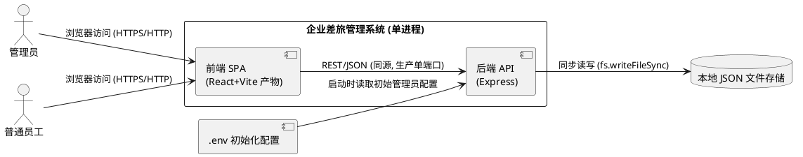
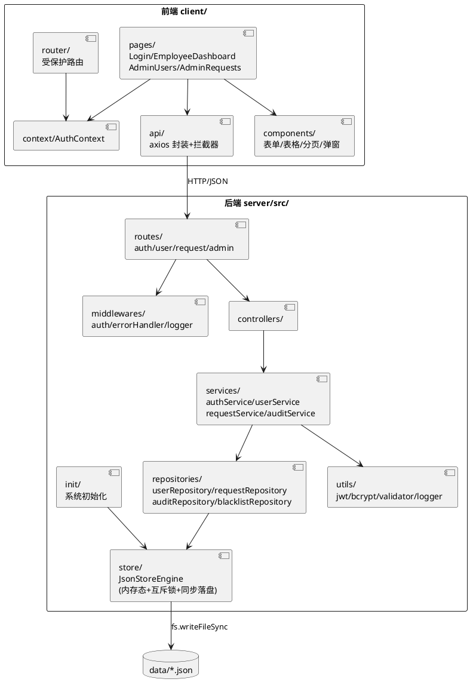
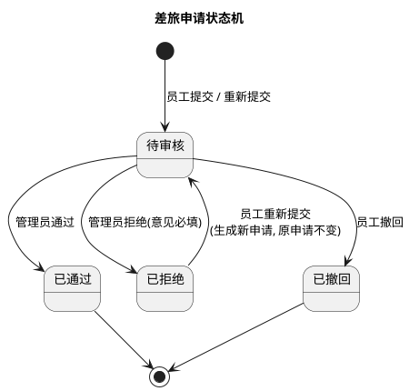
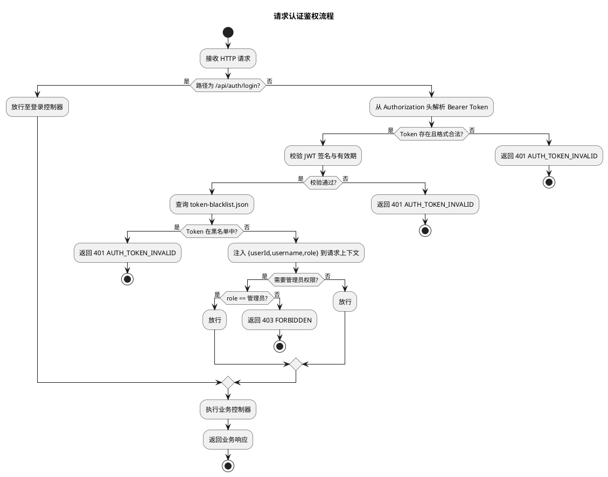
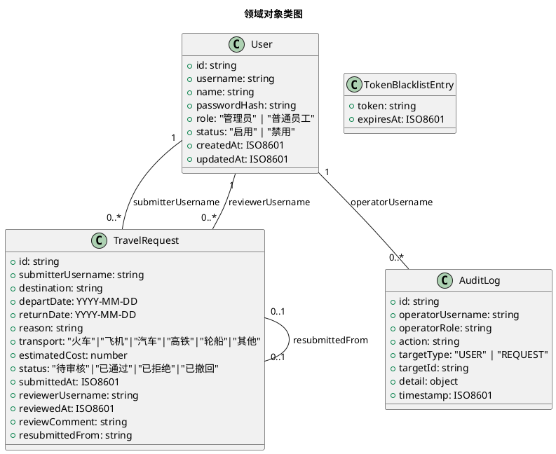

# 企业差旅管理系统 V1 技术设计文档

> 本文档基于 `spec.md` 需求规格与用户确认的 11 项关键技术设计决策生成，描述系统的架构、接口与数据模型设计方案。
>
> 技术栈：前端 React + Vite；后端 Node.js + Express；本地 JSON 文件持久化；认证 JWT + bcrypt；E2E 测试 Playwright MCP；单代码仓库前后台分离架构；前后端统一 JavaScript 技术栈。

---

# 一、需求与存量功能关系分析

## 1.1 需求功能与存量功能对比

### 1.1.1 已实现功能

当前代码库为全新空仓库（仅含 `.codeartsdoer` 配置目录、`.playwright-mcp` 目录与若干工具脚本），不存在任何存量业务代码，因此无已实现功能。

| 需求功能 | 存量功能 | 代码位置 | 匹配度 |
|---------|---------|---------|--------|
| — | 无存量业务代码 | — | — |

### 1.1.2 需要扩展的功能

无存量代码，不存在需要在现有基础上改造的功能。

### 1.1.3 需要新增的功能或接口

本项目为全新建设，`spec.md` 中所有核心能力均需从零实现。按业务模块分组如下，每项标注输入、输出与核心逻辑概要：

**认证模块（auth）**
- 登录认证：输入用户名 + 密码；输出 JWT 令牌与用户信息（含角色，不含密码）。核心逻辑：校验用户存在 → 校验账号启用 → bcrypt 比对密码 → 签发 JWT（有效期 8 小时）。
- 登出：输入当前令牌；输出登出成功。核心逻辑：将令牌写入 `token-blacklist.json`（记录 expiresAt 用于清理），使后续校验失败。
- 令牌校验中间件：从 `Authorization: Bearer <token>` 解析；校验签名、未过期、不在黑名单；将 `{ userId, username, role }` 注入请求上下文。

**员工管理模块（user，管理员独占）**
- 员工列表查询：输出全量员工（脱敏，不含密码哈希）。
- 创建员工：输入用户名/姓名/密码等；校验用户名唯一性与字段约束；bcrypt 加密存储；默认启用状态；角色固定为"普通员工"。
- 编辑员工：可改字段为姓名、用户名（仍受唯一性约束）、账号状态；密码不可通过此接口修改。
- 禁用/启用员工：切换账号状态；保留账号与申请数据。
- 重置密码：管理员在请求体显式传入新密码；bcrypt 加密存储；响应不返回明文。

**差旅申请模块——员工侧（request）**
- 提交申请：输入目的地/出发日期/返回日期/出差事由/交通工具/预计费用；校验字段约束、日期顺序（返回日期 ≥ 出发日期）、交通工具枚举、费用非负；创建为"待审核"并记录提交人与提交时间。
- 查询本人申请列表：支持按状态筛选 + 分页（`page`/`pageSize`，默认 pageSize=100），按提交时间倒序，返回列表与总数及分页元信息。
- 查看本人申请详情：校验申请归属当前用户。
- 撤回申请：仅"待审核"可撤回；撤回后不可恢复。
- 重新提交：仅"已拒绝"可重新提交；校验修改后字段合法性；生成新的"待审核"申请，记录 `resubmittedFrom = 原申请ID`；原申请保持不变。

**差旅申请审核模块——管理员侧（review）**
- 查询全量申请列表：支持状态筛选 + 分页，按提交时间倒序，返回列表与分页元信息。
- 查看申请详情：含提交人信息。
- 通过申请：仅"待审核"可操作；审核意见可选；置为"已通过"；记录审核人/审核时间/审核意见。
- 拒绝申请：仅"待审核"可操作；审核意见必填；置为"已拒绝"；记录审核人/审核时间/审核意见。

**系统初始化模块（init）**
- 启动时检查数据文件是否为空；为空则根据 `.env`（`INIT_ADMIN_USERNAME` / `INIT_ADMIN_PASSWORD`）创建初始管理员（bcrypt 加密）；已存在数据则跳过；配置缺失则启动失败并报错。

**审计模块（audit）**
- 在员工管理操作（创建/编辑/禁用/启用/重置密码）与审核操作（通过/拒绝）时，记录操作人、操作时间、操作类型、目标对象、操作详情到独立 `audit-logs.json`。

**存储引擎模块（store）**
- 按集合分文件的 JSON 持久化：`users.json`、`requests.json`、`audit-logs.json`、`token-blacklist.json`。采用"内存态数据 + 同步 `fs.writeFileSync` 全量覆写 + 进程内互斥锁"，保证单实例强一致与同步落盘。

## 1.2 存量功能详细分析

当前仓库为全新空仓库，不存在存量业务代码，因此无存量功能可深入分析。本设计文档所述全部为增量新建内容。

**约束与依赖说明：**
1. 技术栈已由用户明确锁定，设计需严格遵循：React + Vite（前端）、Node.js + Express（后端）、本地 JSON 文件（存储，禁用任何数据库）、JWT + bcrypt（认证）、Playwright MCP（E2E）、单仓库前后台分离。
2. 运行约束：开发时 Vite dev server 与 Express 分别运行，前端通过 Vite 代理转发 API；生产时 `vite build` 产物由 Express 静态托管，单端口对外。
3. 可靠性约束（spec 4.2）：写入必须同步落盘；单实例强一致，读写基于同一份本地文件数据。
4. 安全约束（spec 4.3）：除登录外所有接口需认证；密码 bcrypt 加盐哈希；管理员接口禁止普通员工访问；员工只能访问本人申请；关键操作需审计。
5. 无存量数据迁移要求（spec 4.5.2，V1 首版）。

---

# 二、增量设计方案

## 2.1 实现模型

### 2.1.1 上下文视图

本系统为单机部署的单体应用，前端构建产物由后端 Express 静态托管。上下文视图展示系统与外部参与者、文件存储、初始化配置的交互关系。



**交互说明：**
- 生产部署：前端 `vite build` 产物由 Express 静态托管，前后端同源单端口，避免跨域。
- 开发环境：Vite dev server（默认 5173）通过 `vite.config.js` 代理将 `/api` 转发至 Express（默认 3001），前后端分离运行便于热更新。
- 文件存储：后端进程内维护内存态数据镜像，所有写操作通过进程内互斥锁串行化后同步全量覆写至对应 JSON 文件。
- 初始化配置：仅在系统启动且数据文件为空时读取一次 `.env`。

### 2.1.2 服务/组件总体架构

后端采用分层架构：路由层 → 控制器层 → 服务层 → 仓储层 → 存储引擎层。前端按页面 + 通用组件 + Context + API 封装组织。



**模块职责：**
| 模块 | 职责 |
|------|------|
| `store/JsonStoreEngine` | 按集合加载 JSON 到内存；提供 `read(collection)` / `write(collection, data)`；进程内互斥锁串行化写入；同步全量覆写落盘 |
| `repositories/*` | 对各集合的领域读写封装，封装 ID 生成、唯一性查询等 |
| `services/*` | 业务规则编排，调用 repository 与 utils，触发审计 |
| `controllers/*` | HTTP 入参解析与校验、调用 service、统一响应封装 |
| `middlewares/auth` | JWT 解析与校验（签名/有效期/黑名单）、角色鉴权 |
| `middlewares/errorHandler` | 统一错误码到 HTTP 响应映射 |
| `init/` | 启动时数据文件空检查与初始管理员创建 |
| 前端 `context/AuthContext` | 登录态管理、令牌持久化（localStorage）、登出清理 |
| 前端 `api/` | axios 实例 + 请求拦截器注入令牌 + 响应拦截器处理 401 跳转登录 |

**配置项及取值策略：**
| 配置项 | 来源 | 取值策略 |
|--------|------|---------|
| `PORT` | `.env` | 后端监听端口，默认 3001 |
| `INIT_ADMIN_USERNAME` | `.env` | 初始管理员用户名，启动时必填校验 |
| `INIT_ADMIN_PASSWORD` | `.env` | 初始管理员密码明文，启动时必填校验，仅用于首次初始化加密 |
| `JWT_SECRET` | `.env` | JWT 签名密钥，必填 |
| `JWT_EXPIRES_IN` | `.env` | JWT 有效期，默认 `8h` |
| `DATA_DIR` | `.env` | JSON 数据文件目录，默认 `server/data` |

### 2.1.3 实现设计文档

#### 2.1.3.1 差旅申请状态机

申请状态流转严格受控，任何非法迁移返回 `STATE_CONFLICT`。



**迁移规则与触发条件：**
| 源状态 | 操作 | 目标状态 | 触发角色 | 约束 |
|--------|------|---------|---------|------|
| — | 提交申请 | 待审核 | 普通员工 | 字段合法、日期顺序、交通枚举、费用非负 |
| 待审核 | 撤回 | 已撤回 | 普通员工（本人） | 不可恢复 |
| 待审核 | 通过 | 已通过 | 管理员 | 审核意见可选 |
| 待审核 | 拒绝 | 已拒绝 | 管理员 | 审核意见必填 |
| 已拒绝 | 重新提交 | 新申请=待审核 | 普通员工（本人） | 字段合法；记录 resubmittedFrom |

#### 2.1.3.2 认证与鉴权活动图



#### 2.1.3.3 存储引擎写入事务设计

由于采用本地 JSON 文件 + 内存态镜像，单实例强一致，写入流程如下（保证落盘可靠性）：
1. 获取进程内互斥锁（同一 collection 的写操作串行）。
2. 修改内存态数据镜像。
3. 调用 `fs.writeFileSync` 全量覆写目标 JSON 文件（同步阻塞，满足 spec 4.2.2 同步落盘要求）。
4. 释放互斥锁。
5. 若写入抛异常，回滚内存态镜像至写入前快照，向上抛出 `STORE_WRITE_FAILED` 错误。

读操作直接读取内存态镜像（无锁，因单进程 Node.js 事件循环无并发读竞争）。

## 2.2 接口设计

### 2.2.1 总体设计

**接口分类依据：** 按业务域与角色划分路由前缀。`/api/auth/*` 为公开认证接口；`/api/requests/*` 为员工本人申请接口（需认证 + 员工角色）；`/api/admin/*` 为管理员独占接口（需认证 + 管理员角色）。

**统一响应 envelope：**
```
成功: { "code": 0, "data": <payload> }
失败: { "code": "<ERROR_CODE>", "message": "<可读提示>" }
```

**接口总览：**

| 分类 | 方法 + 路径 | 角色 | 用途 | 稳定性 |
|------|------------|------|------|--------|
| 认证 | POST /api/auth/login | 公开 | 登录 | 稳定 |
| 认证 | POST /api/auth/logout | 已认证 | 登出 | 稳定 |
| 员工管理 | GET /api/admin/users | 管理员 | 员工列表 | 稳定 |
| 员工管理 | POST /api/admin/users | 管理员 | 创建员工 | 稳定 |
| 员工管理 | PUT /api/admin/users/:id | 管理员 | 编辑员工 | 稳定 |
| 员工管理 | PATCH /api/admin/users/:id/status | 管理员 | 禁用/启用 | 稳定 |
| 员工管理 | POST /api/admin/users/:id/reset-password | 管理员 | 重置密码 | 稳定 |
| 员工申请 | POST /api/requests | 员工 | 提交申请 | 稳定 |
| 员工申请 | GET /api/requests | 员工 | 本人申请列表 | 稳定 |
| 员工申请 | GET /api/requests/:id | 员工 | 本人申请详情 | 稳定 |
| 员工申请 | POST /api/requests/:id/withdraw | 员工 | 撤回申请 | 稳定 |
| 员工申请 | POST /api/requests/:id/resubmit | 员工 | 重新提交 | 稳定 |
| 管理员审核 | GET /api/admin/requests | 管理员 | 全量申请列表 | 稳定 |
| 管理员审核 | GET /api/admin/requests/:id | 管理员 | 申请详情 | 稳定 |
| 管理员审核 | POST /api/admin/requests/:id/approve | 管理员 | 通过申请 | 稳定 |
| 管理员审核 | POST /api/admin/requests/:id/reject | 管理员 | 拒绝申请 | 稳定 |

**接口版本策略：** V1 为基线版本，URL 不显式带版本号；后续不兼容变更通过 `/api/v2/*` 前缀实现，V1 保持向后兼容（spec 4.5.1）。

### 2.2.2 接口清单

#### 2.2.2.1 POST /api/auth/login — 登录

- **接口签名：**
  ```
  请求体: { username: string, password: string }
  响应体: { code: 0, data: { token: string, user: { id, username, name, role, status } } }
  ```
- **业务说明：** 用户名密码登录，成功签发 JWT（有效期 8h）并返回用户信息（不含密码）。
- **前置条件：** 无。
- **后置条件：** 内存态 `token-blacklist` 不变；客户端获得有效 token。
- **异常映射：**
  - 用户名不存在或密码错误 → 401 `AUTH_INVALID_CREDENTIALS` / "用户名或密码错误"
  - 账号禁用 → 401 `AUTH_ACCOUNT_DISABLED` / "账号已禁用，请联系管理员"
  - 字段缺失 → 400 `VALIDATION_ERROR`
- **调用示例：**
  ```js
  // 前端 api/auth.js
  export const login = (username, password) =>
    apiClient.post('/api/auth/login', { username, password });
  ```

#### 2.2.2.2 POST /api/auth/logout — 登出

- **接口签名：**
  ```
  请求头: Authorization: Bearer <token>
  响应体: { code: 0, data: { success: true } }
  ```
- **业务说明：** 将当前 token 写入 `token-blacklist.json`（记录 `expiresAt` 用于过期清理），使后续校验失败。
- **前置条件：** 携带有效 token。
- **后置条件：** 该 token 进入黑名单，后续请求被拒绝。
- **异常映射：** token 无效 → 401 `AUTH_TOKEN_INVALID`
- **调用示例：**
  ```js
  export const logout = () => apiClient.post('/api/auth/logout');
  ```

#### 2.2.2.3 GET /api/admin/users — 员工列表

- **接口签名：**
  ```
  响应体: { code: 0, data: { users: Array<{ id, username, name, role, status, createdAt, updatedAt }> } }
  ```
- **业务说明：** 返回全量用户（含管理员），密码哈希字段不返回。
- **前置条件：** 管理员角色。
- **后置条件：** 无。
- **异常映射：** 非管理员 → 403 `FORBIDDEN`

#### 2.2.2.4 POST /api/admin/users — 创建员工

- **接口签名：**
  ```
  请求体: { username: string, name: string, password: string }
  响应体: { code: 0, data: { user: { id, username, name, role, status, createdAt, updatedAt } } }
  ```
- **业务说明：** 创建普通员工，角色固定"普通员工"，状态默认"启用"，密码 bcrypt 加密存储。触发审计。
- **前置条件：** 管理员角色。
- **后置条件：** `users.json` 新增一条记录；`audit-logs.json` 新增一条审计。
- **异常映射：**
  - 用户名冲突 → 409 `USER_NAME_CONFLICT` / "用户名已存在"
  - 字段非法（用户名格式/长度、姓名长度、密码长度<6）→ 400 `VALIDATION_ERROR`
- **校验规则：** 用户名 `^[A-Za-z0-9_]{3,20}$`；姓名 1-50 字符；密码明文 ≥6 字符。

#### 2.2.2.5 PUT /api/admin/users/:id — 编辑员工

- **接口签名：**
  ```
  请求体: { username?: string, name?: string, status?: "启用"|"禁用" }
  响应体: { code: 0, data: { user: {...} } }
  ```
- **业务说明：** 可改字段：姓名、用户名（受唯一性约束）、账号状态。禁止通过此接口改密码或改角色。触发审计。
- **前置条件：** 管理员角色；目标员工存在且为普通员工。
- **后置条件：** `users.json` 对应记录更新 `updatedAt`；审计写入。
- **异常映射：**
  - 员工不存在 → 404 `USER_NOT_FOUND`
  - 用户名冲突 → 409 `USER_NAME_CONFLICT`
  - 字段非法 → 400 `VALIDATION_ERROR`

#### 2.2.2.6 PATCH /api/admin/users/:id/status — 禁用/启用

- **接口签名：**
  ```
  请求体: { status: "启用"|"禁用" }
  响应体: { code: 0, data: { user: {...} } }
  ```
- **业务说明：** 切换账号状态，保留账号与申请数据。触发审计。
- **前置条件：** 管理员角色；目标员工存在。
- **后置条件：** 状态更新；审计写入。
- **异常映射：** 员工不存在 → 404 `USER_NOT_FOUND`；status 取值非法 → 400 `VALIDATION_ERROR`

#### 2.2.2.7 POST /api/admin/users/:id/reset-password — 重置密码

- **接口签名：**
  ```
  请求体: { newPassword: string }
  响应体: { code: 0, data: { success: true } }
  ```
- **业务说明：** 管理员显式传入新密码，bcrypt 加密存储，响应不返回明文。触发审计。
- **前置条件：** 管理员角色；目标员工存在。
- **后置条件：** 密码哈希更新；审计写入。
- **异常映射：** 员工不存在 → 404 `USER_NOT_FOUND`；新密码长度<6 → 400 `VALIDATION_ERROR`

#### 2.2.2.8 POST /api/requests — 提交差旅申请

- **接口签名：**
  ```
  请求体: {
    destination: string,        // 1-100
    departDate: string(YYYY-MM-DD),
    returnDate: string(YYYY-MM-DD),
    reason: string,             // 1-500
    transport: "火车"|"飞机"|"汽车"|"高铁"|"轮船"|"其他",
    estimatedCost: number       // ≥0, 两位小数
  }
  响应体: { code: 0, data: { request: {...完整申请对象} } }
  ```
- **业务说明：** 普通员工提交申请，创建为"待审核"，记录提交人（当前登录用户名）与提交时间。
- **前置条件：** 已认证且角色为"普通员工"。
- **后置条件：** `requests.json` 新增一条"待审核"申请。
- **异常映射：**
  - 管理员提交 → 403 `FORBIDDEN`
  - 返回日期早于出发日期 → 400 `VALIDATION_ERROR` / "返回日期不能早于出发日期"
  - 交通工具非枚举 → 400 `VALIDATION_ERROR`
  - 费用为负 → 400 `VALIDATION_ERROR`
  - 必填字段缺失/超长 → 400 `VALIDATION_ERROR`

#### 2.2.2.9 GET /api/requests — 本人申请列表

- **接口签名：**
  ```
  查询参数: status?="全部"|"待审核"|"已通过"|"已拒绝", page?=number(默认1), pageSize?=number(默认100)
  响应体: { code: 0, data: { list: Array<申请>, total: number, page: number, pageSize: number } }
  ```
- **业务说明：** 返回当前登录员工本人的申请，按提交时间倒序，支持状态筛选与分页。
- **前置条件：** 已认证且角色为"普通员工"。
- **后置条件：** 无。
- **异常映射：** 非员工角色 → 403 `FORBIDDEN`

#### 2.2.2.10 GET /api/requests/:id — 本人申请详情

- **接口签名：**
  ```
  响应体: { code: 0, data: { request: {...完整申请对象} } }
  ```
- **业务说明：** 查看本人申请详情，校验归属。
- **前置条件：** 已认证员工；申请归属本人。
- **异常映射：** 申请不存在 → 404 `REQUEST_NOT_FOUND`；非本人申请 → 403 `FORBIDDEN`

#### 2.2.2.11 POST /api/requests/:id/withdraw — 撤回申请

- **接口签名：**
  ```
  响应体: { code: 0, data: { request: {...更新后申请} } }
  ```
- **业务说明：** 仅"待审核"可撤回，撤回后状态置"已撤回"，不可恢复。
- **前置条件：** 已认证员工；申请归属本人；状态为"待审核"。
- **后置条件：** 申请状态变为"已撤回"。
- **异常映射：** 申请不存在 → 404 `REQUEST_NOT_FOUND`；非本人 → 403 `FORBIDDEN`；状态非待审核 → 409 `STATE_CONFLICT` / "仅待审核申请可撤回"

#### 2.2.2.12 POST /api/requests/:id/resubmit — 重新提交

- **接口签名：**
  ```
  请求体: { destination, departDate, returnDate, reason, transport, estimatedCost }  // 修改后字段
  响应体: { code: 0, data: { request: {...新申请} } }
  ```
- **业务说明：** 仅"已拒绝"可重新提交；校验修改后字段合法性；生成新的"待审核"申请，记录 `resubmittedFrom = 原申请ID`；原申请保持不变。
- **前置条件：** 已认证员工；申请归属本人；状态为"已拒绝"。
- **后置条件：** `requests.json` 新增一条"待审核"申请，`resubmittedFrom` 指向原申请。
- **异常映射：** 状态非已拒绝 → 409 `STATE_CONFLICT` / "仅已拒绝申请可重新提交"；字段非法 → 400 `VALIDATION_ERROR`

#### 2.2.2.13 GET /api/admin/requests — 全量申请列表

- **接口签名：**
  ```
  查询参数: status?, page?=1, pageSize?=100
  响应体: { code: 0, data: { list: Array<申请含提交人信息>, total, page, pageSize } }
  ```
- **业务说明：** 管理员查看所有员工申请，按提交时间倒序，支持状态筛选与分页。
- **前置条件：** 管理员角色。
- **异常映射：** 非管理员 → 403 `FORBIDDEN`

#### 2.2.2.14 GET /api/admin/requests/:id — 申请详情（管理员）

- **接口签名：**
  ```
  响应体: { code: 0, data: { request: {...含提交人姓名等} } }
  ```
- **业务说明：** 管理员查看任一申请详情，含提交人信息。
- **前置条件：** 管理员角色。
- **异常映射：** 申请不存在 → 404 `REQUEST_NOT_FOUND`；非管理员 → 403 `FORBIDDEN`

#### 2.2.2.15 POST /api/admin/requests/:id/approve — 通过申请

- **接口签名：**
  ```
  请求体: { comment?: string }   // 审核意见可选, 0-500
  响应体: { code: 0, data: { request: {...} } }
  ```
- **业务说明：** 仅"待审核"可操作；置"已通过"；记录审核人/审核时间/审核意见。触发审计。
- **前置条件：** 管理员角色；申请状态"待审核"。
- **后置条件：** 申请状态"已通过"，`reviewerUsername`/`reviewedAt`/`reviewComment` 写入；审计写入。
- **异常映射：** 申请不存在 → 404 `REQUEST_NOT_FOUND`；状态非待审核 → 409 `STATE_CONFLICT` / "仅待审核申请可审核"

#### 2.2.2.16 POST /api/admin/requests/:id/reject — 拒绝申请

- **接口签名：**
  ```
  请求体: { comment: string }   // 审核意见必填, 1-500
  响应体: { code: 0, data: { request: {...} } }
  ```
- **业务说明：** 仅"待审核"可操作；审核意见必填；置"已拒绝"；记录审核人/审核时间/审核意见。触发审计。
- **前置条件：** 管理员角色；申请状态"待审核"；`comment` 非空。
- **后置条件：** 申请状态"已拒绝"，审核信息写入；审计写入。
- **异常映射：** 意见缺失 → 400 `VALIDATION_ERROR` / "拒绝申请必须填写审核意见"；状态非待审核 → 409 `STATE_CONFLICT`

## 2.3 数据模型

### 2.3.1 设计目标

1. **支持的业务场景：** 登录登出、员工全生命周期管理（创建/编辑/禁用启用/重置密码，不删除）、差旅申请全生命周期（提交/查看/撤回/重新提交/审核）、关键操作审计。
2. **性能与容量目标：** 单机本地文件存储，单实例强一致；申请列表单次返回上限 100 条（分页支持）；核心接口响应 ≤2s（spec 4.1.1）。
3. **扩展性目标：** 领域对象与存储解耦（repository 层封装），后续若替换存储介质仅需实现 repository 接口。
4. **存量数据兼容：** V1 首版无存量数据迁移要求（spec 4.5.2）；启动时数据文件为空则初始化管理员，已存在则跳过。
5. **术语对齐：** 领域对象命名与 `spec.md` 第 2 章"领域术语"一致（管理员/普通员工/差旅申请/申请状态/撤回/重新提交/审核意见）。

### 2.3.2 模型实现

领域对象类图如下。技术字段（id/createdAt/updatedAt）为系统运维所需，业务字段与 spec 第 6 章"数据约束"对齐。



**对象关系说明：**
- `User` 与 `TravelRequest` 通过 `username` 关联（提交人、审核人），不使用外键 ID 以贴合 spec 第 6.2 条"提交人关联到用户名"的约束。
- `TravelRequest.resubmittedFrom` 指向原申请 ID，仅重新提交生成的新申请非空，用于追溯链。
- `AuditLog` 通过 `operatorUsername` 关联操作人，`targetType`+`targetId` 关联被操作对象，`detail` 存储操作快照（如编辑前后字段、审核意见）。

**对象生命周期与创建/销毁策略：**
| 对象 | 创建 | 销毁 | 备注 |
|------|------|------|------|
| User | 初始管理员由 init 模块创建；其余由管理员创建接口创建 | 禁止删除（spec 5.2.1 规则7） | 禁用仅改状态 |
| TravelRequest | 员工提交/重新提交创建 | 不删除（spec 5.4.1 规则7） | 撤回仅改状态 |
| AuditLog | 关键操作时追加 | 不删除 | 仅追加写 |
| TokenBlacklistEntry | 登出时追加 | token 过期后由清理任务移除 | 启动时与校验时惰性清理已过期项 |

**ID 生成策略：** 使用 `crypto.randomUUID()` 生成全局唯一 ID。

**持久化策略（不包含表结构）：**
- 每个集合对应一个 JSON 文件，文件内容为该集合全部对象的 JSON 数组。
- 启动时由 `JsonStoreEngine` 将各文件加载到内存态镜像；文件不存在则视为空数组并创建空文件。
- 写操作：内存态修改 → `fs.writeFileSync` 同步全量覆写（满足 spec 4.2.2 同步落盘）→ 进程内互斥锁串行化。
- 读操作：直接读内存态镜像。
- `token-blacklist.json` 在启动时与每次校验时惰性清理已过期条目，避免无限增长。

**枚举常量集中管理：**
- `constants/roles.js`：`["管理员", "普通员工"]`
- `constants/userStatus.js`：`["启用", "禁用"]`
- `constants/requestStatus.js`：`["待审核", "已通过", "已拒绝", "已撤回"]`
- `constants/transports.js`：`["火车", "飞机", "汽车", "高铁", "轮船", "其他"]`
- `constants/errorCodes.js`：集中定义全部错误码（`AUTH_INVALID_CREDENTIALS` / `AUTH_ACCOUNT_DISABLED` / `AUTH_TOKEN_INVALID` / `FORBIDDEN` / `USER_NAME_CONFLICT` / `USER_NOT_FOUND` / `REQUEST_NOT_FOUND` / `STATE_CONFLICT` / `VALIDATION_ERROR` / `INIT_CONFIG_MISSING` / `STORE_WRITE_FAILED` 等）。

**前端领域对象镜像：** 前端 `constants/` 维护与后端一致的枚举（roles/status/transports/errorCodes），用于表单校验与错误提示国际化，避免前后端校验不一致。

---

## 2.4 前端页面结构（补充）

前端按角色划分页面，路由由 `AuthContext` 的登录态与角色守卫：

| 路由 | 页面 | 访问角色 | 说明 |
|------|------|---------|------|
| `/login` | Login | 公开 | 登录页，登录成功后按角色跳转 |
| `/employee/requests` | EmployeeRequestList | 普通员工 | 本人申请列表（状态筛选+分页+撤回+重新提交入口） |
| `/employee/requests/new` | NewRequest | 普通员工 | 提交新申请表单 |
| `/employee/requests/:id` | RequestDetail | 普通员工 | 本人申请详情 |
| `/admin/users` | AdminUsers | 管理员 | 员工管理（列表+创建+编辑+禁用启用+重置密码） |
| `/admin/requests` | AdminRequestList | 管理员 | 全量申请列表（状态筛选+分页+审核入口） |
| `/admin/requests/:id` | AdminRequestDetail | 管理员 | 申请详情+通过/拒绝操作 |

**前端通用组件：** 表单（含字段校验）、表格、分页器、状态标签、确认弹窗、错误提示 Toast。`api/` 模块的 axios 响应拦截器统一处理 401（清登录态跳登录页）与业务错误码 Toast。

## 2.5 E2E 测试方案（补充）

采用 Playwright MCP 对核心业务流程进行端到端验证，覆盖 spec 第 5 章各能力的验收条件：
1. 初始化：系统启动后初始管理员可用 `.env` 配置登录。
2. 登录登出：正确/错误密码、禁用账号、登出后 token 失效。
3. 员工管理：创建（含用户名冲突）、编辑、禁用启用、重置密码；普通员工访问管理接口被拒。
4. 申请提交：字段校验、日期顺序、交通枚举、费用非负；管理员提交被拒。
5. 员工侧管理：本人列表筛选分页、详情归属校验、撤回（含状态冲突）、重新提交（含关联与状态冲突）。
6. 管理员审核：全量列表、通过（意见可选）、拒绝（意见必填）、状态冲突、审核记录。
7. 权限隔离：员工访问他人申请被拒；员工访问管理员接口被拒。

测试在独立 `tests/` 目录组织，通过 Playwright MCP 操纵浏览器执行真实用户操作流，断言 UI 状态与业务结果。


