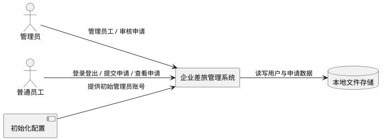
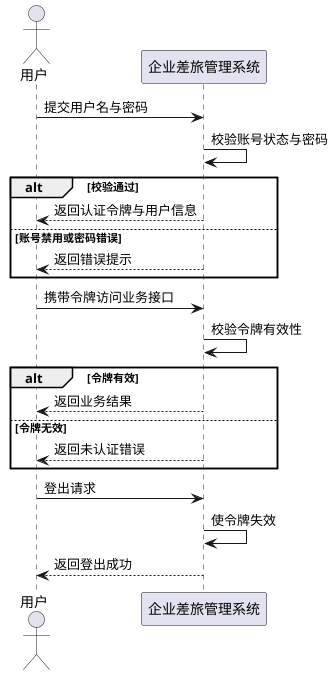
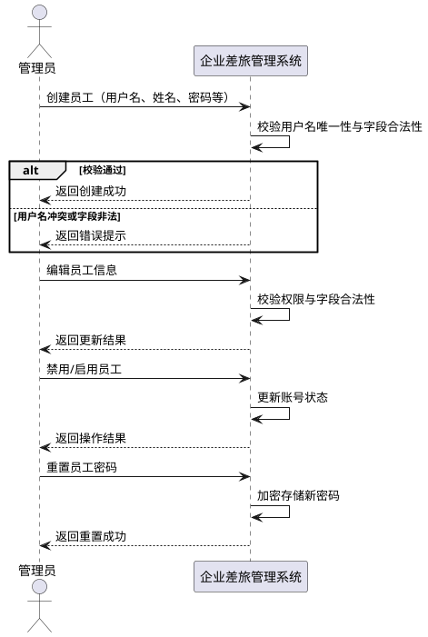
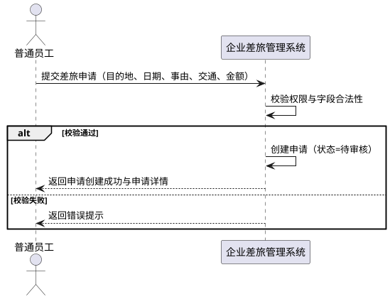
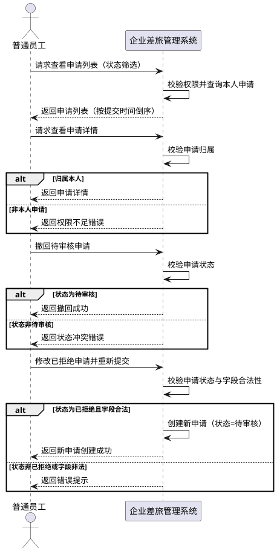
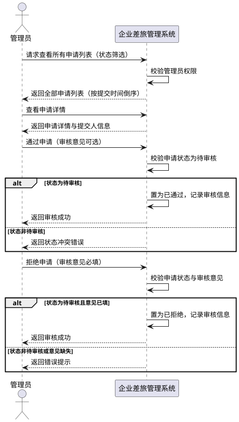
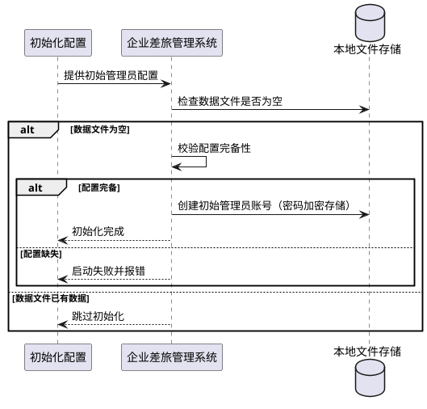

# **1. 组件定位**

## **1.1 核心职责**
本组件负责管理企业差旅申请的提交、查看与审核流程，实现差旅申请的全生命周期管控与角色化访问控制。

## **1.2 核心输入**
1. 用户的登录/登出请求（来源：前端用户操作，内容：用户名、密码或登出指令）
2. 管理员的员工管理指令（来源：管理员前端操作，内容：创建/编辑/禁用/启用/重置密码）
3. 普通员工的差旅申请提交请求（来源：员工前端操作，内容：申请单据字段）
4. 普通员工的申请查看/撤回/重新提交请求（来源：员工前端操作，内容：申请ID与操作类型）
5. 管理员的申请审核请求（来源：管理员前端操作，内容：申请ID、审核结果、审核意见）
6. 系统启动初始化信号（来源：系统启动触发，内容：初始管理员配置）

## **1.3 核心输出**
1. 登录认证响应（目标：前端调用方，内容：认证令牌与用户信息、角色）
2. 登出结果响应（目标：前端调用方，内容：登出成功标识）
3. 员工列表与员工管理操作结果响应（目标：管理员前端，内容：员工列表或操作结果）
4. 差旅申请列表与详情响应（目标：员工/管理员前端，内容：申请列表或申请详情）
5. 申请提交/撤回/重新提交结果响应（目标：员工前端，内容：操作结果与新申请详情）
6. 审核操作结果响应（目标：管理员前端，内容：审核结果与更新后的申请状态）
7. 错误提示信息（目标：前端调用方，内容：校验失败/权限不足/业务冲突等错误码与提示）

## **1.4 职责边界**
1. 本组件不负责差旅费用报销与财务结算。
2. 本组件不负责差旅申请的审批流配置（V1 仅支持管理员单级审核，不支持多级审批）。
3. 本组件不负责差旅政策规则引擎与超标自动拦截。
4. 本组件不负责出差行程的预订（机票/酒店/火车票预订）。
5. 本组件不负责组织架构管理与部门层级维护。
6. 本组件不负责消息通知（邮件/短信/站内信推送）。
7. 本组件不负责数据统计报表与导出。
8. 本组件不负责员工考勤与出差实际天数核算。

# **2. 领域术语**

**管理员**
: 拥有员工管理与差旅申请审核权限的系统角色，是系统中具有最高业务操作权限的用户类型。
: 备注：系统初始内置一个管理员账号，不支持通过界面创建新管理员。

**普通员工**
: 可提交差旅申请并查看本人申请的系统角色，不具备管理他人或审核申请的权限。

**差旅申请**
: 普通员工发起的出差请求单据，包含出差目的地、出发日期、返回日期、出差事由、交通工具、预计费用金额等信息。
: 备注：简称"申请"。

**申请状态**
: 差旅申请在生命周期中所处的阶段，取值为"待审核""已通过""已拒绝"三者之一。

**撤回**
: 员工将处于"待审核"状态的申请主动取消的操作，撤回后申请不可恢复。

**重新提交**
: 员工将"已拒绝"的申请修改后再次提交生成新申请的操作，原申请保持不变。

**审核意见**
: 管理员在审核申请时填写的说明性文字，通过时可选，拒绝时必填。

**禁用/启用**
: 管理员对员工账号可用状态的切换操作，禁用后员工无法登录系统，但账号数据与申请数据保留。

# **3. 角色与边界**

## **3.1 核心角色**
- 管理员：负责管理员工账号与审核差旅申请，是系统业务管理的核心角色。
- 普通员工：负责提交差旅申请并查看/管理本人申请，是系统业务使用的核心角色。

## **3.2 外部系统**
- 本地文件存储系统：与本组件交互以持久化用户数据与差旅申请数据。
- 初始化配置：系统启动时提供初始管理员账号配置信息（用户名与密码）。

## **3.3 交互上下文**

# **4. DFX约束**

## **4.1 性能**
1. 核心接口（登录、申请提交、申请列表查询、审核操作）响应时间上限：2 秒（单机本地文件存储场景）。
2. 申请列表单次返回记录数上限：100 条；超出时按提交时间倒序取前 100 条。

## **4.2 可靠性**
1. 系统可用性目标：单机部署场景下，业务时段可用性不低于 99%。
2. 数据持久化要求：所有用户数据与申请数据的写入操作必须同步落盘至本地文件，避免内存态丢失。
3. 数据一致性级别：单实例强一致，读写均基于同一份本地文件数据。

## **4.3 安全性**
1. 接口认证方式：除登录接口外，所有业务接口必须经过认证令牌校验，未认证请求必须被拒绝。
2. 密码存储要求：用户密码必须以不可逆的加盐哈希方式存储，禁止明文存储。
3. 权限隔离要求：管理员接口禁止普通员工访问；员工本人申请接口禁止访问他人申请数据。
4. 关键操作审计：员工管理操作（创建/禁用/启用/重置密码）与审核操作必须记录操作人、操作时间与操作内容。

## **4.4 可维护性**
1. 日志规范：系统必须输出结构化日志，包含时间戳、日志级别、操作模块、关键业务标识（如用户ID、申请ID）。
2. 错误码规范：所有对外错误响应必须包含统一错误码与可读错误提示，便于问题定位。

## **4.5 兼容性**
1. 接口兼容策略：V1 版本接口为基线版本，后续版本变更需保持向后兼容。
2. 存量数据迁移：V1 为首版，无存量数据迁移要求。

# **5. 核心能力**

## **5.1 登录与登出**

### **5.1.1 业务规则**

1. **登录认证规则**：用户必须使用用户名与密码登录，系统校验通过后签发认证令牌。
   a. 验收条件：When 用户提交正确的用户名与密码，the system shall 签发认证令牌并返回用户信息与角色。
2. **禁用账号登录拦截规则**：处于禁用状态的员工账号禁止登录系统。
   a. 验收条件：While 员工账号处于禁用状态，when 该员工提交登录请求，the system shall 拒绝登录并提示账号已禁用。
3. **登出规则**：用户登出后，其认证令牌必须失效，后续使用该令牌的请求必须被拒绝。
   a. 验收条件：When 用户执行登出操作，the system shall 使当前认证令牌失效并返回登出成功。
4. **未认证访问拦截规则**：未携带有效认证令牌的请求禁止访问业务接口。
   a. 验收条件：If 请求未携带有效认证令牌，the system shall 返回未认证错误并拒绝处理业务逻辑。
5. **禁止项**：禁止以明文形式在响应中返回用户密码。
   a. 验收条件：When 系统返回用户信息，the system shall 不包含密码字段。

### **5.1.2 交互流程**

### **5.1.3 异常场景**

1. **用户名或密码错误**
   a. 触发条件：用户提交的用户名不存在或密码与存储值不匹配
   b. 系统行为：拒绝登录，不签发令牌
   c. 用户感知：错误码 AUTH_INVALID_CREDENTIALS，提示"用户名或密码错误"
2. **账号已禁用**
   a. 触发条件：用户账号存在但处于禁用状态
   b. 系统行为：拒绝登录，不签发令牌
   c. 用户感知：错误码 AUTH_ACCOUNT_DISABLED，提示"账号已禁用，请联系管理员"
3. **认证令牌过期或无效**
   a. 触发条件：请求携带的令牌已失效或格式非法
   b. 系统行为：拒绝处理业务逻辑
   c. 用户感知：错误码 AUTH_TOKEN_INVALID，提示"登录已失效，请重新登录"

## **5.2 员工管理**

### **5.2.1 业务规则**

1. **管理员独占规则**：员工管理操作必须由管理员执行，普通员工禁止访问员工管理功能。
   a. 验收条件：If 普通员工发起员工管理请求，the system shall 返回权限不足错误。
2. **创建员工规则**：管理员创建员工时必须提供必要的员工信息，员工用户名必须唯一。
   a. 验收条件：When 管理员提交合法且用户名不重复的员工信息，the system shall 创建员工账号并默认为启用状态。
3. **用户名唯一性规则**：系统中不允许存在两个用户名相同的账号。
   a. 验收条件：If 管理员创建或编辑员工时使用已存在的用户名，the system shall 返回用户名冲突错误。
4. **编辑员工规则**：管理员可以编辑员工信息，但禁止通过编辑将普通员工提升为管理员。
   a. 验收条件：When 管理员提交员工编辑请求，the system shall 更新员工信息且不改变其为普通员工的角色。
5. **禁用/启用规则**：管理员可以切换员工账号的可用状态，禁用后员工无法登录但账号数据与申请数据保留。
   a. 验收条件：When 管理员禁用某员工账号，the system shall 将该账号置为禁用状态且保留其所有申请数据。
6. **重置密码规则**：管理员可以重置员工密码，重置后员工使用新密码登录。
   a. 验收条件：When 管理员提交重置密码请求，the system shall 更新该员工密码并以不可逆方式存储。
7. **禁止项**：禁止删除员工账号；禁止管理员创建新的管理员账号。
   a. 验收条件：If 管理员发起删除员工请求，the system shall 返回不支持操作错误。
   a. 验收条件：If 管理员发起创建管理员请求，the system shall 返回不支持操作错误。

### **5.2.2 交互流程**

### **5.2.3 异常场景**

1. **权限不足**
   a. 触发条件：普通员工发起员工管理请求
   b. 系统行为：拒绝处理，不执行任何管理操作
   c. 用户感知：错误码 FORBIDDEN，提示"权限不足"
2. **用户名冲突**
   a. 触发条件：创建或编辑员工时使用的用户名已存在
   b. 系统行为：拒绝创建/更新，保留原数据
   c. 用户感知：错误码 USER_NAME_CONFLICT，提示"用户名已存在"
3. **员工不存在**
   a. 触发条件：编辑/禁用/启用/重置密码的目标员工ID不存在
   b. 系统行为：拒绝操作
   c. 用户感知：错误码 USER_NOT_FOUND，提示"员工不存在"
4. **必填字段缺失**
   a. 触发条件：创建/编辑员工时缺少必填字段
   b. 系统行为：拒绝创建/更新
   c. 用户感知：错误码 VALIDATION_ERROR，提示具体缺失字段

## **5.3 差旅申请提交**

### **5.3.1 业务规则**

1. **员工独占规则**：差旅申请提交必须由普通员工执行，管理员禁止提交差旅申请。
   a. 验收条件：If 管理员发起差旅申请提交请求，the system shall 返回权限不足错误。
2. **必填字段规则**：申请必须包含出差目的地、出发日期、返回日期、出差事由、交通工具、预计费用金额，且各字段必须满足对应约束。
   a. 验收条件：When 员工提交满足所有字段约束的申请，the system shall 创建申请并置为"待审核"状态。
3. **日期顺序规则**：返回日期必须晚于或等于出发日期。
   a. 验收条件：If 员工提交的返回日期早于出发日期，the system shall 返回校验错误。
4. **交通工具取值规则**：交通工具必须为预设枚举值之一（火车、飞机、汽车等）。
   a. 验收条件：If 员工提交的交通工具不在允许枚举范围内，the system shall 返回校验错误。
5. **费用金额规则**：预计费用金额必须为非负数值。
   a. 验收条件：If 员工提交的预计费用金额为负数，the system shall 返回校验错误。
6. **初始状态规则**：新提交的申请必须以"待审核"状态创建。
   a. 验收条件：When 申请创建成功，the system shall 将其状态置为"待审核"并记录提交时间与提交人。
7. **禁止项**：禁止员工提交他人名义的差旅申请。
   a. 验收条件：If 员工提交的申请提交人标识与当前登录用户不一致，the system shall 返回权限不足错误。

### **5.3.2 交互流程**

### **5.3.3 异常场景**

1. **权限不足**
   a. 触发条件：管理员或未认证用户发起申请提交
   b. 系统行为：拒绝创建申请
   c. 用户感知：错误码 FORBIDDEN，提示"权限不足"
2. **必填字段缺失或非法**
   a. 触发条件：申请缺少必填字段或字段值不满足约束
   b. 系统行为：拒绝创建申请
   c. 用户感知：错误码 VALIDATION_ERROR，提示具体字段错误
3. **日期逻辑错误**
   a. 触发条件：返回日期早于出发日期
   b. 系统行为：拒绝创建申请
   c. 用户感知：错误码 VALIDATION_ERROR，提示"返回日期不能早于出发日期"

## **5.4 差旅申请查看与管理（员工侧）**

### **5.4.1 业务规则**

1. **本人可见规则**：普通员工只能查看自己提交的差旅申请，禁止查看他人申请。
   a. 验收条件：If 普通员工请求查看不属于本人的申请，the system shall 返回权限不足错误。
2. **列表筛选规则**：申请列表必须支持按状态筛选（全部/待审核/已通过/已拒绝），并按提交时间倒序排列。
   a. 验收条件：When 员工请求查看指定状态的申请列表，the system shall 返回该状态下本人申请并按提交时间倒序排列。
3. **撤回规则**：员工只能撤回处于"待审核"状态的申请，撤回后申请不可恢复。
   a. 验收条件：While 申请处于"待审核"状态，when 员工发起撤回请求，the system shall 撤回该申请且不允许恢复。
4. **撤回状态约束规则**：禁止撤回"已通过"或"已拒绝"状态的申请。
   a. 验收条件：If 员工对非"待审核"状态申请发起撤回请求，the system shall 返回状态冲突错误。
5. **重新提交规则**：员工只能对"已拒绝"状态的申请修改后重新提交，重新提交必须生成新的申请单据。
   a. 验收条件：While 申请处于"已拒绝"状态，when 员工修改字段后发起重新提交，the system shall 创建一条新的"待审核"申请，原申请保持不变。
6. **重新提交状态约束规则**：禁止对"待审核"或"已通过"状态的申请执行重新提交。
   a. 验收条件：If 员工对非"已拒绝"状态申请发起重新提交请求，the system shall 返回状态冲突错误。
7. **禁止项**：禁止员工删除差旅申请。
   a. 验收条件：If 员工发起删除申请请求，the system shall 返回不支持操作错误。

### **5.4.2 交互流程**

### **5.4.3 异常场景**

1. **访问他人申请**
   a. 触发条件：普通员工请求查看/操作不属于本人的申请
   b. 系统行为：拒绝访问，不返回任何申请数据
   c. 用户感知：错误码 FORBIDDEN，提示"权限不足"
2. **申请不存在**
   a. 触发条件：操作的申请ID不存在
   b. 系统行为：拒绝操作
   c. 用户感知：错误码 REQUEST_NOT_FOUND，提示"申请不存在"
3. **撤回状态冲突**
   a. 触发条件：对非"待审核"状态申请发起撤回
   b. 系统行为：拒绝撤回，不改变申请状态
   c. 用户感知：错误码 STATE_CONFLICT，提示"仅待审核申请可撤回"
4. **重新提交状态冲突**
   a. 触发条件：对非"已拒绝"状态申请发起重新提交
   b. 系统行为：拒绝重新提交，不创建新申请
   c. 用户感知：错误码 STATE_CONFLICT，提示"仅已拒绝申请可重新提交"
5. **重新提交字段非法**
   a. 触发条件：重新提交时修改后的字段不满足约束
   b. 系统行为：拒绝创建新申请
   c. 用户感知：错误码 VALIDATION_ERROR，提示具体字段错误

## **5.5 差旅申请审核（管理员侧）**

### **5.5.1 业务规则**

1. **管理员独占规则**：差旅申请审核必须由管理员执行，普通员工禁止审核申请。
   a. 验收条件：If 普通员工发起审核请求，the system shall 返回权限不足错误。
2. **全量可见规则**：管理员可以查看所有员工提交的差旅申请。
   a. 验收条件：When 管理员请求查看申请列表，the system shall 返回所有员工的申请并按提交时间倒序排列。
3. **审核目标状态规则**：管理员只能对"待审核"状态的申请执行审核操作。
   a. 验收条件：If 管理员对非"待审核"状态申请发起审核请求，the system shall 返回状态冲突错误。
4. **通过审核规则**：管理员通过申请时，审核意见为可选填写，通过后申请状态变更为"已通过"。
   a. 验收条件：While 申请处于"待审核"状态，when 管理员发起通过请求，the system shall 将申请状态置为"已通过"并记录审核意见、审核人与审核时间。
5. **拒绝审核规则**：管理员拒绝申请时，审核意见为必填，拒绝后申请状态变更为"已拒绝"。
   a. 验收条件：While 申请处于"待审核"状态，when 管理员发起拒绝请求且未填写审核意见，the system shall 返回校验错误。
   a. 验收条件：While 申请处于"待审核"状态，when 管理员发起拒绝请求且已填写审核意见，the system shall 将申请状态置为"已拒绝"并记录审核意见、审核人与审核时间。
6. **审核记录规则**：审核操作必须记录审核人、审核时间与审核意见（若有）。
   a. 验收条件：When 审核操作完成，the system shall 在申请上记录审核人标识、审核时间戳与审核意见。
7. **禁止项**：禁止管理员修改申请的业务字段内容（目的地、日期、事由、交通、金额）。
   a. 验收条件：If 管理员发起修改申请业务字段请求，the system shall 返回不支持操作错误。

### **5.5.2 交互流程**

### **5.5.3 异常场景**

1. **权限不足**
   a. 触发条件：普通员工发起审核请求
   b. 系统行为：拒绝审核，不改变申请状态
   c. 用户感知：错误码 FORBIDDEN，提示"权限不足"
2. **申请不存在**
   a. 触发条件：审核的申请ID不存在
   b. 系统行为：拒绝审核
   c. 用户感知：错误码 REQUEST_NOT_FOUND，提示"申请不存在"
3. **审核状态冲突**
   a. 触发条件：对非"待审核"状态申请发起审核
   b. 系统行为：拒绝审核，不改变申请状态
   c. 用户感知：错误码 STATE_CONFLICT，提示"仅待审核申请可审核"
4. **拒绝时审核意见缺失**
   a. 触发条件：拒绝申请但未填写审核意见
   b. 系统行为：拒绝该审核操作
   c. 用户感知：错误码 VALIDATION_ERROR，提示"拒绝申请必须填写审核意见"

## **5.6 系统初始化**

### **5.6.1 业务规则**

1. **初始管理员规则**：系统启动时若数据文件为空，必须根据预设配置初始化一个管理员账号。
   a. 验收条件：While 数据文件为空，when 系统启动，the system shall 根据配置创建初始管理员账号并加密存储其密码。
2. **幂等初始化规则**：若数据文件已存在数据，系统启动时禁止重复初始化管理员账号。
   a. 验收条件：While 数据文件已存在用户数据，when 系统启动，the system shall 不执行初始化操作。
3. **配置完备性规则**：初始管理员配置必须包含用户名与密码，缺失时系统必须启动失败并明确报错。
   a. 验收条件：If 初始管理员配置缺失用户名或密码，the system shall 启动失败并输出配置错误日志。

### **5.6.2 交互流程**

### **5.6.3 异常场景**

1. **初始配置缺失**
   a. 触发条件：系统启动时未提供初始管理员用户名或密码
   b. 系统行为：终止启动流程
   c. 用户感知：错误码 INIT_CONFIG_MISSING，提示"初始管理员配置缺失，系统无法启动"

# **6. 数据约束**

## **6.1 用户**
1. **用户名**：全局唯一，非空，由字母、数字、下划线组成，长度 3-20 字符。
2. **姓名**：非空，长度 1-50 字符。
3. **密码**：非空，以不可逆加盐哈希方式存储，禁止明文存储；明文长度不少于 6 字符。
4. **角色**：取值为"管理员"或"普通员工"二者之一，非空。
5. **账号状态**：取值为"启用"或"禁用"二者之一，默认为"启用"。
6. **创建时间**：非空，记录账号创建时间戳。
7. **更新时间**：非空，记录账号最近一次更新时间戳。

## **6.2 差旅申请**
1. **申请ID**：全局唯一，非空，由系统自动生成。
2. **提交人**：非空，关联到系统中存在的普通员工用户名。
3. **出差目的地**：非空，长度 1-100 字符。
4. **出发日期**：非空，合法日期。
5. **返回日期**：非空，合法日期，且必须晚于或等于出发日期。
6. **出差事由**：非空，长度 1-500 字符。
7. **交通工具**：非空，取值为预设枚举之一（火车、飞机、汽车等）。
8. **预计费用金额**：非空，非负数值，精确到小数点后两位。
9. **申请状态**：非空，取值为"待审核""已通过""已拒绝"三者之一，初始为"待审核"。
10. **提交时间**：非空，记录申请提交时间戳。
11. **审核人**：可选，当申请状态为"已通过"或"已拒绝"时非空，关联到管理员用户名。
12. **审核时间**：可选，当申请状态为"已通过"或"已拒绝"时非空，记录审核操作时间戳。
13. **审核意见**：可选，长度 0-500 字符；当申请状态为"已拒绝"时必填。