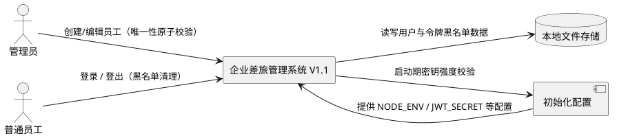
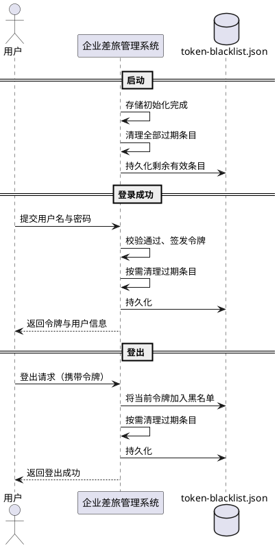
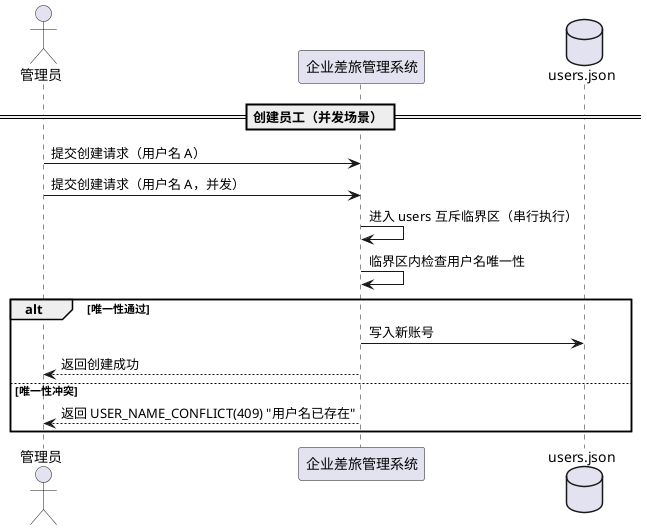
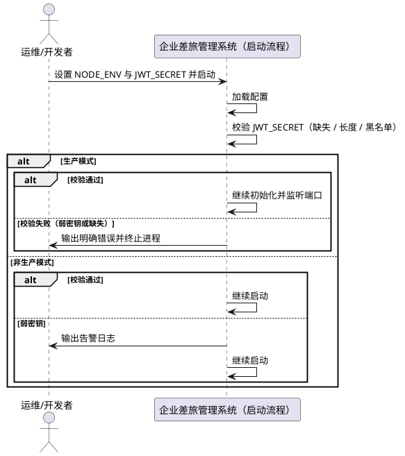

# 企业差旅管理系统 V1.1 加固版需求规格

> 版本：V1.1（加固版）｜基线：V1.0（2026-08-11）
> 定位：针对 code-reviewer 审查发现的高置信度风险进行系统加固，**不改变 V1.0 已有业务功能与接口语义**。

# **1. 组件定位**

## **1.1 核心职责**
本组件负责在保持 V1.0 全部业务功能与接口语义不变的前提下，对企业差旅管理系统进行三项安全与可靠性加固：令牌黑名单定期清理、用户唯一性检查的并发原子化、JWT_SECRET 密钥强度校验。

## **1.2 核心输入**
1. 系统启动信号（来源：Node.js 进程启动，内容：环境变量配置，含 NODE_ENV、JWT_SECRET）
2. 用户登录请求（来源：前端用户操作，内容：用户名、密码）
3. 用户登出请求（来源：前端用户操作，内容：当前认证令牌）
4. 管理员创建员工请求（来源：管理员前端操作，内容：用户名、姓名、初始密码）
5. 管理员编辑员工请求（来源：管理员前端操作，内容：员工ID、用户名、姓名、状态）
6. 令牌黑名单写入与查询请求（来源：认证服务与鉴权中间件，内容：令牌及其过期时间）

## **1.3 核心输出**
1. 系统启动校验结果（目标：进程运行环境，内容：配置校验通过/告警/失败退出）
2. 登录认证响应（目标：前端调用方，内容：认证令牌与用户信息、角色，行为与 V1.0 一致）
3. 登出结果响应（目标：前端调用方，内容：登出成功标识，行为与 V1.0 一致）
4. 员工管理操作结果响应（目标：管理员前端，内容：创建/编辑结果，行为与 V1.0 一致）
5. 令牌黑名单清理结果（目标：本地文件存储，内容：清理后剩余的有效黑名单条目）
6. 结构化日志（目标：运行环境日志输出，内容：清理操作、配置告警/错误等）

## **1.4 职责边界**
1. 本组件不改变 V1.0 的登录、申请提交、撤回、重新提交、审批、用户管理等既有业务行为与接口语义。
2. 本组件不改变前端页面、路由、接口地址与请求/响应数据结构（接口字段与错误码语义保持兼容）。
3. 本组件不引入新的存储技术；仍使用本地 JSON 文件持久化。
4. 本组件不引入分布式锁、消息队列、外部缓存等新组件；并发互斥仅基于现有进程内串行写锁机制实现。
5. 本组件不负责数据库级别的数据迁移；`users.json`、`token-blacklist.json` 的存量数据结构保持兼容。
6. 本组件不扩展新的业务功能（如多级审批、报销、通知等），仅对已确认的三项风险点进行加固。

# **2. 领域术语**

**加固**
: 在不改变既有业务语义的前提下，对系统安全性、可靠性、并发正确性进行增强的工程活动。

**令牌黑名单**
: 用于记录已登出、需立即失效的 JWT 令牌的条目集合，持久化于 `token-blacklist.json`。
: 备注：每条黑名单记录包含令牌原文与过期时间（expiresAt）。

**过期条目**
: 黑名单中 `expiresAt` 早于当前时间的记录，可安全删除，不影响任何有效令牌的校验。

**互斥临界区**
: 将"唯一性检查 + 数据写入"视为一个不可分割单元串行执行的区域，用于消除 check-then-act 竞态。
: 备注：V1.1 基于 JsonStoreEngine 既有的 per-collection 串行写锁实现。

**TOCTOU 竞态**
: Time-of-check to time-of-use，指"先检查后使用"之间存在时间窗口、导致并发下检查结果失效的问题。

**弱密钥**
: 长度不足 32 字符，或命中系统内置示例/弱密钥黑名单（如 `dev-jwt-secret-key-for-testing-only`、`your-jwt-secret-key-change-in-production`）的 JWT_SECRET。

**fail-fast**
: 启动阶段立即失败并终止进程的配置校验策略，用于生产环境杜绝弱密钥带病运行。

# **3. 角色与边界**

## **3.1 核心角色**
- 管理员：执行员工创建、编辑、禁用/启用、重置密码等管理操作；V1.1 加固不改变其操作方式与返回结果。
- 普通员工：执行登录、登出、差旅申请相关操作；V1.1 加固不改变其操作方式与返回结果。

## **3.2 外部系统**
- 本地文件存储系统：读写 `users.json`、`token-blacklist.json` 等 JSON 数据文件。
- 初始化配置：系统启动时提供环境变量（NODE_ENV、JWT_SECRET、INIT_ADMIN_* 等）。

## **3.3 交互上下文**

# **4. DFX约束**

## **4.1 性能**
1. 核心接口（登录、登出、员工创建、员工编辑）响应时间上限保持 V1.0 基线：2 秒（单机本地文件存储场景）。
2. 黑名单单次按需清理的过期条目数不做上限限定，但单次清理必须为同步文件写入且不得引入额外的轮询/定时任务。
3. 用户唯一性原子化方法不得引入除既有写锁之外的新增等待机制；临界区外不增加额外 I/O。

## **4.2 可靠性**
1. 黑名单清理失败（含写入失败）不得阻断登录/登出主流程，且不得导致有效条目丢失或重复。
2. 用户唯一性原子化必须保证 users 集合强一致：并发操作后，任一用户名最多对应一个账号记录。
3. 清理与登出写入并发时必须串行执行，避免互相覆盖丢失数据。

## **4.3 安全性**
1. JWT_SECRET 必须满足最小长度 ≥ 32 字符且不得命中内置示例/弱密钥黑名单。
2. 生产模式（NODE_ENV=production）下弱密钥必须导致启动失败，禁止带病运行。
3. 非生产模式下弱密钥必须输出告警日志，便于开发阶段及早发现。
4. 用户密码存储方式、令牌签发与校验机制保持 V1.0 不变（bcrypt + JWT）。

## **4.4 可维护性**
1. 黑名单清理操作必须输出结构化日志，包含清理时间、清理前/后条目数。
2. 启动期配置校验失败/告警必须输出结构化日志，包含失败原因类别（缺失/过短/命中黑名单）。
3. 新增错误信息必须遵循既有错误码与错误提示规范，便于问题定位。

## **4.5 兼容性**
1. V1.0 全部对外接口、请求参数、响应结构与错误码语义保持兼容，V1.1 不引入破坏性变更。
2. `users.json`、`token-blacklist.json` 存量数据格式保持兼容，无需数据迁移。
3. 开发模式下的默认 `JWT_SECRET` 示例值在 V1.1 起将被判定为弱密钥（开发模式告警、生产模式拦截），属预期行为变更，不影响开发启动。

# **5. 核心能力**

## **5.1 令牌黑名单定期清理**

### **5.1.1 业务规则**

1. **启动清理规则**：系统完成存储初始化后，必须清理令牌黑名单中的全部过期条目。
   a. 验收条件：When 系统启动并完成存储初始化，the system shall 清理 `token-blacklist` 中全部过期条目并将结果持久化。
2. **登录按需清理规则**：用户登录成功时，系统必须按需清理令牌黑名单中的过期条目。
   a. 验收条件：When 用户登录成功，the system shall 清理 `token-blacklist` 中的过期条目并持久化，且不影响本次登录结果。
3. **登出按需清理规则**：用户登出时，系统在将当前令牌加入黑名单后，必须按需清理过期条目。
   a. 验收条件：When 用户执行登出操作，the system shall 将当前令牌加入黑名单并清理既有过期条目，随后返回登出成功。
4. **清理范围规则**：清理操作仅允许移除 `expiresAt` 早于当前时间的条目，禁止误删未过期条目。
   a. 验收条件：When 清理操作执行完毕，the system shall 仅删除已过期条目，所有未过期条目保持完整。
5. **清理并发安全规则**：清理操作必须与黑名单的读写操作（含登出加入条目、鉴权查询）在同一互斥临界区内串行执行。
   a. 验收条件：While 清理操作与登出加入条目并发发生，the system shall 串行执行两者，保证既有有效条目与新增条目均不丢失。
6. **清理容错规则**：清理或清理后的持久化失败时，系统必须回滚内存态、记录错误日志，且不得阻断登录/登出主流程。
   a. 验收条件：If 清理持久化失败，the system shall 恢复清理前的内存态、输出错误日志，并照常返回登录/登出结果。
7. **黑名单校验语义保持规则**：清理机制不得改变令牌失效校验语义——已登出令牌（含过期与未过期）访问接口仍必须被拒绝。
   a. 验收条件：While 令牌处于黑名单中，when 携带该令牌访问业务接口，the system shall 返回令牌已失效错误（与 V1.0 一致）。
8. **清理时机范围规则**：V1.1 仅允许在启动、登录成功、登出三个时机触发清理，禁止引入独立定时任务或新增清理入口。
   a. 验收条件：If 除上述三个时机外存在任何其他自动清理触发源，the system shall 不产生该行为（该条件用于约束实现范围）。

### **5.1.2 交互流程**

### **5.1.3 异常场景**

1. **清理持久化失败**
   a. 触发条件：清理后写入 `token-blacklist.json` 失败
   b. 系统行为：恢复清理前内存态，输出错误日志，继续完成登录/登出主流程
   c. 用户感知：登录/登出接口仍返回正常结果；通过日志定位失败原因
2. **清理与登出写入并发竞争**
   a. 触发条件：登出加入新条目与清理过期条目同时发生
   b. 系统行为：两者在统一临界区内串行执行，不丢失任何条目
   c. 用户感知：无感知，登出返回成功
3. **数据文件损坏导致清理无法解析**
   a. 触发条件：`token-blacklist.json` 内容损坏、无法解析
   b. 系统行为：记录错误日志，不执行清理，不阻断主流程（行为不劣于 V1.0）
   c. 用户感知：登录/登出按 V1.0 行为继续，错误仅记录于日志

## **5.2 用户唯一性并发原子化**

### **5.2.1 业务规则**

1. **创建原子化规则**：创建员工时，"用户名唯一性检查 + 写入用户数据"必须整体纳入同一互斥临界区执行。
   a. 验收条件：When 管理员发起创建员工请求，the system shall 在临界区内完成唯一性检查与数据写入，消除检查与写入之间的竞态窗口。
2. **编辑原子化规则**：修改员工用户名时，"新用户名唯一性检查 + 写入更新数据"必须整体纳入同一互斥临界区执行。
   a. 验收条件：When 管理员提交修改员工用户名的请求，the system shall 在临界区内校验新用户名唯一性后写入更新。
3. **并发重名单成功规则**：并发提交相同用户名的创建请求时，最终必须仅有一个请求成功创建账号。
   a. 验收条件：When 两个创建请求携带相同用户名并发提交，the system shall 仅允许其中一个成功，另一个被拒绝。
4. **并发失败语义保持规则**：并发冲突失败必须返回与 V1.0 完全一致的错误码与提示（`USER_NAME_CONFLICT`、HTTP 409、"用户名已存在"）。
   a. 验收条件：If 并发场景下唯一性校验失败，the system shall 返回错误码 `USER_NAME_CONFLICT`、HTTP 状态 409 及提示"用户名已存在"。
5. **复用既有写锁规则**：原子化方法必须复用 JsonStoreEngine 既有的 per-collection 串行写锁实现临界区，禁止引入新的锁机制或外部组件。
   a. 验收条件：When 原子化方法执行，the system shall 基于既有 users 集合串行写锁将检查与写入串行化，且不引入新依赖。
6. **非用户集合不受影响规则**：本版本仅对 users 集合的唯一性敏感操作进行原子化，requests、audit-logs、token-blacklist 的既有行为与并发特性保持不变。
   a. 验收条件：When 申请提交、审批、审计记录、黑名单写入等非用户集合操作执行，the system shall 行为与 V1.0 完全一致。
7. **接口语义保持规则**：原子化加固不得改变创建/编辑员工接口的请求参数、成功响应结构与字段校验规则。
   a. 验收条件：When 创建/编辑员工请求成功，the system shall 返回与 V1.0 结构一致的响应数据（含审计记录行为不变）。
8. **唯一性约束保证规则**：任一时刻，users 集合中不得存在两个用户名相同的账号记录（含并发场景）。
   a. 验收条件：While 系统处于运行状态，when 任意时刻查询 users 集合，the system shall 不存在用户名重复的记录。

### **5.2.2 交互流程**

### **5.2.3 异常场景**

1. **并发用户名冲突**
   a. 触发条件：多个管理员并发创建/修改为相同用户名
   b. 系统行为：在临界区内串行校验，仅首个通过，其余返回唯一性冲突
   c. 用户感知：错误码 `USER_NAME_CONFLICT`、HTTP 409、提示"用户名已存在"（与 V1.0 一致）
2. **临界区内写入失败**
   a. 触发条件：唯一性检查通过后写入 `users.json` 失败
   b. 系统行为：回滚内存态，输出错误日志
   c. 用户感知：错误码 `STORE_WRITE_FAILED`、HTTP 500、提示"数据写入失败"（与 V1.0 一致）
3. **数据文件损坏导致临界区内读取失败**
   a. 触发条件：`users.json` 内容损坏、无法解析
   b. 系统行为：记录错误日志，拒绝本次创建/编辑操作
   c. 用户感知：返回明确的服务端错误，不产生半写入状态

## **5.3 JWT_SECRET 强度校验**

### **5.3.1 业务规则**

1. **最小长度规则**：JWT_SECRET 的长度必须不少于 32 字符。
   a. 验收条件：If JWT_SECRET 长度小于 32 字符，the system shall 将其判定为弱密钥。
2. **弱密钥黑名单规则**：JWT_SECRET 命中内置示例/弱密钥黑名单时必须被判定为弱密钥；黑名单至少包含 `dev-jwt-secret-key-for-testing-only` 与 `your-jwt-secret-key-change-in-production`。
   a. 验收条件：If JWT_SECRET 与黑名单中任一示例值完全一致，the system shall 将其判定为弱密钥。
3. **生产模式 fail-fast 规则**：当 NODE_ENV=production 时，若 JWT_SECRET 缺失、过短或命中黑名单，系统必须拒绝启动并终止进程。
   a. 验收条件：While 系统处于生产模式启动流程，if JWT_SECRET 为弱密钥或缺失，the system shall 终止启动并输出错误日志。
4. **开发模式告警规则**：当 NODE_ENV 非 production 时，若 JWT_SECRET 为弱密钥，系统必须输出告警日志并允许继续启动。
   a. 验收条件：While 系统处于非生产模式启动流程，if JWT_SECRET 为弱密钥，the system shall 输出告警日志并正常启动。
5. **密钥缺失拒绝启动规则**：任何模式下 JWT_SECRET 未配置时，系统必须拒绝启动并提示配置缺失（保持 V1.0 语义）。
   a. 验收条件：If JWT_SECRET 未配置，the system shall 拒绝启动并输出配置缺失错误。
6. **错误信息可定位规则**：生产模式下拒绝启动的错误信息必须明确失败原因类别（缺失 / 长度不足 / 命中示例黑名单）。
   a. 验收条件：When 生产模式因弱密钥拒绝启动，the system shall 在错误信息中指出具体失败原因类别。
7. **校验时机规则**：JWT_SECRET 强度校验必须在服务开始监听端口之前完成。
   a. 验收条件：When 启动流程执行密钥校验，the system shall 在端口监听前完成校验，确保弱密钥进程不会对外提供服务。

### **5.3.2 交互流程**

### **5.3.3 异常场景**

1. **生产模式弱密钥**
   a. 触发条件：NODE_ENV=production 且 JWT_SECRET 缺失 / 过短 / 命中示例黑名单
   b. 系统行为：输出包含失败原因的错误日志并终止进程，不监听端口
   c. 用户感知：进程退出码非 0，控制台输出明确错误信息
2. **开发模式弱密钥**
   a. 触发条件：NODE_ENV 非 production 且 JWT_SECRET 为弱密钥
   b. 系统行为：输出告警日志后继续正常启动
   c. 用户感知：控制台输出 WARN 告警，服务照常可用
3. **强密钥校验通过**
   a. 触发条件：JWT_SECRET 长度 ≥ 32 字符且未命中黑名单
   b. 系统行为：不输出告警，正常完成启动
   c. 用户感知：无额外提示，启动日志与 V1.0 一致

# **6. 数据约束**

## **6.1 令牌黑名单条目（token-blacklist）**
1. **id**：每条记录的全局唯一标识，格式不限，同一集合内不得重复。
2. **token**：登出时写入的 JWT 令牌原文，用于鉴权时精确匹配；同一集合内允许重复写入但以 V1.0 校验语义为准。
3. **expiresAt**：令牌的过期时间（ISO 8601 格式字符串）；清理时以此为唯一过期判据，当前时间晚于该值时视为过期。
4. **清理幂等性**：对同一数据状态重复执行清理，其结果必须一致（无副作用）。

## **6.2 用户账号（users）**
1. **username**：全局唯一，创建与编辑时必须在互斥临界区内校验；同一集合内不得存在两个相同的用户名。
2. **id**：账号唯一标识，创建时生成，创建后不得变更。
3. **passwordHash**：密码的 bcrypt 哈希值，接口响应中必须剔除，V1.1 不改变其存储与使用方式。
4. **role / status**：取值与语义保持 V1.0 不变（角色仅 ADMIN/EMPLOYEE；状态仅 ACTIVE/DISABLED）。
5. **createdAt / updatedAt**：记录创建与最近更新时间，格式保持 ISO 8601 字符串。