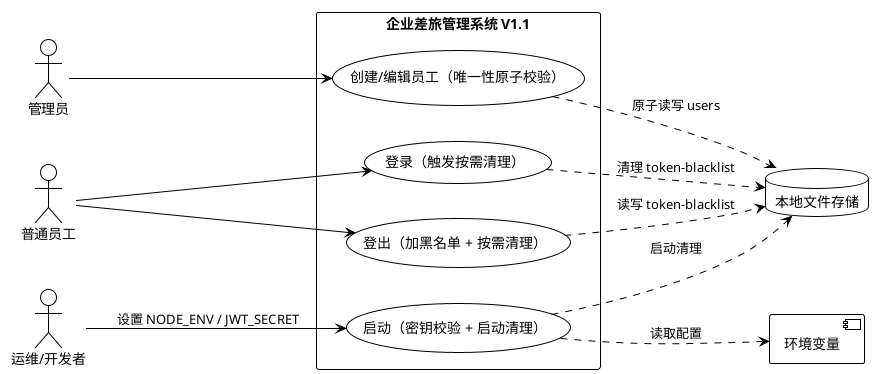
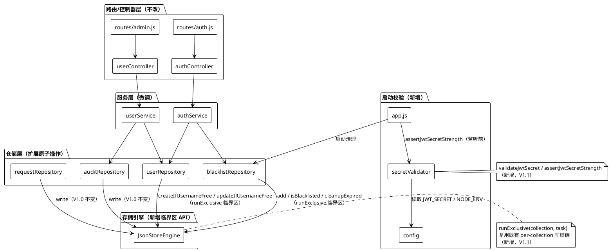
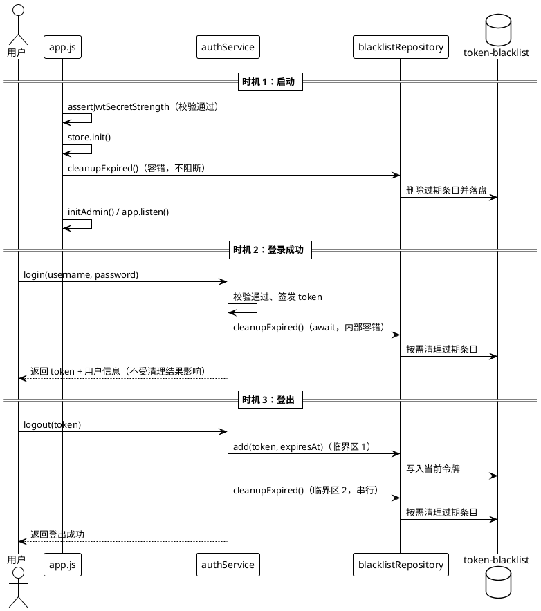
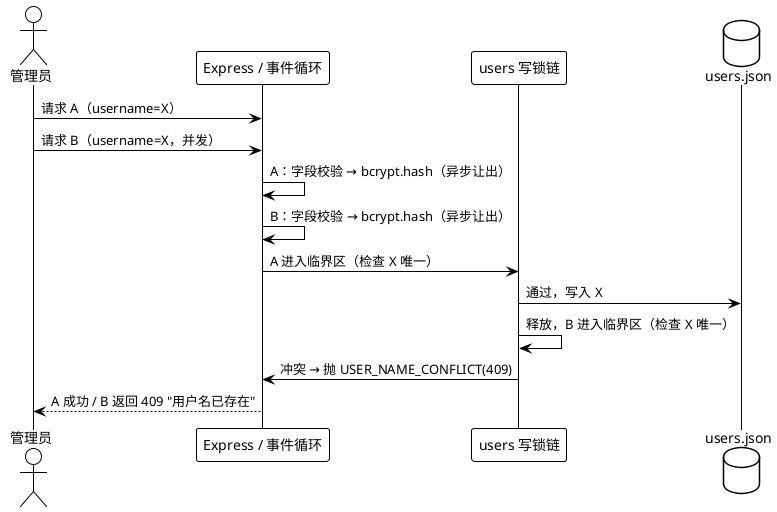
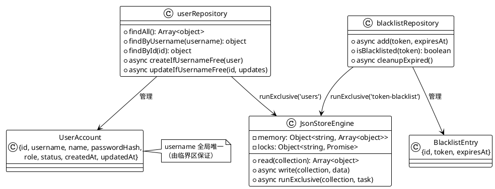
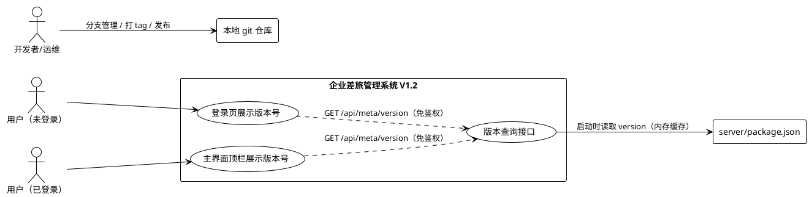
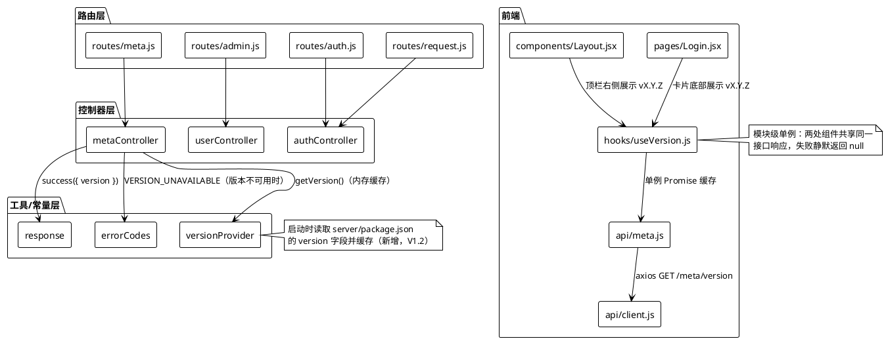
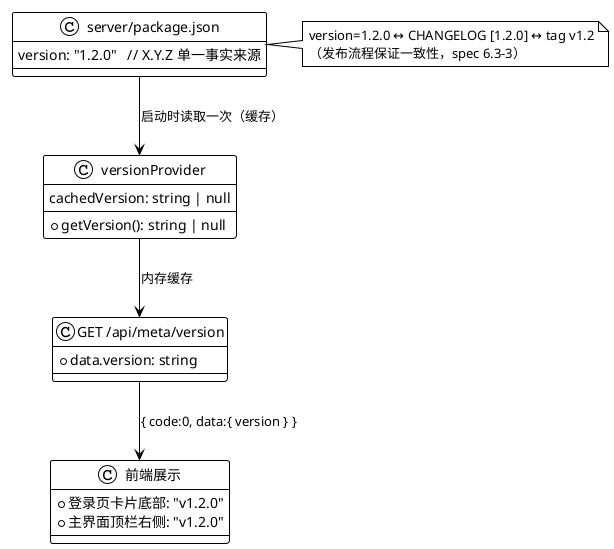

# 企业差旅管理系统技术设计方案（V1.2）

> 版本：V1.2 ｜ 基线：V1.1（加固版，2026-08-11）
> 对应需求：`docs/spec.md`（V1.1 基线 23 条 + V1.2 新增 5A-1~13「版本分支管理策略」、5B-1~11「版本号展示」）
> 文档结构说明：**第一、二章为 V1.1 加固版技术设计（完整保留作为基线，各章标题标注【V1.1 基线，保持不变】）**；**第三、四章为 V1.2 新增设计（需求与存量关系分析 + 增量设计方案）**。
> 设计原则（V1.1 基线，保持不变）：改动点最小化、保持 V1.0 业务语义与接口完全兼容、复用既有 per-collection 串行写锁机制、不引入新组件/新存储/定时任务。
> 设计原则（V1.2 新增）：版本号单一事实来源（`server/package.json`）、新增版本接口为纯增量公开接口、前端失败静默降级（隐藏版本号、不阻断、不弹错）、版本分支策略文档化并落地（`BRANCHING.md`）。

## V1.2 变更概览（V1.1 → V1.2）

| 需求编号 | 变更类型 | 对应设计章节 | 一句话说明 |
|---------|---------|-------------|-----------|
| 5A-1 ~ 5A-13 | 新增 | 第三、四章 | 版本分支管理策略：GitHub Flow 简化版文档化（BRANCHING.md）+ 历史分支补建 + V1.2 发布流程落地 |
| 5B-1 ~ 5B-11 | 新增 | 第三、四章 | 版本号展示：后端公开版本接口 + 前端登录页/主界面两处展示 + 失败降级 + 版本号自动跟随 |

---

# 一、需求与存量功能关系分析【V1.1 基线，保持不变】

本章明确 V1.1 三项加固需求与 V1.0 现有代码的关系，是增量设计的基础。所有代码位置均已核实到文件级（函数级以行号标注）。

## 1.1 需求功能与存量功能对比

### 1.1.1 已实现功能

以下功能在 V1.0 已完整实现，V1.1 **保持原样、不做改动**：

| 需求功能 | 存量功能 | 代码位置 | 匹配度 |
|---------|---------|---------|--------|
| 登出时将当前令牌加入黑名单 | `authService.logout()` 调用 `blacklistRepository.add()`，写入 `{id, token, expiresAt}` | `server/src/services/authService.js:36-42`；`server/src/repositories/blacklistRepository.js:4-8` | 100% |
| 鉴权时校验令牌是否在黑名单中 | `authRequired` 中间件调用 `blacklistRepository.isBlacklisted()`，命中返回 `AUTH_TOKEN_INVALID`(401) | `server/src/middlewares/auth.js:16-18`；`server/src/repositories/blacklistRepository.js:10-13` | 100% |
| 用户名唯一性检查的错误语义（`USER_NAME_CONFLICT` / HTTP 409 / "用户名已存在"） | `createUser()` 与 `updateUser()` 中的 `findByUsername` 冲突检查 | `server/src/services/userService.js:30-33, 73-76`；`server/src/constants/errorCodes.js:6` | 100% |
| JWT_SECRET 缺失时拒绝启动（`INIT_CONFIG_MISSING`） | `startServer()` 起始处缺失检查 | `server/src/app.js:19-21`；`server/src/constants/errorCodes.js:11` | 100% |
| 存储写入失败回滚内存态并抛 `STORE_WRITE_FAILED` | `JsonStoreEngine.write()` 的 try/catch 回滚逻辑 | `server/src/store/JsonStoreEngine.js:42-53` | 100% |
| 黑名单"按过期时间过滤"的删除逻辑 | `blacklistRepository.cleanupExpired()` 的 filter 判断（V1.1 仅扩展调用时机与临界区，不重写过滤逻辑） | `server/src/repositories/blacklistRepository.js:15-22` | 75%（逻辑已实现，缺调用点/临界区/日志，见 1.1.2） |
| 员工创建/编辑/禁用/重置密码、申请、审批、审计等既有业务 | 服务层 `userService` / `requestService` / `reviewService` / `auditService` 全量逻辑 | `server/src/services/*.js` | 100%（V1.1 不改动其业务语义） |

### 1.1.2 需要扩展的功能

以下功能与存量代码部分匹配，需要在现有基础上改造：

| 需求功能 | 存量功能 | 差异说明 | 扩展方向 |
|---------|---------|---------|---------|
| 清理操作纳入与读写相同的互斥临界区 | `cleanupExpired()` 直接 `read → filter → write`，未加锁；`add()` 亦未加锁 | ①清理与登出写入并发时可能互相覆盖丢失数据；②"检查+写"存在竞态窗口 | ①为 `JsonStoreEngine` 新增 `runExclusive(collection, task)` 串行临界区 API，复用既有 `this.locks[collection]` 锁链；②`add()`、`cleanupExpired()` 均改为在临界区内执行"读-改-写" |
| 启动 / 登录成功 / 登出三个时机触发清理 | `cleanupExpired()` 全项目无调用点 | 功能"定义了但未启用" | ①`app.js` 在 `store.init()` 后调用；②`authService.login()` 成功后调用；③`authService.logout()` 加入黑名单后调用；调用处均以内置容错包裹 |
| 清理失败不阻断主流程、输出结构化日志 | `cleanupExpired()` 无 try/catch、无日志 | 清理/持久化失败将向调用方抛错 | 在 `cleanupExpired()` 内统一 try/catch，记录 `BLACKLIST` 模块 ERROR 日志（含清理前后条目数、失败原因），失败不向外抛出 |
| `createUser` 唯一性检查 + 写入原子化 | 检查在 `userService.createUser()`，写入在 `userRepository.create()`，期间 `await bcrypt.hash()` 让出事件循环 | TOCTOU 竞态：并发同用户名创建时两个请求都可能通过检查 | ①`userRepository` 新增 `createIfUsernameFree()`，在 users 集合临界区内完成"唯一性检查 + 写入"；②`createUser()` 将 bcrypt.hash 提前到临界区外执行（缩短临界区） |
| `updateUser` 新用户名唯一性检查 + 写入原子化 | 检查在 `userService.updateUser()`（`userService.js:73-76`），写入在 `userRepository.update()` | 同上，存在竞态窗口 | ①`userRepository` 新增 `updateIfUsernameFree()`，临界区内完成"读用户 + 唯一性检查 + 写入"；②`updateUser()` 仅做参数/角色校验（临界区外只读），唯一性检查移交原子方法 |
| JWT_SECRET 强度校验（长度 ≥ 32 + 弱密钥黑名单 + 环境感知） | 仅 `app.js:19-21` 做缺失检查 | 无长度/黑名单校验；无 NODE_ENV 分支 | ①新增 `server/src/utils/secretValidator.js`（`validateJwtSecret` / `assertJwtSecretStrength`）；②`app.js` 在 `store.init()` 与 `listen()` 之前调用校验；③`config.js` 新增 `NODE_ENV` 字段 |
| 生产模式弱密钥 fail-fast、开发模式 WARN | 无 | 生产模式弱密钥会带病运行 | 由 `assertJwtSecretStrength()` 按 `NODE_ENV === 'production'` 分支：fail-fast 抛错终止启动（错误信息含失败原因类别）；非生产仅 `CONFIG` 模块 WARN |

### 1.1.3 需要新增的功能或接口

按业务模块分组，存量代码中完全没有对应实现的部分：

**A. 存储引擎层（`server/src/store/JsonStoreEngine.js`）**
- 新增 `runExclusive(collection, task)`：per-collection 串行临界区 API，与既有 `write()` 共享同一 `this.locks[collection]` 锁链，消除"检查 + 写"之间的竞态窗口；task 抛错不中断锁链（后续操作可继续）。

**B. 用户仓储层（`server/src/repositories/userRepository.js`）**
- 新增 `createIfUsernameFree(user)`：临界区内校验用户名唯一 → 生成 id → 写入；冲突抛 `USER_NAME_CONFLICT`(409)。
- 新增 `updateIfUsernameFree(id, updates)`：临界区内定位用户 → 校验新用户名唯一（排除自身）→ 写入更新；不存在返回 `null`（由服务层映射 404）。

**C. 配置校验（新增 `server/src/utils/secretValidator.js`）**
- 常量：`MIN_JWT_SECRET_LENGTH = 32`、`WEAK_JWT_SECRETS = ['dev-jwt-secret-key-for-testing-only', 'your-jwt-secret-key-change-in-production', ...]`。
- `validateJwtSecret(secret)`：返回 `{ valid, reason }`，`reason ∈ { 'missing' | 'too-short' | 'blacklisted' | null }`。
- `assertJwtSecretStrength(secret, nodeEnv)`：启动期入口，缺失→拒绝（保持 V1.0 语义）；生产模式弱密钥→抛错终止；开发模式→WARN 后放行。

**D. 错误码（`server/src/constants/errorCodes.js`）**
- 新增 `INIT_CONFIG_WEAK_SECRET`：仅用于启动期内部错误日志，不对外暴露（不改变任何对外接口错误码语义）。

**E. 配置项（`server/src/config.js`）**
- 新增 `NODE_ENV: process.env.NODE_ENV` 字段，供启动校验分支使用。

**F. 测试基础设施（新增，V1.0 无服务端测试）**
- `server/package.json` 新增 `"test": "node --test test/"` 脚本；新增 `server/test/` 目录（`secretValidator.test.js`、`blacklistCleanup.test.js`、`userConcurrency.test.js`、`startupValidation.test.js`），使用 Node 内置 `node:test` + `node:assert`，零新增依赖。
- `tests/hardening.test.js`：新增 Playwright E2E 加固回归用例。

**G. 配置示例（新增 `server/.env.example`）**
- 当前仓库仅有 `server/.env`（无 `.env.example`），新增示例文件并给出强密钥占位，避免误导（详见 2.1.3.4）。

## 1.2 存量功能详细分析

本节对 1.1.1"已实现功能"中与 V1.1 强相关的部分做深入解读，明确其接口契约与约束，避免设计落空。

### 1.2.1 JsonStoreEngine（存储引擎单例）

- **接口契约**：
  - `read(collection)`：同步返回 `this.memory[collection]`（不存在返回 `[]`）；**返回的是内存数组的引用**，调用方原地修改会直接污染内存态，且不会触发持久化。
  - `write(collection, data)`：将写入任务追加到 `this.locks[collection]` Promise 链（per-collection 串行写锁）；锁内先更新内存再同步 `writeFileSync` 落盘；失败则回滚 `this.memory[collection]` 并抛 `BusinessError(STORE_WRITE_FAILED, '数据写入失败', 500)`。
- **约束与边界**：
  - 锁仅覆盖"写"本身，`read` 为无锁同步读，**"读-检查-写"整体并非原子**——这是 V1.1 需要扩展的根本原因。
  - `this.locks[collection]` 初始为 `undefined`，`write()` 首次调用时初始化为 `Promise.resolve()`；锁链通过 `locks[collection] = locks[collection].then(...)` 不断追加，天然 FIFO 串行。
  - `COLLECTIONS = ['users', 'requests', 'audit-logs', 'token-blacklist']`，四类集合共用同一引擎与锁机制。
  - **死锁风险点**：若在临界区内再次调用 `write()`（链上自引用等待）会形成死锁，V1.1 新增 `runExclusive` 时必须通过契约规避（见 2.1.3.1）。

### 1.2.2 blacklistRepository（黑名单仓储）

- **接口契约**：
  - `add(token, expiresAt)`：`read → list.push → write`，无锁；`token` 可重复（V1.0 校验语义为准）。
  - `isBlacklisted(token)`：同步读内存做精确匹配，无写操作。
  - `cleanupExpired()`：`read → filter(expiresAt > now) → 若有删除则 write`；当前无 try/catch、无日志、**无任何调用点**。
- **约束**：`read` 返回引用，`list.push` 直接改内存后再 `write`（V1.0 依赖此行为）；改用临界区后需转为"不可变更新"模式以配合持久化判定（见 2.1.3.1 契约约定）。

### 1.2.3 userService 用户唯一性检查

- **接口契约**：
  - `createUser(operator, {username, name, password})`：字段校验(400) → `findByUsername` 查重(409) → `await bcrypt.hash()` → `userRepository.create()` → 审计。
  - `updateUser(operator, id, {username, name, status})`：`findById`(404) → 角色校验(403) → 字段校验(400) → 新用户名查重(409，排除自身) → `userRepository.update()` → 审计。
- **约束与竞态窗口**：`bcrypt.hash()` 为异步且耗时（bcryptjs 非阻塞实现），查重与写入之间必然让出事件循环；两个并发请求可同时通过查重后再先后写入，产生重复用户名——**V1.1 需将"查重 + 写入"整体纳入临界区**。
- **兼容性约束**：字段校验顺序、错误码与 HTTP 状态必须保持 V1.0 完全一致（400 校验 → 409 冲突 → 404 不存在 → 403 越权）。

### 1.2.4 app.js 启动流程

- **接口契约**：`startServer()`：缺失校验 → `store.init()`（读/建 JSON 文件）→ `await initAdmin()` → 构建 Express app → 注册路由/静态托管 → `app.listen(PORT)`。
- **约束**：`require('dotenv').config()` 位于 `app.js` 第 1 行，所有模块 require 时环境变量已就绪；启动失败经 `startServer().catch()` 记录 ERROR 日志并以 `process.exit(1)` 终止。V1.1 的密钥校验与启动清理必须插入到 `listen()` **之前**，且任何校验失败不得进入监听。

### 1.2.5 config.js 与测试现状

- `config.js` 为纯环境变量透传，无校验逻辑、无 `NODE_ENV` 字段；`JWT_SECRET` 为 `undefined` 时由 `app.js` 兜底报错。
- `server/.env` 当前 `JWT_SECRET=dev-jwt-secret-key-for-testing-only` **恰为 spec 指定的弱密钥黑名单示例值**：V1.1 实施后，开发/测试模式启动将输出 `CONFIG` 模块 WARN 告警但不阻断，符合 spec 兼容性条款 4.5.3，`playwright.config.js` 的 webServer（`node src/app.js`）不受影响。
- 服务端当前**无任何测试框架与脚本**（`server/package.json` 无 test 相关配置）；E2E 测试位于 `tests/`（Playwright，`helpers.js` 提供 `loginAs`/`apiCall`/`createEmployee` 等 API 封装）。

---

# 二、增量设计方案【V1.1 基线，保持不变】

本章将 V1.1 三项加固需求转化为可落地的技术方案。总体策略：**改动点最小化**——不重构既有分层（Controller → Service → Repository → Store），不改变任何对外接口/响应结构/错误码语义，仅在三处"薄改动点"（存储引擎临界区 API、黑名单与用户仓储原子操作、启动配置校验）上增量扩展。

## 2.1 实现模型

### 2.1.1 上下文视图

V1.1 不改变系统与外部角色/系统的交互边界，仅新增"启动期校验"与"清理/原子化"两类内部行为：



### 2.1.2 服务/组件总体架构

架构保持 V1.0 分层不变（Route → Controller → Service → Repository → JsonStoreEngine），V1.1 的改动集中标注如下：



组件职责与 V1.1 变更对照：

| 组件 | 职责 | V1.1 变更 |
|------|------|----------|
| `JsonStoreEngine` | 内存态管理、per-collection 串行写锁、JSON 落盘与回滚 | **新增** `runExclusive()`；`write()` 逻辑保持（内部可提取共享持久化辅助） |
| `blacklistRepository` | 黑名单增/查/清理 | `add()`、`cleanupExpired()` 改为临界区原子操作；清理补日志与容错 |
| `userRepository` | users 集合 CRUD | **新增** `createIfUsernameFree()`、`updateIfUsernameFree()`；既有 `create`/`update` 保留（供 `initAdmin` 等使用） |
| `userService` | 用户管理业务 | `createUser`/`updateUser` 改调原子方法；bcrypt.hash 提前到临界区外 |
| `authService` | 登录/登出 | 登录成功后、登出加黑名单后触发按需清理 |
| `app.js` | 启动编排 | 监听前插入密钥强度校验；`store.init()` 后插入启动清理 |
| `secretValidator`（新） | JWT_SECRET 强度判定与环境分支 | 新增模块 |
| `config` | 环境变量透传 | 新增 `NODE_ENV` 字段 |

### 2.1.3 实现设计文档

#### 2.1.3.1 加固点 1：令牌黑名单定期清理

**核心设计——存储引擎串行临界区 API `runExclusive`**

三个加固点的并发正确性均依赖"既有 per-collection 写锁的复用"，因此先在 `JsonStoreEngine` 上新增唯一一个公共并发原语：

```js
/**
 * 在指定集合的串行临界区内执行 task（复用既有 this.locks[collection] 锁链，
 * 与 write() 天然串行——同一把锁，FIFO）。
 *
 * 契约约束（防止死锁与内存污染）：
 *  1) task 内禁止调用 write() 或 runExclusive() 自身（链上自引用会死锁）；
 *     允许调用同步 read() 读取当前集合快照。
 *  2) task 返回值约定：返回「变更后的完整集合数据（新数组/不可变更新）」→
 *     引擎在锁内同步落盘，失败回滚内存态并抛 BusinessError(STORE_WRITE_FAILED, 500)；
 *     返回 null / undefined → 视为无变更，不落盘（保证清理幂等、无副作用）。
 *  3) task 抛错（含业务冲突）时，引擎以 run.catch(() => {}) 维持锁链连续，
 *     后续操作不被阻塞（错误向上冒泡给调用方处理）。
 *
 * @param {string} collection - 集合名（users / requests / audit-logs / token-blacklist）
 * @param {() => Promise<Array<object> | null>} task - 临界区内任务
 * @returns {Promise<void>}
 */
async runExclusive(collection, task)
```

设计要点：
- **锁复用**：`runExclusive` 与 `write()` 读写同一个 `this.locks[collection]`，因此"登出加黑名单（add）"与"清理（cleanupExpired）"在锁链上排队串行，天然满足 spec 5.1.1-5"清理与读写在同一互斥临界区串行执行"。
- **避免死锁**：通过契约（临界区内不调 `write`）+ 锁链失败延续（`run.catch(() => {})`）双保险；`read()` 保持同步无锁（Node 单线程下读取内存快照不会与锁内写交错），因此 `isBlacklisted()` 等纯读接口无需改造，**不增加鉴权路径等待**（满足 spec 4.1-3 性能约束）。
- **幂等性**：task 返回 `null` 表示无过期条目时不落盘，重复清理无副作用（满足 spec 6.1-4）。

**blacklistRepository 改造**

```js
// add：读-改-写整体纳入临界区（不可变更新）
async function add(token, expiresAt) {
  await store.runExclusive('token-blacklist', () => {
    const list = store.read('token-blacklist');
    return [...list, { id: crypto.randomUUID(), token, expiresAt }];
  });
}

// cleanupExpired：仅删过期条目 + 容错 + 结构化日志（内部吞错，不向外抛）
async function cleanupExpired() {
  const before = store.read('token-blacklist').length;
  try {
    await store.runExclusive('token-blacklist', () => {
      const list = store.read('token-blacklist');
      const now = Date.now();
      const filtered = list.filter(e => new Date(e.expiresAt).getTime() > now);
      return filtered.length === list.length ? null : filtered; // 无过期则 null（不落盘）
    });
    const after = store.read('token-blacklist').length;
    logger.info('BLACKLIST', 'Expired tokens cleaned', { before, after });
  } catch (e) {
    logger.error('BLACKLIST', 'Cleanup expired tokens failed', { error: e.message });
  }
}
```

- **错误处理**：持久化失败由 `runExclusive` 回滚内存态并抛 `STORE_WRITE_FAILED`，被 `cleanupExpired` 的 try/catch 吞掉并记录 ERROR 日志 → **登录/登出主流程不受阻断**（满足 spec 5.1.1-6）。数据文件损坏导致读取失败同样被捕获，仅记录日志，行为不劣于 V1.0（满足 spec 5.1.3-3）。

**三个触发时机的调用链**



- 登录成功后 `await cleanupExpired()`：清理同步完成后返回登录结果，保证"必须执行"语义且不影响结果正确性（内部容错）。清理为同步文件写（数据量小），登录响应保持在 2s 基线内（spec 4.1-1）。
- 登出时 add 与 cleanup 为两次独立临界区调用，在锁链上**串行执行**，不会互相覆盖（spec 4.2-3）。
- 三个时机之外无任何自动清理入口，**不引入定时任务**（spec 5.1.1-8）。
- 黑名单校验语义不变：`isBlacklisted()` 保持同步读，已登出令牌（含过期/未过期）访问接口仍返回 `AUTH_TOKEN_INVALID`(401)（spec 5.1.1-7）。

#### 2.1.3.2 加固点 2：用户唯一性并发原子化

**核心设计——用户仓储原子方法**

在 `userRepository` 新增两个原子方法，将"唯一性检查 + 写入"整体纳入 users 集合临界区：

```js
/**
 * 临界区内创建用户：唯一性检查 + 写入原子化（复用 users 集合既有写锁）。
 * 唯一性冲突 → 抛 BusinessError(USER_NAME_CONFLICT, '用户名已存在', 409)（与 V1.0 语义一致）；
 * 持久化失败 → 由 runExclusive 统一回滚并抛 STORE_WRITE_FAILED(500)。
 * @param {object} user - { username, name, passwordHash, role, status, createdAt, updatedAt }
 * @returns {Promise<object>} 创建后的用户（含 id，经闭包捕获返回）
 */
async createIfUsernameFree(user)

/**
 * 临界区内更新用户：定位 + 新用户名唯一性检查（排除自身）+ 写入原子化。
 * 用户不存在 → 返回 null（服务层映射 404）；新用户名冲突 → 抛 USER_NAME_CONFLICT(409)。
 * @param {string} id
 * @param {object} updates - { username?, name?, status? } 等
 * @returns {Promise<object|null>} 更新后的用户或 null
 */
async updateIfUsernameFree(id, updates)
```

**userService 改造**

- `createUser()`：
  1. 字段校验（400）——**临界区外，与 V1.0 顺序一致**；
  2. `await bcrypt.hash(password)`——**提前到临界区外**执行（耗时异步操作不占锁，缩短临界区）；
  3. 调用 `createIfUsernameFree({...})`——临界区内完成查重 + 写入；
  4. 审计、返回脱敏用户（不变）。
- `updateUser()`：
  1. `findById` + 角色校验 + 字段校验（临界区外只读快照，V1.0 语义不变）；
  2. 调用 `updateIfUsernameFree(id, updates)`——临界区内"重新定位用户 + 新用户名查重（排除自身）+ 写入"；
  3. 返回 `null` 映射 404；审计、返回（不变）。

> 说明：`findById`/角色校验放在临界区外读快照是安全的——V1.0 中用户 role 创建后不可变，且不存在删除用户操作，临界区内 `updateIfUsernameFree` 会基于锁内最新记录合并写入，状态类并发（如同时禁用）不会破坏唯一性。

**并发时序（以并发创建同用户名为例）**



- **结果**：任一用户名在任意时刻至多一条账号记录（spec 5.2.1-8）；并发重名仅一个成功，其余返回 `USER_NAME_CONFLICT`(409)（spec 5.2.1-3/4）。
- **锁作用域**：仅 users 集合受影响；requests、audit-logs、token-blacklist 的既有写操作继续走 `write()`，与 users 临界区互不干扰（spec 5.2.1-6）。
- **错误处理**：冲突抛 `USER_NAME_CONFLICT`；临界区内写入失败回滚内存并抛 `STORE_WRITE_FAILED`(500)；数据文件损坏导致读失败时本次操作拒绝、不产生半写入状态（spec 5.2.3）。

#### 2.1.3.3 加固点 3：JWT_SECRET 强度校验

**核心设计——secretValidator 模块（新增 `server/src/utils/secretValidator.js`）**

```js
const MIN_JWT_SECRET_LENGTH = 32;
const WEAK_JWT_SECRETS = [
  'dev-jwt-secret-key-for-testing-only',          // spec 指定示例
  'your-jwt-secret-key-change-in-production',      // spec 指定示例
  // 后续可扩展其他已知示例/弱密钥
];

/**
 * 纯判定函数（可单测）：
 * @param {string|undefined} secret
 * @returns {{ valid: boolean, reason: 'missing'|'too-short'|'blacklisted'|null }}
 */
function validateJwtSecret(secret)

/**
 * 启动期校验入口（须在 app.listen 之前调用）：
 *  - 缺失（任何模式）→ 抛 BusinessError(INIT_CONFIG_MISSING, 'JWT_SECRET 配置缺失', 500)，保持 V1.0 语义；
 *  - 生产模式（NODE_ENV === 'production'）弱密钥 → 抛 BusinessError(INIT_CONFIG_WEAK_SECRET,
 *    含原因类别消息（缺失/长度不足/命中示例黑名单）, 500) → fail-fast 终止进程；
 *  - 非生产模式弱密钥 → logger.warn('CONFIG', 'JWT_SECRET 为弱密钥，仅限开发环境使用', { reason }) → 放行。
 * @param {string|undefined} secret
 * @param {string|undefined} nodeEnv
 * @returns {{ ok: boolean, reason: ... }}
 */
function assertJwtSecretStrength(secret, nodeEnv)
```

**app.js 启动流程改造（校验时机：端口监听前）**

```plantuml
@startuml
!theme plain
[*] --> 加载配置(dotenv)
加载配置 --> 校验 JWT_SECRET
校验 JWT_SECRET --> alt[缺失] : 任何模式
alt[缺失]
  --> [抛错 INIT_CONFIG_MISSING] --> 终止进程(exit 1)
end
校验 JWT_SECRET --> alt[弱密钥]
alt[弱密钥]
  --> alt[NODE_ENV=production]
  alt[NODE_ENV=production]
    --> [抛错 INIT_CONFIG_WEAK_SECRET(含原因)] --> 终止进程(exit 1)
  else[非生产]
    --> [WARN 告警] --> 继续启动
  end
else[强密钥]
  --> [无告警] --> 继续启动
end
继续启动 --> store.init() --> 启动清理(容错) --> initAdmin() --> app.listen(PORT)
@enduml
```

- **校验时机**：`assertJwtSecretStrength` 置于 `startServer()` 最前（`store.init()` 之前、`app.listen()` 之前），确保弱密钥进程**不会对外监听**（spec 5.3.1-7）。
- **fail-fast 语义**：生产模式校验失败抛出的错误经 `startServer().catch()` 记录 ERROR 日志并以 `process.exit(1)` 终止，退出码非 0（spec 5.3.3-1）。
- **错误信息可定位**：生产模式错误消息明确标注失败原因类别（缺失/长度不足/命中示例黑名单）（spec 5.3.1-6）。
- **新错误码** `INIT_CONFIG_WEAK_SECRET` 仅用于启动期内部日志，不改变任何对外接口错误码（对外接口错误码集合保持不变）。

#### 2.1.3.4 config 加载与校验设计

- **加载时序**：`app.js` 第 1 行 `require('dotenv').config()` 先于一切模块加载执行，`config.js` 及各依赖模块 require 时环境变量已就绪（V1.0 既有行为，不变）。
- **`config.js` 变更**：新增 `NODE_ENV: process.env.NODE_ENV`（其余字段不动）；`JWT_SECRET` 仍为 `process.env.JWT_SECRET` 透传，校验职责下沉到 `secretValidator`，避免 config 模块承担业务判定。
- **校验链路**：`app.js → secretValidator.assertJwtSecretStrength(config.JWT_SECRET, config.NODE_ENV)`，单入口、可单测、不侵入 jwt 签发/校验路径。
- **示例配置文档化**：新增 `server/.env.example`（当前仓库缺失），示例中 `JWT_SECRET` 使用 ≥32 字符强密钥占位（如 `please-change-me-to-a-random-secret-at-least-32-chars`）并注释说明；`server/.env` 现有弱密钥值**保持不变**——开发模式将输出 WARN 但不阻断（符合 spec 4.5.3 预期行为变更），保证开发与 E2E 启动不被破坏。

## 2.2 接口设计

### 2.2.1 总体设计

- **对外接口（HTTP API）零变更**：`/api/auth/login`、`/api/auth/logout`、`/api/admin/users`（GET/POST/PUT/PATCH/reset-password）、`/api/requests/**` 的路径、请求参数、成功响应结构、错误码与 HTTP 状态全部保持 V1.0 不变。新增/修改的均为**进程内内部接口**（存储引擎、仓储、启动校验）。
- **接口分类**：内部接口分为三类——①存储引擎并发原语（`runExclusive`）；②仓储原子方法（`createIfUsernameFree`、`updateIfUsernameFree`、改造后的 `add`/`cleanupExpired`）；③启动校验（`validateJwtSecret`、`assertJwtSecretStrength`）。
- **稳定性等级**：`read`/`write`/`findByUsername` 等既有接口为**稳定**；新增内部接口为**实验级**（V1.1 内部使用，未来可演进）；无废弃接口。
- **类型安全**：全栈 JS 技术栈，内部接口以 JSDoc `@param`/`@returns` 声明类型；临界区 task 返回值严格约定为 `Array<object> | null`（运行时语义约束 + 契约文档化），杜绝 `any`/非结构化 Map 传参。

### 2.2.2 接口清单

**A. 存储引擎层（`JsonStoreEngine`，新增/变更）**

```js
// 新增
async runExclusive(collection, task)          // 串行临界区，契约见 2.1.3.1
// 不变（既有接口，锁链与 runExclusive 共享）
read(collection)                              // 同步读内存快照
async write(collection, data)                 // 串行写 + 失败回滚
```

**B. 仓储层（新增原子方法 / 变更）**

```js
// blacklistRepository（改造，行为对外不变）
async add(token, expiresAt)                   // 临界区内读-改-写（不可变更新）
async cleanupExpired()                        // 仅删过期 + 容错 + 结构化日志
isBlacklisted(token)                          // 不变（同步读）

// userRepository（新增）
async createIfUsernameFree(user)              // 冲突抛 409；返回新用户
async updateIfUsernameFree(id, updates)       // 不存在返回 null；冲突抛 409
```

**C. 启动校验（`secretValidator`，新增）**

```js
validateJwtSecret(secret)                     // → { valid, reason }
assertJwtSecretStrength(secret, nodeEnv)      // 生产 fail-fast / 开发 WARN / 缺失拒绝
```

## 2.3 数据模型

### 2.3.1 设计目标

- 支持的业务场景：黑名单过期条目按需清理；并发下用户名全局唯一；启动期密钥强度校验。
- 兼容策略：`users.json`、`token-blacklist.json` 存量数据格式**零变更、零迁移**（spec 4.5-2）；不新增任何数据文件。
- 性能目标：临界区仅含"内存读 + 比较 + 同步文件写"，单次临界区耗时 ms 级；核心接口响应保持 2s 基线内。

### 2.3.2 模型实现

**核心对象关系（V1.0 数据条目不变，仅新增操作语义）**



- **`token-blacklist` 条目**：`id` / `token` / `expiresAt`（ISO 8601）——结构不变；`expiresAt` 为唯一过期判据（spec 6.1）。
- **`users` 条目**：`username` 唯一性由临界区在写入时保证（spec 6.2-1）；`passwordHash` 存储与脱敏逻辑不变；`role`/`status` 取值语义不变；`createdAt`/`updatedAt` 生成规则不变（`updatedAt` 在 `updateIfUsernameFree` 内同步刷新）。
- **对象生命周期**：黑名单条目仅由 `add` 创建、由 `cleanupExpired` 批量删除；用户记录仅由创建/更新原子方法写入，无新增删除操作。

## 2.4 改动点清单（文件级 + 方法级）

| # | 文件 | 改动类型 | 方法/位置级改动 |
|---|------|---------|----------------|
| 1 | `server/src/store/JsonStoreEngine.js` | 修改（新增方法） | 新增 `runExclusive(collection, task)`；`write()` 内部可提取私有 `_persist` 共享落盘/回滚逻辑（可选重构，行为不变） |
| 2 | `server/src/repositories/blacklistRepository.js` | 修改 | `add()` 改临界区不可变更新；`cleanupExpired()` 改临界区 + 容错 + 结构化日志；`isBlacklisted()` 不变 |
| 3 | `server/src/repositories/userRepository.js` | 修改（新增方法） | 新增 `createIfUsernameFree(user)`、`updateIfUsernameFree(id, updates)`；既有 `create`/`update` 保留 |
| 4 | `server/src/services/userService.js` | 修改 | `createUser()`：bcrypt.hash 提前到临界区外，改调 `createIfUsernameFree`；`updateUser()`：唯一性检查移交 `updateIfUsernameFree` |
| 5 | `server/src/services/authService.js` | 修改 | `login()`：签发 token 后 `await cleanupExpired()`；`logout()`：`add()` 后 `await cleanupExpired()` |
| 6 | `server/src/app.js` | 修改 | `startServer()`：监听前调用 `assertJwtSecretStrength`；`store.init()` 后调用 `cleanupExpired()` |
| 7 | `server/src/config.js` | 修改 | 新增 `NODE_ENV: process.env.NODE_ENV` |
| 8 | `server/src/constants/errorCodes.js` | 修改 | 新增 `INIT_CONFIG_WEAK_SECRET`（仅启动期内部使用） |
| 9 | `server/src/utils/secretValidator.js` | **新增** | `MIN_JWT_SECRET_LENGTH`、`WEAK_JWT_SECRETS`、`validateJwtSecret`、`assertJwtSecretStrength` |
| 10 | `server/.env.example` | **新增** | 配置示例（强密钥占位 + 注释） |
| 11 | `server/package.json` | 修改 | 新增脚本 `"test": "node --test test/"` |
| 12 | `server/test/secretValidator.test.js` | **新增** | 密钥判定单测 |
| 13 | `server/test/blacklistCleanup.test.js` | **新增** | 清理逻辑 + 并发不丢数据 |
| 14 | `server/test/userConcurrency.test.js` | **新增** | 并发重名唯一性（Promise.all） |
| 15 | `server/test/startupValidation.test.js` | **新增** | 生产 fail-fast / 开发 WARN（子进程） |
| 16 | `tests/hardening.test.js` | **新增** | E2E 加固回归用例 |

**明确不改动**：`controllers/*`、`routes/*`、`middlewares/auth.js`、`middlewares/errorHandler.js`、`utils/jwt.js`、`utils/bcrypt.js`、`utils/validator.js`、`utils/response.js`、`utils/logger.js`、`errors/BusinessError.js`、`requestService`、`reviewService`、`auditService`、`requestRepository`、`auditRepository`、`initAdmin.js`（内部不动）、`client/**`、`server/.env`（保留弱密钥值，开发模式 WARN 属预期）。

## 2.5 风险与兼容性分析

| 维度 | 风险/影响 | 评估与对策 |
|------|----------|-----------|
| 接口兼容 | 对外 HTTP API 路径、参数、响应、错误码零变化 | `USER_NAME_CONFLICT`(409)、`AUTH_TOKEN_INVALID`(401) 等语义原样保留；新错误码仅启动期内部日志 |
| 数据兼容 | `users.json` / `token-blacklist.json` 格式不变 | 无数据迁移；`runExclusive` 落盘内容与既有 `write` 一致（`JSON.stringify(data, null, 2)`） |
| 并发正确性 | `runExclusive` 死锁（task 内调 `write`） | 契约约束（临界区内禁调 `write`/`runExclusive`）+ 锁链失败延续（`run.catch(() => {})`）+ 代码评审；纯读接口不进临界区，无额外等待 |
| 并发正确性 | 内存污染（task 原地修改集合引用） | 契约强制"不可变更新"（返回新数组）；`data === previous` 判定跳过落盘，避免误写 |
| 行为兼容 | `createUser` 的 bcrypt.hash 提前 | 对外校验顺序与错误码不变（校验仍先于查重，查重后移但语义等价）；重名时多消耗一次 hash 成本（~100ms 级），单用户操作场景可接受 |
| 启动行为 | 生产模式弱密钥将拒绝启动 | 属 spec 明确要求的 fail-fast；开发模式仅 WARN 不阻断，`server/.env` 现有值（黑名单示例）在开发/E2E 下照常启动 |
| 启动耗时 | 启动新增一次同步清理（数据量小） | 影响可忽略；清理失败不阻断启动（内部容错） |
| 测试隔离 | 服务端测试会触碰真实 `server/data/` | 每个测试文件在 require 模块前设置 `process.env.DATA_DIR` 为临时目录（`node:test` 文件级进程隔离天然支持），杜绝污染 |
| 兼容性回归 | E2E webServer（`node src/app.js`）启动判定 | 开发模式弱密钥仅 WARN，端口正常监听，Playwright `reuseExistingServer` 行为不变 |

## 2.6 测试方案设计

分层验证策略：**服务端自动化测试（`node:test`）承担并发正确性与启动期校验的核心验证；Playwright E2E 覆盖主流程加固回归**（与已确认的设计选择一致）。

### 2.6.1 服务端自动化测试（`server/test/`，零新增依赖）

测试运行：`cd server && npm test`（即 `node --test test/`，Node 18+ 内置 runner）。

**隔离约定**：每个测试文件为独立进程（`node:test` 默认），文件顶部先设置 `process.env.DATA_DIR = <os.tmpdir() 下的临时目录>`、`process.env.JWT_SECRET = <≥32字符强密钥>`（启动校验用例除外），再 `require` 被测模块；`after` 钩子清理临时目录。

| 测试文件 | 覆盖点 | 关键用例 |
|---------|--------|---------|
| `secretValidator.test.js` | 密钥判定逻辑（纯函数单测） | ①缺失→`{valid:false, reason:'missing'}`；②`31` 字符→`'too-short'`；③黑名单示例值→`'blacklisted'`（两个示例均覆盖）；④≥32 非黑名单→`valid:true`；⑤`assertJwtSecretStrength` 开发模式弱密钥返回 `{ok:true}` 且输出 WARN；⑥生产模式弱密钥抛出且消息含原因类别 |
| `blacklistCleanup.test.js` | 清理逻辑与并发安全 | ①仅删 `expiresAt < now` 条目、未过期条目完整保留；②无过期条目时不落盘（文件 mtime/内容不变，验证幂等）；③并发 `Promise.all` 发起多条 `add` + 一次 `cleanupExpired`，断言全部未过期新条目与清理结果一致、无条目丢失；④模拟写入失败（注入引擎写异常）时 `cleanupExpired` 不抛错且内存态回滚 |
| `userConcurrency.test.js` | 用户唯一性并发原子化 | ①并发 `createIfUsernameFree` 两个相同 username（`Promise.all`，利用 bcrypt.hash 异步让出制造真实竞态），断言恰一个成功、一个抛 `USER_NAME_CONFLICT`；②`updateIfUsernameFree` 改为已有用户名（排除自身）→ 抛 409；③HTTP 层（`app.listen(随机端口)` + 内置 `fetch`）并发 POST `/api/admin/users` 同 username，断言一 200 一 409 且错误码 `USER_NAME_CONFLICT`；④users.json 最终无重复 username |
| `startupValidation.test.js` | 启动期校验（子进程） | ①`NODE_ENV=production` + 弱密钥 → `spawn node src/app.js` 退出码非 0、日志含原因类别；②`NODE_ENV=production` + 缺失 → 退出码非 0、`INIT_CONFIG_MISSING`；③非生产 + 弱密钥 → 退出码 0、日志含 WARN、端口可访问；④生产 + 强密钥 → 正常启动 |

### 2.6.2 Playwright E2E 加固回归（`tests/hardening.test.js`）

沿用 `tests/helpers.js` 既有 API 封装（`loginAs` / `apiCall` / `createEmployee`），在既有 E2E 基础上**仅追加加固点回归用例**（不重构既有用例）：

| 用例 | 步骤 | 断言 |
|------|------|------|
| 创建重名员工仍返回 409（串行回归） | 登录管理员 → 创建员工 X → 再次创建同名员工 X | 第二次响应 `status=409`、`code=USER_NAME_CONFLICT`、提示"用户名已存在" |
| 登出后令牌失效且登出流程不受清理影响 | 登录管理员 → 登出 → 携带已登出 token 访问 `/api/admin/users` | 登出返回 `code=0`；后续请求 `status=401`、`code=AUTH_TOKEN_INVALID` |
| 登录/登出主流程冒烟回归（覆盖清理触发路径） | 管理员登录 → 登出 → 重新登录 → 创建员工 | 每一步均成功（`code=0`），系统持续可用，验证三时机清理未破坏主流程 |

> 说明：真实并发重名、启动期密钥校验等**不依赖浏览器交互**的验证由服务端 `node:test` 承担（E2E 单浏览器无法构造真实并发），与已确认的测试分层一致。

---

# 三、V1.2 需求与存量功能关系分析

本章明确 V1.2 两项新需求（5A 版本分支管理策略、5B 版本号展示）与 V1.1 现有代码/仓库状态的关系，是增量设计的基础。所有代码位置均已核实到文件级。

## 3.1 需求功能与存量功能对比

### 3.1.1 已实现功能

以下能力在存量代码/仓库中已具备，V1.2 直接复用、无需重新开发：

| 需求功能 | 存量功能 | 代码位置 | 匹配度 |
|---------|---------|---------|--------|
| 5A-5 发布 tag（vX.Y） | 仓库已存在 tag `v1.0`、`v1.1`（指向 V1.0/V1.1 发布提交） | `git tag`（提交 `6f0423a`、`0364c75`） | 100%（打 tag 方式已具备，V1.2 沿用） |
| 5A-6 release 归档分支（release/vX.Y） | git 分支管理机制已具备（当前仅有 main） | 仓库 `git branch` | 50%（机制已具备，release 分支不存在，需补建） |
| 5B-3/5B-4 公开免鉴权 HTTP 接口能力 | Express 路由挂载机制 + 不挂 `authRequired` 即为公开路径 | `server/src/routes/auth.js:6`（login 免鉴权示例）；`server/src/app.js:32-34` | 100%（机制具备，接口本体需新增） |
| 5B-5 响应结构 `{ code, data }` 契约 | `response.success()/fail()` 统一封装；前端 `apiClient` 响应拦截器已解包 `response.data` | `server/src/utils/response.js:1-8`；`client/src/api/client.js:16-17` | 100%（契约已具备，直接复用） |
| 5B-2 语义化版本号 `X.Y.Z` | `server/package.json` version 字段（当前 `1.0.0`，符合 X.Y.Z 格式） | `server/package.json:3` | 100%（格式具备，值需升级为 1.2.0） |

### 3.1.2 需要扩展的功能

| 需求功能 | 存量功能 | 差异说明 | 扩展方向 |
|---------|---------|---------|---------|
| 5A-7 历史分支补建（release/v1.0、release/v1.1） | 已有 tag v1.0、v1.1，无对应 release 分支 | tag 已存在但归档分支缺失 | git 操作：`git branch release/v1.0 v1.0`、`git branch release/v1.1 v1.1` 并推送（无代码改动） |
| 5B-1 版本号单一来源（version 升级） | `server/package.json` version=1.0.0；`client/package.json`、根 `package.json` version=1.0.0 | 值需升级；三处同步升级但展示仍以 server 为唯一来源 | 三处 `version` 修改为 `1.2.0`；前端展示只走后端接口，不读本地 package.json |
| 5B-6/5B-7 登录页与主界面展示版本号 | 登录页 `Login.jsx`（独立卡片，底部为空闲区）；主界面 `Layout.jsx` 顶栏右侧（用户信息/登出并列区） | 页面无版本号展示逻辑 | 引入 `useVersion` hook + 版本接口调用，两处挂载展示；失败静默隐藏 |
| 5B-8 两处展示同源一致 | 无既有版本展示 | 需保证登录页与主界面取同一数据源 | `useVersion` 采用模块级单例 Promise 缓存，两处共享同一接口响应 |

### 3.1.3 需要新增的功能或接口

**A. 后端（版本号展示）**
- 新增公开免鉴权接口 `GET /api/meta/version`：返回 `{ code: 0, data: { version } }`，version 来自启动时缓存的 `server/package.json`。
- 新增 `versionProvider` 模块：启动时读取 `server/package.json` 的 version 并缓存于内存；读取失败/缺失/格式非法时缓存 null 并输出 ERROR 日志（不阻断启动）。
- 新增 `VERSION_UNAVAILABLE` 错误码（仅版本接口使用，不影响既有对外错误码语义）。

**B. 前端（版本号展示）**
- 新增 `client/src/api/meta.js`：封装 `fetchVersion()`。
- 新增 `client/src/hooks/useVersion.js`：模块级单例缓存 + 失败静默降级，返回格式化后的展示版本号（`vX.Y.Z`）或 null。
- 改造 `Login.jsx`（卡片底部）、`Layout.jsx`（顶栏右侧）：version 非 null 时渲染。

**C. 分支管理（工程流程）**
- 新增 `BRANCHING.md`：GitHub Flow 简化版策略文档（5A-13）。
- 补建 release/v1.0、release/v1.1（git 操作，5A-7）。
- 执行 V1.2 发布流程（feature → merge main → tag v1.2 → release/v1.2，5A-8）。

## 3.2 存量功能详细分析

### 3.2.1 app.js 启动与路由挂载（5B 后端落点）

- **接口契约**：`startServer()`：密钥校验 → `store.init()` → 启动清理 → `initAdmin()` → 构建 Express app → 挂载 `/api/auth`、`/api/requests`、`/api/admin` → 静态托管与 SPA fallback → `errorHandler` → `listen()`。
- **约束**：
  - 新增 `/api/meta` 路由必须挂载在 `errorHandler` 之前（与既有路由一致）；`app.get('*')` fallback 对 `/api` 前缀直接 `next()`，版本接口不会被 SPA 兜底吞掉。
  - 版本接口**不得挂 `authRequired`/`requireAdmin` 中间件**（5B-4 免鉴权），与 `/api/auth/login` 同属公开路径。
  - 启动预热缓存应放在 `listen()` 之前；读取失败仅输出日志、不阻断启动（版本展示为可降级功能，spec 4.2-4）。

### 3.2.2 前端 apiClient 与页面结构（5B 前端落点）

- **`client/src/api/client.js`**：axios 实例 baseURL=`/api`；请求拦截器自动附加 `Authorization`（无 token 时不附加）；响应拦截器 `response => response.data`，仅 401 时清除凭证并跳转登录页。
- **约束**：
  - 版本接口正常返回 200，**不会触发 401 跳转分支**；即便版本接口异常，错误对象 `{ code, message }` 或 `{ code: 'NETWORK_ERROR' }` 由 `useVersion` catch 后静默处理，不经过 Toast 弹窗（5B-9 不弹错误）。
  - `fetchVersion()` 经 `apiClient.get('/meta/version')`，因拦截器解包后实际结构为 `{ code: 0, data: { version } }`，需取 `.data.version`。
- **`Login.jsx`**：无 Layout、独立居中卡片；卡片底部当前为空闲区域，适合新增版本号（5B-6）。
- **`Layout.jsx`**：顶栏右侧 flex 容器已有 `{user.name}({role})` 与登出按钮，版本号作为并列 `<span>` 插入（5B-7）；所有主界面页面（admin/employee）均经 `<Layout>` 渲染，改动一处即全局生效。

### 3.2.3 git 仓库现状（5A 落点）

- **现状**：仅 `main` 分支；tag `v1.0`（提交 `6f0423a`）、`v1.1`（提交 `0364c75`）；无任何 release 分支；无 `BRANCHING.md`。
- **约束**：补建分支必须从既有 tag 创建（`git branch <name> <tag>` 即从 tag 指向的提交创建），满足 5A-7「指向 v1.0/v1.1 tag 对应提交」；分支/tag 命名唯一性由 git 强制（5A-11）。

---

# 四、V1.2 增量设计方案

本章将 5A（版本分支管理策略）与 5B（版本号展示）转化为可落地技术方案。总体策略：**改动点最小化**——5B 为纯增量前后端功能（新增 1 个公开接口 + 2 个前端组件改动 + 版本号升级），不触碰任何既有业务接口/数据文件/鉴权语义；5A 为工程流程类需求（文档 + git 操作），不涉及运行时代码。

## 4.1 实现模型

### 4.1.1 上下文视图



- **上游**：登录页与主界面（前端组件）挂载时调用版本接口获取版本号，两处共享同一数据源（5B-8）。
- **下游**：后端仅依赖 `server/package.json`（启动时读取一次），无存储 I/O、无鉴权开销，满足 200ms 响应上限（spec 4.1-4）。
- 5A 分支管理由开发者/运维在本地 git 仓库操作，与运行时无交互。

### 4.1.2 服务/组件总体架构

架构保持 V1.0/V1.1 分层不变（Route → Controller → Service/Util → 数据源），V1.2 的改动为「新增 meta 链路」与「前端展示链路」：



组件职责与 V1.2 变更对照：

| 组件 | 职责 | V1.2 变更 |
|------|------|----------|
| `routes/meta.js`（新） | 公开元信息路由，挂载 `/api/meta`，version 子路由免鉴权 | 新增模块 |
| `metaController.js`（新） | 版本接口处理器：取缓存版本号并返回 `{ code: 0, data: { version } }`；不可用时抛 `VERSION_UNAVAILABLE`(500) | 新增模块 |
| `versionProvider.js`（新） | 启动时读取 `server/package.json` version 并缓存；提供工厂函数便于测试注入 | 新增模块 |
| `errorCodes.js` | 错误码常量 | 新增 `VERSION_UNAVAILABLE`（仅版本接口使用） |
| `app.js` | 启动编排与路由挂载 | 挂载 `/api/meta`；`listen()` 前调用 `versionProvider.getVersion()` 预热缓存 |
| `client/src/api/meta.js`（新） | 封装 `fetchVersion()` → `GET /api/meta/version` | 新增模块 |
| `client/src/hooks/useVersion.js`（新） | 版本号获取 hook：单例 Promise 缓存 + 失败静默降级，返回 `vX.Y.Z` 或 null | 新增模块 |
| `Login.jsx` | 登录页 | 卡片底部展示版本号（version 非 null 时） |
| `Layout.jsx` | 主界面布局 | 顶栏右侧（用户信息/登出并列）展示版本号 |
| 三处 `package.json` | 包元数据 | version 同步升级为 1.2.0（展示唯一来源仍为 server） |
| `BRANCHING.md`（新） | 版本分支管理策略文档 | 新增文档（5A-13） |

### 4.1.3 实现设计文档（5B 版本号展示）

#### 后端：versionProvider 启动缓存

设计要点（已确认决策 3：启动时读取一次并缓存于内存）：

```js
/**
 * 版本号提供器：以 server/package.json 的 version 字段为单一事实来源（5B-1）。
 * 首次调用（启动期预热）读取并缓存于内存，进程生命周期内不重复读取；
 * 读取失败 / version 缺失或不符合 X.Y.Z 格式 → 缓存 null 并输出 META 模块 ERROR 日志，
 * 不阻断启动（版本展示为可降级功能）。
 * 提供 createVersionProvider(packagePath) 工厂，便于测试注入临时 package.json。
 */
getVersion() → string | null          // 惰性读取 + 缓存
createVersionProvider(packagePath)    // 工厂（测试用）
```

- **读取方式**：`fs.readFileSync(path.join(__dirname, '..', '..', 'package.json'), 'utf8')` + `JSON.parse`，取 `version` 字段；格式校验正则 `/^\d+\.\d+\.\d+$/`（X.Y.Z）。
- **缓存策略**：模块级 `cachedVersion` + 初始化标志，首次调用后不再读文件（进程内恒定，符合「单一事实来源」与 200ms 约束）。
- **启动预热**：`app.js` 的 `startServer()` 在 `listen()` 前调用一次 `versionProvider.getVersion()`，触发读取并缓存；读取异常仅输出 ERROR 日志。
- **接口异常映射**：`getVersion()` 返回 null（package.json 缺失 / version 缺失 / 格式非法，spec 5.5.3-2）→ `metaController` 抛 `BusinessError(VERSION_UNAVAILABLE, '版本信息不可用', 500)` → `errorHandler` 返回 `{ code: 'VERSION_UNAVAILABLE', message: '版本信息不可用' }`；前端按失败降级静默隐藏（5B-9）。

#### 后端：app.js 挂载方式

```js
// startServer() 内（增量，V1.2）：
const versionProvider = require('./utils/versionProvider');
const metaRoutes = require('./routes/meta');
// ... 既有初始化 ...
versionProvider.getVersion();      // 启动预热缓存（新增，listen 前）
// ...
app.use('/api/meta', metaRoutes);  // 新增：免鉴权路由（不挂 authRequired）
```

- 挂载位置：与 `/api/auth` 等并列，位于 `errorHandler` 之前、SPA fallback 之前；`/api` 前缀由 `app.get('*')` 直接 `next()`，不会被 index.html 兜底。
- 兼容性：不修改 `authRequired`/`errorHandler` 任何行为；`errorHandler` 的 `INTERNAL_ERROR` 兜底分支保持原样。

#### 前端：版本号获取、缓存与展示

**API 封装（`client/src/api/meta.js`）**

```js
import apiClient from './client';
// 响应拦截器已解包 response.data → resolve 为 { code: 0, data: { version } }
export const fetchVersion = () => apiClient.get('/meta/version');
```

**数据获取 hook（`client/src/hooks/useVersion.js`）——无需全局状态库**

设计要点（满足 5B-6/7/8/9，不引入 Redux/Zustand 等任何状态库）：

```js
// 模块级单例 Promise 缓存：登录页与 Layout 共享同一请求与结果（5B-8 同源一致）
let versionPromise = null;
function loadVersion() {
  if (!versionPromise) {
    versionPromise = fetchVersion()
      .then(res => res.data.version)   // 取 { code:0, data:{ version } }.data.version
      .catch(() => null);              // 失败静默降级（5B-9）：不抛出、不弹错
  }
  return versionPromise;
}

export default function useVersion() {
  const [version, setVersion] = useState(null);
  useEffect(() => {
    let mounted = true;
    loadVersion().then(v => { if (mounted) setVersion(v); });
    return () => { mounted = false; };
  }, []);
  return version ? `v${version}` : null;  // 1.2.0 → v1.2.0（5B-2）
}
```

- **同源一致性（5B-8）**：`versionPromise` 为模块级单例——登录页首次挂载发起请求，登录跳转主界面后 Layout 挂载复用同一已 resolve 的 Promise，两处取值必然一致，且整个运行实例只发一次请求。
- **失败降级（5B-9）**：`.catch(() => null)` 吞掉一切异常（网络错误 / 接口 500 / 超时），hook 返回 null，组件不渲染版本号；不弹 Toast、不影响登录流程与主界面使用；刷新页面可重试。
- **版本号格式（5B-2）**：后端下发 `1.2.0`（X.Y.Z），hook 内统一加前缀 `v` 得 `v1.2.0`；version 为空/非法时返回 null 隐藏。
- **无全局状态库**：React 18 内 `useState` + 模块级单例即可满足「两处共享数据 + 一次请求」，不新增任何依赖。

**登录页（`Login.jsx`）改动**：卡片底部（`</form>` 之后）新增版本号区域，`{version && <div>…{version}</div>}`，version 为 null 时不渲染。

**主界面（`Layout.jsx`）改动**：顶栏右侧 flex 容器中、用户信息与登出按钮之间（或之后）并列新增版本号 `<span>`（已确认决策 2），同样为条件渲染 `{version && <span>…{version}</span>}`。

**两处展示均为条件渲染**：加载中/失败时不显示任何占位，不阻断页面（5B-9）。

### 4.1.4 实现设计文档（5A 版本分支管理落地）

#### BRANCHING.md 内容大纲（5A-13）

新增仓库根目录 `BRANCHING.md`，内容大纲：

1. **分支模型总览**：GitHub Flow 简化版（单主干）；不设 develop 分支；main 兼任功能集成与版本发布。
2. **分支角色与命名规范**：
   - `main`：唯一开发主分支（集成 + 发布）；禁止直接提交新功能，仅允许合并 feature、打 tag、文档/配置类维护（5A-10）。
   - `feature/<功能名>`：新功能开发分支，从 main 检出，完成后合并回 main 并删除（5A-2/3/4）。
   - `release/vX.Y`：已发布版本归档分支，从 tag `vX.Y` 创建，仅允许该版本缺陷修复（5A-6/9）。
   - tag `vX.Y`：从 main 创建的版本标签（5A-5）。
3. **开发流程**：`git checkout -b feature/<功能名> main` → 开发提交 → `git checkout main && git merge --no-ff feature/<功能名>` → 删除 feature 分支。
4. **发布流程**：合并 feature → 更新三处 package.json version → 追加 CHANGELOG 对应章节 → 打 tag → 补建 release 分支 → 推送。
5. **约束与检查**：分支/tag 命名唯一性（5A-11）；打 tag 前 CHANGELOG 必须已含对应版本章节且版本号一致（5A-12）；违规处理（main 直接开发新功能 / release 混入新功能时回退并改走规范流程）。
6. **常用命令速查表**：检出/合并/打 tag/补建分支/推送命令。

#### 历史分支补建（5A-7）——具体命令

```bash
# 从既有 tag 补建历史归档分支（指向 tag 对应提交）
git branch release/v1.0 v1.0
git branch release/v1.1 v1.1
# 推送远端（仓库已存在 origin）
git push -u origin release/v1.0
git push -u origin release/v1.1
```

- 验证：`git branch --list 'release/*'` 显示 `release/v1.0`、`release/v1.1`；`git rev-parse release/v1.0` 与 `git rev-parse v1.0^{commit}` 一致（满足 5A-7 验收条件）。

#### V1.2 发布流程（5A-8）——具体步骤

| 步骤 | 操作 | 说明 |
|------|------|------|
| 1 | `git checkout -b feature/travel-mgmt-v1.2 main` | 从 main 检出 V1.2 功能分支（5A-2/3） |
| 2 | 在 feature 分支完成 V1.2 开发与文档（版本接口、前端展示、BRANCHING.md、三处 package.json、CHANGELOG [1.2.0]） | 所有变更落在 feature 分支（5A-10） |
| 3 | `git checkout main && git merge --no-ff feature/travel-mgmt-v1.2` | 合并回 main（5A-4）；合并后删除 feature 分支 |
| 4 | 检查 `CHANGELOG.md` 已含 `## [1.2.0]` 章节且版本号与 package.json 一致 | 满足 5A-12（tag 与 CHANGELOG 一致性） |
| 5 | `git tag -a v1.2 -m "release v1.2"` | 在 main 上打 tag（5A-5）；tag 名唯一（5A-11） |
| 6 | `git branch release/v1.2 v1.2` | 从 tag 补建归档分支（5A-6） |
| 7 | `git push origin main v1.2`、`git push -u origin release/v1.2` | 推送 main、tag 与 release 分支 |

#### 三处 package.json 版本同步（5B-1/5B-10）

- **同步升级**：`package.json`（根）、`client/package.json`、`server/package.json` 的 `version` 字段均由 `1.0.0` 升级为 `1.2.0`（已确认决策 4）。
- **展示唯一来源不变**：前端展示的版本号仅通过后端 `GET /api/meta/version` 获取，该接口值恒等于 `server/package.json` 的 version（5B-1）；client 与根 package.json 的 version 不参与展示，同步升级仅为仓库版本号整体一致。
- **自动跟随（5B-10）**：后续版本升级只需修改 `server/package.json` version 并重启后端（刷新缓存），前端展示自动跟随，无需前端代码改动。

## 4.2 接口设计

### 4.2.1 总体设计

- **对外接口**：新增 **1 个**公开只读接口 `GET /api/meta/version`；V1.0/V1.1 全部既有接口（auth/requests/admin）路径、参数、响应结构、错误码语义**零变更**（5B-11）。
- **接口分类**：元信息类（`/api/meta` 命名空间），与业务路由隔离，未来可扩展其他元信息（如构建号、环境标识）。
- **鉴权策略**：不挂 `authRequired`/`requireAdmin` 中间件，匿名可访问（5B-4）。
- **稳定性等级**：新增接口标记为**实验级**（V1.2 新增，未来可演进）；既有接口稳定性不变。
- **类型安全**：响应字段类型明确——`data.version` 为 `string`（`X.Y.Z`）；前端解包后不做类型转换，非法值（null/非字符串）由 hook 降级隐藏，杜绝 `any` 式传递。

### 4.2.2 接口清单

**A. 元信息类（新增）**

```js
// GET /api/meta/version —— 查询当前系统版本号（公开、免鉴权、只读）
// 成功：HTTP 200
//   { code: 0, data: { version: "1.2.0" } }
// 失败（server/package.json 缺失 / version 缺失或格式非法）：
//   HTTP 500
//   { code: "VERSION_UNAVAILABLE", message: "版本信息不可用" }
```

- **业务说明**：供登录页与主界面获取版本号，值来源于 `server/package.json` 的 version 字段（启动时缓存），符合 5B-1/3/5。
- **前置条件**：无（匿名可调用）。
- **后置条件**：无任何状态变更（只读接口）。
- **异常映射**：`VERSION_UNAVAILABLE`(500) 仅由版本数据不可用触发；其余错误走 `errorHandler` 通用分支（`INTERNAL_ERROR`(500)）。
- **调用示例（前端）**：

```js
// client/src/api/meta.js
export const fetchVersion = () => apiClient.get('/meta/version');
// 使用：const { data: { version } } = await fetchVersion();  // '1.2.0'
```

**B. 内部接口（新增，进程内）**

```js
// versionProvider
getVersion() → string | null                        // 启动缓存版本号
createVersionProvider(packagePath) → { getVersion() }  // 工厂（测试注入）
```

## 4.3 数据模型

### 4.3.1 设计目标

- 支持的场景：系统版本号查询（登录页/主界面展示）；版本分支与 tag 的可追溯管理。
- **不引入任何 JSON 数据文件变更**：版本号来源为 `server/package.json`（包元数据，非运行时数据文件）；`users.json`、`token-blacklist.json` 等存量数据零改动。
- 兼容策略：既有数据格式零变更、零迁移（spec 4.5-2 保持）。

### 4.3.2 模型实现

**系统版本号（V1.2 新增约束，spec 6.3）**



- **对象生命周期**：版本号无持久化对象生命周期——启动时由 `versionProvider` 读取并缓存，进程重启后重新读取；不落任何数据文件。
- **git 分支/tag（spec 6.4）**：`main`（集成+发布）、`feature/<功能名>`（从 main 检出，合并后删除）、`release/vX.Y`（从 tag 创建，仅缺陷修复）、tag `vX.Y`（从 main 创建）；均为 git 仓库对象，非 JSON 数据，无需运行时存储层支持。

## 4.4 改动点清单（文件级 + 方法级 + git 操作）

**A. 后端（版本号展示）**

| # | 文件 | 改动类型 | 方法/位置级改动 |
|---|------|---------|----------------|
| 1 | `server/src/utils/versionProvider.js` | **新增** | `getVersion()`、`createVersionProvider(packagePath)`；启动缓存 + 异常降级 |
| 2 | `server/src/controllers/metaController.js` | **新增** | `getVersion(req, res, next)`：返回 `{ code:0, data:{ version } }`；null 时抛 `VERSION_UNAVAILABLE` |
| 3 | `server/src/routes/meta.js` | **新增** | `router.get('/version', metaController.getVersion)`（免鉴权） |
| 4 | `server/src/app.js` | 修改 | 引入 `versionProvider` + `metaRoutes`；`listen()` 前调用 `getVersion()` 预热；挂载 `app.use('/api/meta', metaRoutes)` |
| 5 | `server/src/constants/errorCodes.js` | 修改 | 新增 `VERSION_UNAVAILABLE: 'VERSION_UNAVAILABLE'`（仅版本接口使用） |
| 6 | `server/package.json` | 修改 | `version: "1.2.0"` |

**B. 前端（版本号展示）**

| # | 文件 | 改动类型 | 方法/位置级改动 |
|---|------|---------|----------------|
| 7 | `client/src/api/meta.js` | **新增** | `fetchVersion()` |
| 8 | `client/src/hooks/useVersion.js` | **新增** | `useVersion()`：单例 Promise 缓存 + 失败降级 + 格式化 `vX.Y.Z` |
| 9 | `client/src/pages/Login.jsx` | 修改 | 卡片底部条件渲染版本号（`{version && ...}`） |
| 10 | `client/src/components/Layout.jsx` | 修改 | 顶栏右侧（用户信息/登出并列）条件渲染版本号 |
| 11 | `client/package.json` | 修改 | `version: "1.2.0"`（同步，不参与展示） |

**C. 版本号同步与文档**

| # | 文件/操作 | 改动类型 | 说明 |
|---|----------|---------|------|
| 12 | `package.json`（根） | 修改 | `version: "1.2.0"`（同步，不参与展示） |
| 13 | `CHANGELOG.md` | 修改 | 顶部追加 `## [1.2.0] - 未发布` 章节（含 5A/5B 变更描述） |
| 14 | `BRANCHING.md` | **新增** | GitHub Flow 简化版策略文档（5A-13） |
| 15 | git 操作 | 执行 | 补建 `release/v1.0`、`release/v1.1`（5A-7） |
| 16 | git 操作（发布） | 执行 | V1.2 发布流程：feature → merge main → tag v1.2 → release/v1.2（5A-8） |

**D. 测试**

| # | 文件 | 改动类型 | 说明 |
|---|------|---------|------|
| 17 | `server/test/versionApi.test.js` | **新增** | 版本接口单测（node:test） |
| 18 | `tests/versionDisplay.test.js` | **新增** | 版本号展示与降级 E2E（Playwright） |

**明确不改动**：`routes/auth.js`、`routes/admin.js`、`routes/request.js`、`middlewares/auth.js`、`middlewares/errorHandler.js`、`store/JsonStoreEngine.js`、全部既有 services/controllers/repositories、`data/*.json`、`client/src/api/client.js`（既有拦截器不动）、`AuthContext.jsx`、既有页面业务逻辑与样式结构、`server/.env`。

## 4.5 风险与兼容性分析

| 维度 | 风险/影响 | 评估与对策 |
|------|----------|-----------|
| 接口兼容 | 新增 `/api/meta/version` 是否影响既有接口 | 纯增量公开接口；未改动任何既有路由/中间件/错误码语义（5B-11）；`app.get('*')` 对 `/api` 前缀 `next()` 不受影响 |
| 前端兼容 | 版本接口失败是否影响页面 | `useVersion` catch 静默返回 null，版本号隐藏；不弹 Toast、不跳转、不影响登录/主流程（5B-9） |
| 前端兼容 | `apiClient` 401 拦截器是否误触发 | 版本接口免鉴权恒 200；即便异常也是非 401 错误，拦截器仅 401 分支处理，不触发跳转 |
| 数据兼容 | 版本号引入是否影响 JSON 数据 | 不新增/修改任何数据文件；`server/package.json` 为包元数据，非运行时数据 |
| 版本一致性 | 三处 package.json 版本不一致风险 | 展示唯一来源为 server（接口下发）；client/根 package.json 仅同步元数据，不参与展示，发布流程统一修改（改动点 12/13） |
| 版本一致性 | version 与 CHANGELOG/tag 不一致 | 发布流程步骤 4 强制检查 CHANGELOG [1.2.0] 与 tag v1.2 对应（5A-12）；页面展示以 server/package.json 为准（正确来源） |
| 分支管理 | 补建分支/打 tag 与既有提交冲突 | 分支/tag 命名唯一性由 git 强制；release/v1.0、release/v1.1 从既有 tag 创建，不改变既有提交历史 |
| 缓存语义 | 部署后修改 version 需重启才生效 | 已确认决策 3（启动时读取缓存）；本项目无热更新部署场景，符合预期 |
| 启动行为 | package.json 读取失败是否阻断启动 | `versionProvider` 内部容错：仅 ERROR 日志 + 缓存 null，不阻断启动（spec 4.2-4 版本接口不可用不影响主流程） |
| 测试隔离 | 版本接口测试避免污染真实 package.json | `createVersionProvider` 工厂注入临时 package.json 文件；服务端测试沿用 DATA_DIR 临时目录约定 |

## 4.6 测试方案设计

分层验证策略（与 V1.1 一致）：**服务端 `node:test` 承担接口契约与缓存逻辑验证；Playwright E2E 承担页面展示与降级验证**。

### 4.6.1 服务端自动化测试（`server/test/versionApi.test.js`，node:test，零新增依赖）

沿用 V1.1 测试隔离约定（文件顶部设置临时 `DATA_DIR`、强 `JWT_SECRET`，`after` 清理临时目录）。

| 用例 | 覆盖点 | 关键断言 |
|------|--------|---------|
| 版本接口正常返回 | 5B-3/5 | 无 token 调用 `GET /api/meta/version` → HTTP 200、`code=0`、`data.version` 等于 `server/package.json` 的 version（`1.2.0`） |
| 免鉴权访问 | 5B-4 | 不带 `Authorization` 头访问 → 200（而非 401） |
| 单一来源一致性 | 5B-1 | `versionProvider.getVersion()` 返回值与 `require('../../package.json').version` 完全一致 |
| 缓存生效 | 已确认决策 3 | 连续调用 `getVersion()` 仅读取一次文件（注入计数器/修改临时文件后取值不变验证） |
| version 缺失/格式非法降级 | spec 5.5.3-2 | `createVersionProvider(临时 package.json)`：无 version 字段 / version 非法 → `getVersion()` 返回 null；接口路径返回 500 + `VERSION_UNAVAILABLE` |
| package.json 读取失败 | spec 5.5.3-2 | `createVersionProvider(不存在的路径)` → 返回 null 且不抛错（容错） |

### 4.6.2 Playwright E2E（`tests/versionDisplay.test.js`）

沿用 `tests/playwright.config.js`（webServer=`node src/app.js`）与既有页面交互方式（Playwright 浏览器交互，符合用户偏好）：

| 用例 | 步骤 | 断言 |
|------|------|------|
| 登录页展示版本号 | 打开 `/login` | 页面出现文本 `v1.2.0`（卡片底部） |
| 主界面展示版本号 | 登录管理员 → 进入任一主界面页 | 顶栏右侧出现 `v1.2.0`；与登录页所展示一致（同源，5B-8） |
| 接口失败降级（登录页） | `page.route('/api/meta/version')` 拦截返回 500 → 打开 `/login` | 页面无版本号文本、登录表单可正常使用、无错误弹窗（5B-9） |
| 接口失败降级（主界面） | 同上拦截 → 登录进入主界面 | 页面正常加载、无版本号、无错误弹窗 |
| 既有主流程回归 | 既有 E2E 用例全量执行 | `auth/userManagement/adminReview/requestSubmit` 等全部通过（5B-11 不影响既有接口） |
