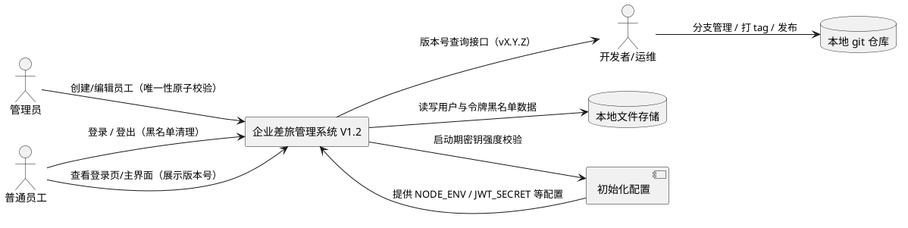
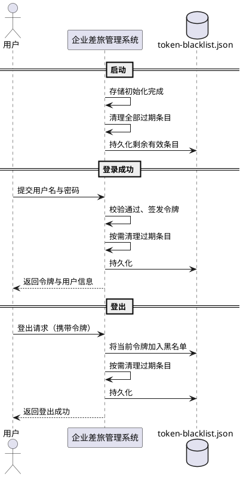
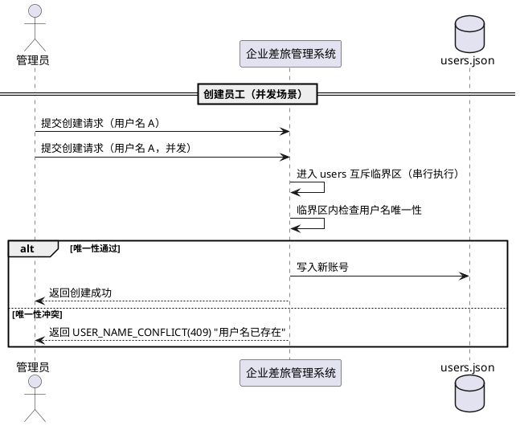
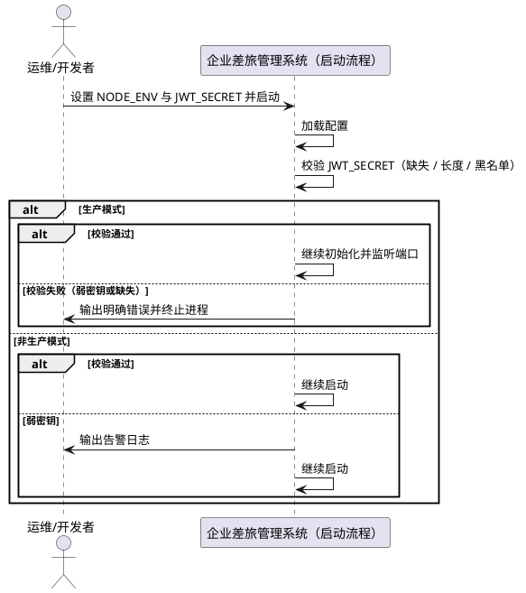
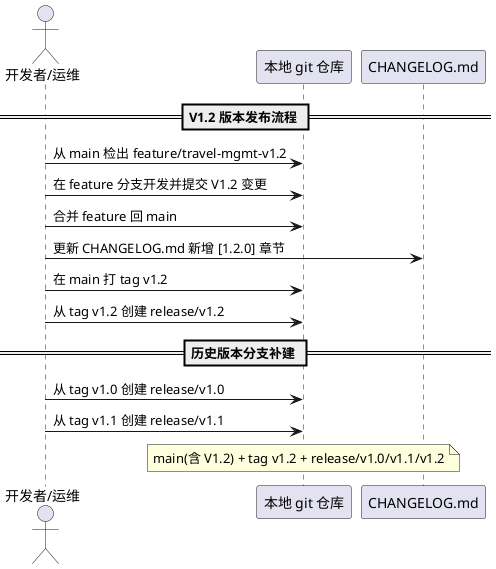
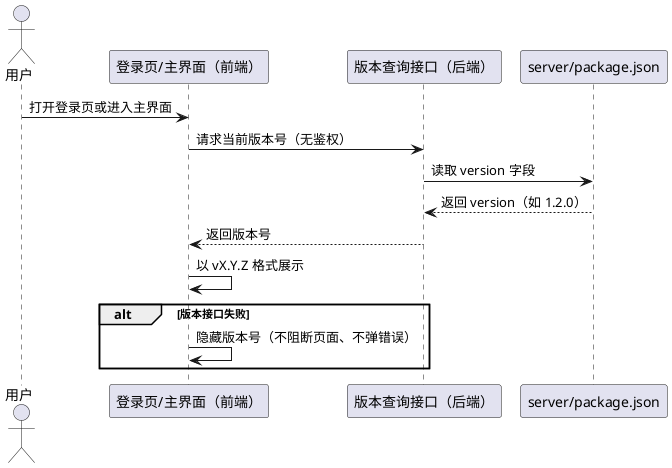

# 企业差旅管理系统 V1.2 需求规格

> 版本：V1.2 ｜ 基线：V1.1（加固版，2026-08-11）
> 定位：在 V1.1 加固版基础上新增两项能力——①**版本分支管理策略**（GitHub Flow 简化版，工程流程类需求，随 tasks 落地）；②**版本号展示**（登录页与主界面可见，版本号单一来源）。
> 兼容性承诺：V1.1 全部既有业务规则、接口语义与数据格式保持兼容；本文档完整保留 V1.1 内容作为背景基线，V1.2 新增内容以 **【V1.2 新增】** 标注。

## 本版本变更概览（V1.1 → V1.2）

| 需求编号 | 变更类型 | 一句话说明 |
|---------|---------|-----------|
| 5A-1 ~ 5A-13 | 新增 | 版本分支管理策略：定义 main/feature/release 分支角色与命名规范、发布 tag 流程、历史分支补建、V1.2 发布流程 |
| 5B-1 ~ 5B-11 | 新增 | 版本号展示：版本号单一来源（server/package.json）、公开版本接口、登录页与主界面展示、失败降级、自动跟随 |

# **1. 组件定位**

## **1.1 核心职责**
**【V1.1 基线】** 本组件负责在保持 V1.0 全部业务功能与接口语义不变的前提下，对企业差旅管理系统进行三项安全与可靠性加固：令牌黑名单定期清理、用户唯一性检查的并发原子化、JWT_SECRET 密钥强度校验。

**【V1.2 新增】** 本组件进一步负责：定义并落地**版本分支管理策略**（GitHub Flow 简化版，明确 main/feature/release 分支角色、tag 规范与发布流程，含历史版本分支补建）；向**登录页与主界面**展示当前系统运行版本号（vX.Y.Z 格式），版本号以 `server/package.json` 的 version 字段为**单一事实来源**。

## **1.2 核心输入**
**【V1.1 基线，保持不变】**
1. 系统启动信号（来源：Node.js 进程启动，内容：环境变量配置，含 NODE_ENV、JWT_SECRET）
2. 用户登录请求（来源：前端用户操作，内容：用户名、密码）
3. 用户登出请求（来源：前端用户操作，内容：当前认证令牌）
4. 管理员创建员工请求（来源：管理员前端操作，内容：用户名、姓名、初始密码）
5. 管理员编辑员工请求（来源：管理员前端操作，内容：员工ID、用户名、姓名、状态）
6. 令牌黑名单写入与查询请求（来源：认证服务与鉴权中间件，内容：令牌及其过期时间）

**【V1.2 新增】**
7. 版本号查询请求（来源：前端登录页/主界面，内容：无业务参数，仅请求当前版本号）
8. 版本分支管理操作（来源：开发者/运维，内容：创建 feature/release 分支、合并回 main、打 tag 等 git 操作）

## **1.3 核心输出**
**【V1.1 基线，保持不变】**
1. 系统启动校验结果（目标：进程运行环境，内容：配置校验通过/告警/失败退出）
2. 登录认证响应（目标：前端调用方，内容：认证令牌与用户信息、角色，行为与 V1.0 一致）
3. 登出结果响应（目标：前端调用方，内容：登出成功标识，行为与 V1.0 一致）
4. 员工管理操作结果响应（目标：管理员前端，内容：创建/编辑结果，行为与 V1.0 一致）
5. 令牌黑名单清理结果（目标：本地文件存储，内容：清理后剩余的有效黑名单条目）
6. 结构化日志（目标：运行环境日志输出，内容：清理操作、配置告警/错误等）

**【V1.2 新增】**
7. 版本号查询响应（目标：前端调用方，内容：当前版本号 vX.Y.Z，值来源于 server/package.json 的 version 字段）
8. 版本分支管理结果（目标：本地 git 仓库，内容：main/feature/release 分支与 vX.Y tag 的结构化状态）

## **1.4 职责边界**
**【V1.1 基线，保持不变】**
1. 本组件不改变 V1.0 的登录、申请提交、撤回、重新提交、审批、用户管理等既有业务行为与接口语义。
2. 本组件不改变前端页面、路由、接口地址与请求/响应数据结构（接口字段与错误码语义保持兼容）。
3. 本组件不引入新的存储技术；仍使用本地 JSON 文件持久化。
4. 本组件不引入分布式锁、消息队列、外部缓存等新组件；并发互斥仅基于现有进程内串行写锁机制实现。
5. 本组件不负责数据库级别的数据迁移；`users.json`、`token-blacklist.json` 的存量数据结构保持兼容。
6. 本组件不扩展新的业务功能（如多级审批、报销、通知等），仅对已确认的三项风险点进行加固。

**【V1.2 新增】**
7. 本组件不负责代码托管平台（GitHub/GitLab 等）的远端分支策略管理与 CI/CD 流水线建设，仅规范本地仓库的分支与版本管理。
8. 本组件不负责版本号自动化发布工具链（如 semantic-release 等），版本号更新由发布流程手工维护。
9. 本组件不改变 V1.1 的登录、登出、申请提交、审批等既有业务行为与接口语义（版本号展示为纯增量功能）。

# **2. 领域术语**

**【V1.1 基线，保持不变】**

**加固**
: 在不改变既有业务语义的前提下，对系统安全性、可靠性、并发正确性进行增强的工程活动。

**令牌黑名单**
: 用于记录已登出、需立即失效的 JWT 令牌的条目集合，持久化于 `token-blacklist.json`。
: 备注：每条黑名单记录包含令牌原文与过期时间（expiresAt）。

**过期条目**
: 黑名单中 `expiresAt` 早于当前时间的记录，可安全删除，不影响任何有效令牌的校验。

**互斥临界区**
: 将"唯一性检查 + 数据写入"视为一个不可分割单元串行执行的区域，用于消除 check-then-act 竞态。
: 备注：V1.1 基于 JsonStoreEngine 既有的 per-collection 串行写锁实现。

**TOCTOU 竞态**
: Time-of-check to time-of-use，指"先检查后使用"之间存在时间窗口、导致并发下检查结果失效的问题。

**弱密钥**
: 长度不足 32 字符，或命中系统内置示例/弱密钥黑名单（如 `dev-jwt-secret-key-for-testing-only`、`your-jwt-secret-key-change-in-production`）的 JWT_SECRET。

**fail-fast**
: 启动阶段立即失败并终止进程的配置校验策略，用于生产环境杜绝弱密钥带病运行。

**【V1.2 新增】**

**GitHub Flow 简化版**
: 一种基于 main 主分支的轻量级分支策略：main 同时承担功能集成与版本发布；新功能从 main 检出 feature/* 分支开发，完成后合并回 main；发布时打 tag 并补建 release/vX.Y 归档分支。
: 备注：别名"单主干分支策略"；不设置独立的 develop 分支。

**main 分支**
: 仓库唯一的开发主分支，既是功能集成的目标分支，也是版本发布的来源分支。

**feature 分支**
: 从 main 分支检出的功能开发分支，命名格式 `feature/<功能名>`，开发完成后合并回 main 并删除。

**release 分支**
: 已发布版本的归档维护分支，命名格式 `release/vX.Y`（如 release/v1.2），从对应 tag 创建，仅用于该版本的缺陷修复。

**git tag**
: 指向 main 分支某次发布提交的不可变标签，命名格式 `vX.Y`（如 v1.2），用于标记已发布版本。

**版本号（version）**
: 系统当前运行版本的标识，遵循语义化版本格式 `X.Y.Z`（如 1.2.0），对外展示格式 `vX.Y.Z`（如 v1.2.0）。
: 备注：与 CHANGELOG.md 版本章节号、git tag（vX.Y）保持对应。

**单一事实来源**
: 版本号唯一维护位置的定义：除 server/package.json 的 version 字段外，前端与后端均不得硬编码版本号。
: 备注：避免两处手写导致版本号不一致。

# **3. 角色与边界**

## **3.1 核心角色**
**【V1.1 基线，保持不变】**
- 管理员：执行员工创建、编辑、禁用/启用、重置密码等管理操作；V1.1 加固不改变其操作方式与返回结果。
- 普通员工：执行登录、登出、差旅申请相关操作；V1.1 加固不改变其操作方式与返回结果。

**【V1.2 新增】**
- 开发者/运维：执行版本分支管理操作（创建 feature/release 分支、合并回 main、打 tag），并按发布流程维护版本号与 CHANGELOG.md。

## **3.2 外部系统**
**【V1.1 基线，保持不变】**
- 本地文件存储系统：读写 `users.json`、`token-blacklist.json` 等 JSON 数据文件。
- 初始化配置：系统启动时提供环境变量（NODE_ENV、JWT_SECRET、INIT_ADMIN_* 等）。

**【V1.2 新增】**
- 本地 git 仓库：承载 main/feature/release 分支与 vX.Y tag，反映版本管理与发布状态。

## **3.3 交互上下文**

# **4. DFX约束**

## **4.1 性能**
**【V1.1 基线，保持不变】**
1. 核心接口（登录、登出、员工创建、员工编辑）响应时间上限保持 V1.0 基线：2 秒（单机本地文件存储场景）。
2. 黑名单单次按需清理的过期条目数不做上限限定，但单次清理必须为同步文件写入且不得引入额外的轮询/定时任务。
3. 用户唯一性原子化方法不得引入除既有写锁之外的新增等待机制；临界区外不增加额外 I/O。

**【V1.2 新增】**
4. 版本号查询接口响应时间上限 200ms（公开静态数据，无存储 I/O、无鉴权开销）。

## **4.2 可靠性**
**【V1.1 基线，保持不变】**
1. 黑名单清理失败（含写入失败）不得阻断登录/登出主流程，且不得导致有效条目丢失或重复。
2. 用户唯一性原子化必须保证 users 集合强一致：并发操作后，任一用户名最多对应一个账号记录。
3. 清理与登出写入并发时必须串行执行，避免互相覆盖丢失数据。

**【V1.2 新增】**
4. 版本号查询接口不可用（异常/超时）时，不得影响登录、登出等既有主流程；前端按降级策略隐藏版本号。

## **4.3 安全性**
**【V1.1 基线，保持不变】**
1. JWT_SECRET 必须满足最小长度 ≥ 32 字符且不得命中内置示例/弱密钥黑名单。
2. 生产模式（NODE_ENV=production）下弱密钥必须导致启动失败，禁止带病运行。
3. 非生产模式下弱密钥必须输出告警日志，便于开发阶段及早发现。
4. 用户密码存储方式、令牌签发与校验机制保持 V1.0 不变（bcrypt + JWT）。

**【V1.2 新增】**
5. 版本号查询接口必须为公开只读接口，不要求认证、不返回任何敏感业务数据，不暴露服务器内部信息。

## **4.4 可维护性**
**【V1.1 基线，保持不变】**
1. 黑名单清理操作必须输出结构化日志，包含清理时间、清理前/后条目数。
2. 启动期配置校验失败/告警必须输出结构化日志，包含失败原因类别（缺失/过短/命中黑名单）。
3. 新增错误信息必须遵循既有错误码与错误提示规范，便于问题定位。

**【V1.2 新增】**
4. 版本号更新仅需修改 `server/package.json` 一处，并同步在 CHANGELOG.md 顶部追加对应版本章节。
5. 分支命名（feature/*、release/vX.Y）与 tag 命名（vX.Y）必须遵循本文档规范，便于版本追溯。

## **4.5 兼容性**
**【V1.1 基线，保持不变】**
1. V1.0 全部对外接口、请求参数、响应结构与错误码语义保持兼容，V1.1 不引入破坏性变更。
2. `users.json`、`token-blacklist.json` 存量数据格式保持兼容，无需数据迁移。
3. 开发模式下的默认 `JWT_SECRET` 示例值在 V1.1 起将被判定为弱密钥（开发模式告警、生产模式拦截），属预期行为变更，不影响开发启动。

**【V1.2 新增】**
4. 新增的版本号查询接口为纯增量公开接口，不影响 V1.1 既有任何接口的地址、请求/响应结构与错误码语义。
5. 版本号展示为前端纯增量功能，不改变既有页面的功能与布局语义。
# **5. 核心能力**

> 说明：5.1 ~ 5.3 为 V1.1 基线需求（背景，保持兼容，本版本不修改）；5.4 ~ 5.5 为 V1.2 新增需求。

## **5.1 令牌黑名单定期清理**【V1.1 基线，保持不变】

### **5.1.1 业务规则**

1. **启动清理规则**：系统完成存储初始化后，必须清理令牌黑名单中的全部过期条目。
   a. 验收条件：When 系统启动并完成存储初始化，the system shall 清理 `token-blacklist` 中全部过期条目并将结果持久化。
2. **登录按需清理规则**：用户登录成功时，系统必须按需清理令牌黑名单中的过期条目。
   a. 验收条件：When 用户登录成功，the system shall 清理 `token-blacklist` 中的过期条目并持久化，且不影响本次登录结果。
3. **登出按需清理规则**：用户登出时，系统在将当前令牌加入黑名单后，必须按需清理过期条目。
   a. 验收条件：When 用户执行登出操作，the system shall 将当前令牌加入黑名单并清理既有过期条目，随后返回登出成功。
4. **清理范围规则**：清理操作仅允许移除 `expiresAt` 早于当前时间的条目，禁止误删未过期条目。
   a. 验收条件：When 清理操作执行完毕，the system shall 仅删除已过期条目，所有未过期条目保持完整。
5. **清理并发安全规则**：清理操作必须与黑名单的读写操作（含登出加入条目、鉴权查询）在同一互斥临界区内串行执行。
   a. 验收条件：While 清理操作与登出加入条目并发发生，the system shall 串行执行两者，保证既有有效条目与新增条目均不丢失。
6. **清理容错规则**：清理或清理后的持久化失败时，系统必须回滚内存态、记录错误日志，且不得阻断登录/登出主流程。
   a. 验收条件：If 清理持久化失败，the system shall 恢复清理前的内存态、输出错误日志，并照常返回登录/登出结果。
7. **黑名单校验语义保持规则**：清理机制不得改变令牌失效校验语义——已登出令牌（含过期与未过期）访问接口仍必须被拒绝。
   a. 验收条件：While 令牌处于黑名单中，when 携带该令牌访问业务接口，the system shall 返回令牌已失效错误（与 V1.0 一致）。
8. **清理时机范围规则**：V1.1 仅允许在启动、登录成功、登出三个时机触发清理，禁止引入独立定时任务或新增清理入口。
   a. 验收条件：If 除上述三个时机外存在任何其他自动清理触发源，the system shall 不产生该行为（该条件用于约束实现范围）。

### **5.1.2 交互流程**

### **5.1.3 异常场景**

1. **清理持久化失败**
   a. 触发条件：清理后写入 `token-blacklist.json` 失败
   b. 系统行为：恢复清理前内存态，输出错误日志，继续完成登录/登出主流程
   c. 用户感知：登录/登出接口仍返回正常结果；通过日志定位失败原因
2. **清理与登出写入并发竞争**
   a. 触发条件：登出加入新条目与清理过期条目同时发生
   b. 系统行为：两者在统一临界区内串行执行，不丢失任何条目
   c. 用户感知：无感知，登出返回成功
3. **数据文件损坏导致清理无法解析**
   a. 触发条件：`token-blacklist.json` 内容损坏、无法解析
   b. 系统行为：记录错误日志，不执行清理，不阻断主流程（行为不劣于 V1.0）
   c. 用户感知：登录/登出按 V1.0 行为继续，错误仅记录于日志

## **5.2 用户唯一性并发原子化**【V1.1 基线，保持不变】

### **5.2.1 业务规则**

1. **创建原子化规则**：创建员工时，"用户名唯一性检查 + 写入用户数据"必须整体纳入同一互斥临界区执行。
   a. 验收条件：When 管理员发起创建员工请求，the system shall 在临界区内完成唯一性检查与数据写入，消除检查与写入之间的竞态窗口。
2. **编辑原子化规则**：修改员工用户名时，"新用户名唯一性检查 + 写入更新数据"必须整体纳入同一互斥临界区执行。
   a. 验收条件：When 管理员提交修改员工用户名的请求，the system shall 在临界区内校验新用户名唯一性后写入更新。
3. **并发重名单成功规则**：并发提交相同用户名的创建请求时，最终必须仅有一个请求成功创建账号。
   a. 验收条件：When 两个创建请求携带相同用户名并发提交，the system shall 仅允许其中一个成功，另一个被拒绝。
4. **并发失败语义保持规则**：并发冲突失败必须返回与 V1.0 完全一致的错误码与提示（`USER_NAME_CONFLICT`、HTTP 409、"用户名已存在"）。
   a. 验收条件：If 并发场景下唯一性校验失败，the system shall 返回错误码 `USER_NAME_CONFLICT`、HTTP 状态 409 及提示"用户名已存在"。
5. **复用既有写锁规则**：原子化方法必须复用 JsonStoreEngine 既有的 per-collection 串行写锁实现临界区，禁止引入新的锁机制或外部组件。
   a. 验收条件：When 原子化方法执行，the system shall 基于既有 users 集合串行写锁将检查与写入串行化，且不引入新依赖。
6. **非用户集合不受影响规则**：本版本仅对 users 集合的唯一性敏感操作进行原子化，requests、audit-logs、token-blacklist 的既有行为与并发特性保持不变。
   a. 验收条件：When 申请提交、审批、审计记录、黑名单写入等非用户集合操作执行，the system shall 行为与 V1.0 完全一致。
7. **接口语义保持规则**：原子化加固不得改变创建/编辑员工接口的请求参数、成功响应结构与字段校验规则。
   a. 验收条件：When 创建/编辑员工请求成功，the system shall 返回与 V1.0 结构一致的响应数据（含审计记录行为不变）。
8. **唯一性约束保证规则**：任一时刻，users 集合中不得存在两个用户名相同的账号记录（含并发场景）。
   a. 验收条件：While 系统处于运行状态，when 任意时刻查询 users 集合，the system shall 不存在用户名重复的记录。

### **5.2.2 交互流程**

### **5.2.3 异常场景**

1. **并发用户名冲突**
   a. 触发条件：多个管理员并发创建/修改为相同用户名
   b. 系统行为：在临界区内串行校验，仅首个通过，其余返回唯一性冲突
   c. 用户感知：错误码 `USER_NAME_CONFLICT`、HTTP 409、提示"用户名已存在"（与 V1.0 一致）
2. **临界区内写入失败**
   a. 触发条件：唯一性检查通过后写入 `users.json` 失败
   b. 系统行为：回滚内存态，输出错误日志
   c. 用户感知：错误码 `STORE_WRITE_FAILED`、HTTP 500、提示"数据写入失败"（与 V1.0 一致）
3. **数据文件损坏导致临界区内读取失败**
   a. 触发条件：`users.json` 内容损坏、无法解析
   b. 系统行为：记录错误日志，拒绝本次创建/编辑操作
   c. 用户感知：返回明确的服务端错误，不产生半写入状态

## **5.3 JWT_SECRET 强度校验**【V1.1 基线，保持不变】

### **5.3.1 业务规则**

1. **最小长度规则**：JWT_SECRET 的长度必须不少于 32 字符。
   a. 验收条件：If JWT_SECRET 长度小于 32 字符，the system shall 将其判定为弱密钥。
2. **弱密钥黑名单规则**：JWT_SECRET 命中内置示例/弱密钥黑名单时必须被判定为弱密钥；黑名单至少包含 `dev-jwt-secret-key-for-testing-only` 与 `your-jwt-secret-key-change-in-production`。
   a. 验收条件：If JWT_SECRET 与黑名单中任一示例值完全一致，the system shall 将其判定为弱密钥。
3. **生产模式 fail-fast 规则**：当 NODE_ENV=production 时，若 JWT_SECRET 缺失、过短或命中黑名单，系统必须拒绝启动并终止进程。
   a. 验收条件：While 系统处于生产模式启动流程，if JWT_SECRET 为弱密钥或缺失，the system shall 终止启动并输出错误日志。
4. **开发模式告警规则**：当 NODE_ENV 非 production 时，若 JWT_SECRET 为弱密钥，系统必须输出告警日志并允许继续启动。
   a. 验收条件：While 系统处于非生产模式启动流程，if JWT_SECRET 为弱密钥，the system shall 输出告警日志并正常启动。
5. **密钥缺失拒绝启动规则**：任何模式下 JWT_SECRET 未配置时，系统必须拒绝启动并提示配置缺失（保持 V1.0 语义）。
   a. 验收条件：If JWT_SECRET 未配置，the system shall 拒绝启动并输出配置缺失错误。
6. **错误信息可定位规则**：生产模式下拒绝启动的错误信息必须明确失败原因类别（缺失 / 长度不足 / 命中示例黑名单）。
   a. 验收条件：When 生产模式因弱密钥拒绝启动，the system shall 在错误信息中指出具体失败原因类别。
7. **校验时机规则**：JWT_SECRET 强度校验必须在服务开始监听端口之前完成。
   a. 验收条件：When 启动流程执行密钥校验，the system shall 在端口监听前完成校验，确保弱密钥进程不会对外提供服务。

### **5.3.2 交互流程**

### **5.3.3 异常场景**

1. **生产模式弱密钥**
   a. 触发条件：NODE_ENV=production 且 JWT_SECRET 缺失 / 过短 / 命中示例黑名单
   b. 系统行为：输出包含失败原因的错误日志并终止进程，不监听端口
   c. 用户感知：进程退出码非 0，控制台输出明确错误信息
2. **开发模式弱密钥**
   a. 触发条件：NODE_ENV 非 production 且 JWT_SECRET 为弱密钥
   b. 系统行为：输出告警日志后继续正常启动
   c. 用户感知：控制台输出 WARN 告警，服务照常可用
3. **强密钥校验通过**
   a. 触发条件：JWT_SECRET 长度 ≥ 32 字符且未命中黑名单
   b. 系统行为：不输出告警，正常完成启动
   c. 用户感知：无额外提示，启动日志与 V1.0 一致

## **5.4 版本分支管理策略**【V1.2 新增】（需求编号 5A）

> 工程流程类需求：规范本地 git 仓库的分支与版本管理。V1.2 实施时需落地为实际分支与 tag 操作（任务归属 design/tasks 阶段）。

### **5.4.1 业务规则**

1. **5A-1 main 主分支角色（Eb）**：main 分支必须作为系统唯一的开发主分支，同时承担功能集成与版本发布角色。
   a. 验收条件：When 版本发布或功能集成操作执行，the system shall 以 main 分支为唯一基准分支。
2. **5A-2 feature 分支创建规则（Ev）**：任何新功能开发必须从 main 分支检出 `feature/*` 分支进行，禁止直接在 main 分支上开发新功能。
   a. 验收条件：When 开发者开始新功能开发，the system shall 从 main 分支创建 feature/<功能名> 分支。
3. **5A-3 feature 分支命名规则（Eb）**：feature 分支命名必须遵循 `feature/<功能名>` 格式，名称应能体现功能含义。
   a. 验收条件：When 创建 feature 分支，the system shall 分支名以 feature/ 为前缀且名称可辨识功能内容。
4. **5A-4 feature 合并回 main 规则（Ev）**：feature 分支开发完成并验证通过后，必须合并回 main 分支，合并后可删除该 feature 分支。
   a. 验收条件：When feature 分支开发完成，the system shall 将变更合并回 main 分支。
5. **5A-5 发布 tag 规则（Ev）**：每个已发布版本必须从 main 分支创建 git tag，命名格式为 `vX.Y`（如 v1.2）。
   a. 验收条件：When 版本 vX.Y 发布，the system shall 在 main 分支上创建 vX.Y 格式的 tag。
6. **5A-6 release 归档分支规则（Ev）**：每个已发布版本必须从对应 tag 创建 `release/vX.Y` 归档分支。
   a. 验收条件：When tag vX.Y 创建完成，the system shall 从该 tag 创建 release/vX.Y 分支。
7. **5A-7 历史分支补建规则（Ev）**：V1.2 实施时必须从既有 tag v1.0、v1.1 补建 `release/v1.0`、`release/v1.1` 分支。
   a. 验收条件：When V1.2 版本实施完成，the system shall 存在 release/v1.0 与 release/v1.1 分支，且分别指向 v1.0 与 v1.1 tag 对应提交。
8. **5A-8 V1.2 发布流程规则（Ev）**：V1.2 版本开发与发布必须遵循：新建 feature 分支开发 → 合并回 main → 打 tag v1.2 → 补建 release/v1.2。
   a. 验收条件：When V1.2 发布流程执行，the system shall 依次完成 feature 开发合并、main 打 tag v1.2、release/v1.2 分支补建。
9. **5A-9 release 分支变更约束（Eu）**：release/vX.Y 归档分支仅允许该版本的缺陷修复，禁止直接开发或合并新功能。
   a. 验收条件：If 新功能变更被直接提交到 release/vX.Y 分支，the system shall 该变更不得进入对应发布版本内容。
10. **5A-10 main 直接开发约束（Eu）**：main 分支禁止直接提交新功能开发变更，仅允许合并 feature 分支、创建 tag 与文档/配置类维护。
    a. 验收条件：If 新功能开发变更被直接提交到 main 分支，the system shall 要求其改走 feature 分支流程。
11. **5A-11 命名唯一性规则（Eb）**：仓库内 git tag 与分支名称必须唯一，不得重复创建。
    a. 验收条件：When 创建 git tag 或分支，the system shall 保证名称在仓库内唯一。
12. **5A-12 tag 与 CHANGELOG 一致性规则（Ev）**：打 tag 前 CHANGELOG.md 必须已包含对应版本章节，且版本号与 tag 一致。
    a. 验收条件：When 创建 tag vX.Y，the system shall CHANGELOG.md 已存在 [X.Y.0] 版本章节且版本号一致。
13. **5A-13 分支策略文档化规则（Eb）**：版本分支管理策略必须记录于仓库内文档（如 BRANCHING.md 或 README 章节），供团队遵循。
    a. 验收条件：When 检视仓库文档，the system shall 存在描述 main/feature/release/tag 角色的版本管理规范文档。

### **5.4.2 交互流程**

### **5.4.3 异常场景**

1. **tag 与 CHANGELOG 版本不一致**
   a. 触发条件：打 tag 时 CHANGELOG.md 缺失对应版本章节或版本号不符
   b. 系统行为：发布流程视为未完成，需先补齐 CHANGELOG 后再打 tag
   c. 用户感知：通过文档与 tag 对照可发现不一致，需人工修正
2. **main 分支直接开发新功能**
   a. 触发条件：开发者绕过 feature 分支直接在 main 提交功能变更
   b. 系统行为：属流程违规，应回退提交并改用 feature 分支流程
   c. 用户感知：通过 git log 审查发现，人工纠正
3. **分支/tag 命名冲突**
   a. 触发条件：创建已存在的分支名或 tag 名
   b. 系统行为：git 拒绝创建（名称冲突错误）
   c. 用户感知：命令失败，需更换名称
4. **release 分支混入新功能**
   a. 触发条件：新功能变更被直接提交/合并到 release/vX.Y
   b. 系统行为：该变更不得进入对应发布版本
   c. 用户感知：通过代码评审与 git 审查拦截

## **5.5 版本号展示**【V1.2 新增】（需求编号 5B）

### **5.5.1 业务规则**

1. **5B-1 版本号单一来源规则（Eb）**：系统版本号必须以 `server/package.json` 的 version 字段为唯一事实来源，前端与后端其他位置禁止硬编码版本号。
   a. 验收条件：When 系统启动并对外提供版本信息，the system shall 版本号值恒等于 server/package.json 的 version 字段。
2. **5B-2 版本号格式规则（Eb）**：版本号必须遵循语义化版本格式 `X.Y.Z`（如 1.2.0），对外展示格式为 `vX.Y.Z`（如 v1.2.0）。
   a. 验收条件：When 前端展示版本号，the system shall 以 vX.Y.Z 格式呈现。
3. **5B-3 公开版本接口规则（Ev）**：后端必须提供公开的版本查询接口，返回当前版本号。
   a. 验收条件：When 客户端（含未登录）调用版本查询接口，the system shall 返回 HTTP 200 与当前版本号。
4. **5B-4 接口免鉴权规则（Ev）**：版本查询接口必须允许匿名访问，不要求携带 JWT 认证令牌。
   a. 验收条件：When 未携带认证令牌访问版本接口，the system shall 正常返回版本信息（而非 401）。
5. **5B-5 接口响应结构规则（Ev）**：版本查询接口的响应必须包含版本号字段。
   a. 验收条件：When 版本接口返回成功，the system shall 响应中包含 version 字段且值等于 server/package.json 的 version。
6. **5B-6 登录页展示规则（Ev）**：登录页面必须展示当前系统版本号。
   a. 验收条件：When 用户打开登录页，the system shall 在页面可见位置展示 vX.Y.Z 格式的版本号。
7. **5B-7 主界面展示规则（Ev）**：登录后的主界面（页脚或顶栏）必须展示当前系统版本号。
   a. 验收条件：When 用户登录进入任一主界面页面，the system shall 在页脚/顶栏可见位置展示版本号。
8. **5B-8 展示一致性规则（Eb）**：登录页与主界面展示的版本号必须来自同一数据源（同一版本接口），两处展示必须一致。
   a. 验收条件：When 同一运行实例中分别查看登录页与主界面，the system shall 两处版本号完全一致。
9. **5B-9 获取失败降级规则（Eu）**：前端获取版本号失败时（接口异常、网络错误、超时等），必须隐藏版本号展示，不得阻断页面使用，不得弹出错误提示。
   a. 验收条件：If 版本接口请求失败，the system shall 隐藏版本号且页面其他功能正常可用、无错误提示。
10. **5B-10 版本自动跟随规则（Ev）**：后续版本升级时，仅需更新 `server/package.json` 的 version 字段，前端展示的版本号必须自动跟随，无需前端代码改动。
    a. 验收条件：When server/package.json 的 version 更新为新值并重新部署，the system shall 登录页与主界面自动展示新版本号。
11. **5B-11 不影响既有接口规则（Ev）**：新增版本接口不得改变 V1.1 既有接口的地址、请求/响应结构与错误码语义。
    a. 验收条件：When V1.2 发布后执行既有接口回归，the system shall 既有接口行为与 V1.1 完全一致。

### **5.5.2 交互流程**

### **5.5.3 异常场景**

1. **版本接口请求失败**
   a. 触发条件：网络异常、后端未启动或接口超时
   b. 系统行为：前端隐藏版本号，不展示、不报错，不阻断页面
   c. 用户感知：页面正常使用，仅版本号区域不可见
2. **package.json 版本字段缺失或格式非法**
   a. 触发条件：server/package.json 无 version 字段或不符合 X.Y.Z 格式
   b. 系统行为：后端按配置缺失/异常处理，接口返回失败（具体语义由 design 定义）
   c. 用户感知：前端按失败降级处理，隐藏版本号
3. **版本号与 tag/CHANGELOG 不一致**
   a. 触发条件：发布时未同步更新 CHANGELOG 或 git tag
   b. 系统行为：页面展示 server/package.json 中的版本号（正确来源），CHANGELOG/tag 需人工对齐
   c. 用户感知：通过文档与页面比对可发现不一致
# **6. 数据约束**

> 说明：6.1 ~ 6.2 为 V1.1 基线内容（背景，保持不变）；6.3 ~ 6.4 为 V1.2 新增约束。

## **6.1 令牌黑名单条目（token-blacklist）**【V1.1 基线，保持不变】
1. **id**：每条记录的全局唯一标识，格式不限，同一集合内不得重复。
2. **token**：登出时写入的 JWT 令牌原文，用于鉴权时精确匹配；同一集合内允许重复写入但以 V1.0 校验语义为准。
3. **expiresAt**：令牌的过期时间（ISO 8601 格式字符串）；清理时以此为唯一过期判据，当前时间晚于该值时视为过期。
4. **清理幂等性**：对同一数据状态重复执行清理，其结果必须一致（无副作用）。

## **6.2 用户账号（users）**【V1.1 基线，保持不变】
1. **username**：全局唯一，创建与编辑时必须在互斥临界区内校验；同一集合内不得存在两个相同的用户名。
2. **id**：账号唯一标识，创建时生成，创建后不得变更。
3. **passwordHash**：密码的 bcrypt 哈希值，接口响应中必须剔除，V1.1 不改变其存储与使用方式。
4. **role / status**：取值与语义保持 V1.0 不变（角色仅 ADMIN/EMPLOYEE；状态仅 ACTIVE/DISABLED）。
5. **createdAt / updatedAt**：记录创建与最近更新时间，格式保持 ISO 8601 字符串。

## **6.3 系统版本号**【V1.2 新增】
1. **version**：系统版本号，遵循语义化版本格式 `X.Y.Z`（如 1.2.0），必须以 `server/package.json` 的 version 字段为唯一事实来源。
2. **展示格式**：对外展示必须为 `vX.Y.Z` 格式（如 v1.2.0），与 CHANGELOG.md 版本章节号、git tag（vX.Y）保持对应。
3. **一致性**：`server/package.json` 的 version 必须与 CHANGELOG.md 顶部版本章节、git tag 对应（如 version=1.2.0 ↔ CHANGELOG [1.2.0] ↔ tag v1.2）。
4. **更新约束**：版本号变更仅允许在发布流程中维护，禁止前端硬编码或在其他后端配置中二次维护。

## **6.4 分支与标签（git branch / tag）**【V1.2 新增】
1. **main**：仓库唯一的开发主分支（集成 + 发布），禁止直接提交新功能开发变更。
2. **feature/* 分支**：从 main 检出，命名格式 `feature/<功能名>`，开发完成后合并回 main 并删除；名称在仓库内唯一。
3. **release/vX.Y 分支**：从对应 tag `vX.Y` 创建，命名格式 `release/vX.Y`，仅用于该版本的缺陷修复；名称在仓库内唯一。
4. **tag vX.Y**：从 main 分支创建，命名格式 `vX.Y`，仓库内唯一；指向对应版本的发布提交，且与 CHANGELOG.md 版本号对应。

