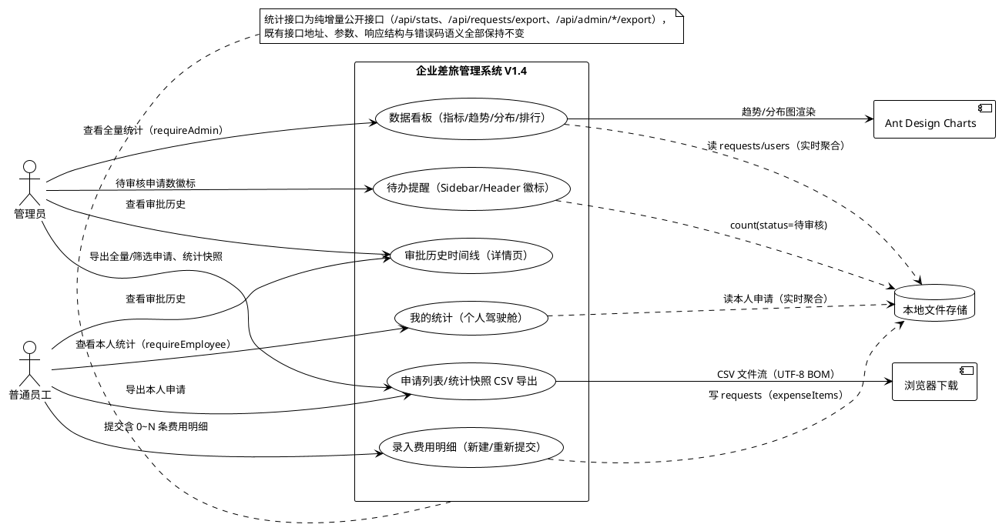
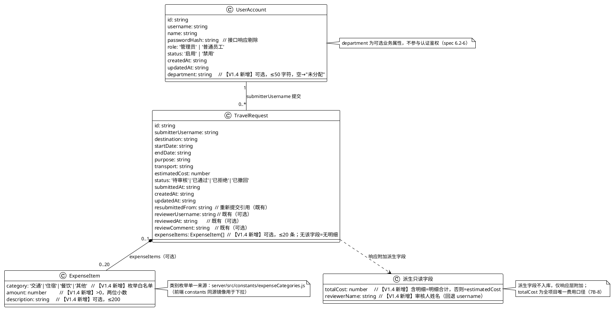

# 企业差旅管理系统技术设计方案（V1.4）

> 版本：V1.4 ｜ 基线：V1.3（2026-08-12）｜ 历史基线：V1.2、V1.1（加固版）、V1.0
> 对应需求：`.codeartsdoer/specs/travel_mgmt_v14/spec.md`（V1.4 新增 7A-1~7A-16「Dashboard 管理驾驶舱与数据可视化」、7B-1~7B-11「费用明细扩展」、7C-1~7C-9「审批流优化」、7D-1~7D-8「统计导出」；V1.0~V1.3 全部既有需求作为兼容性基线）
> 文档结构说明：**第一章、第二章为 V1.4 新增设计（需求与存量关系分析 + 增量设计方案）**；V1.1 加固、V1.2 版本管理、V1.3 UI/UX 与双语的既有技术设计保持不变，作为背景基线不在本文重复展开（参见 `.codeartsdoer/specs/travel_mgmt_v13/design.md`）。
> 设计原则（V1.4 新增）：改动点最小化、既有接口/数据格式/状态机零变更、统计为实时内存聚合（不持久化快照、不引入新存储/新组件）、费用口径单一来源、导出权限与列表查询一致、双语覆盖全部新增文案。
> 关键决策（依据 spec 第 7 章，用户已授权默认采用）：图表采用 Ant Design Charts（D-1）；统计后端实时聚合（D-2）；users 新增可选 department 字段（D-3）；requests 新增可选 expenseItems 数组、总费用=明细合计（有明细时）（D-4）；费用类别枚举=交通/住宿/餐饮/其他（D-5）；审批历史由既有字段推导、不新增历史数组（D-6）；待办提醒位于管理员 Sidebar/Header 徽标（D-7）；CSV 编码 UTF-8 含 BOM（D-8）；导出上限 5000 条（D-9）；导出由后端生成文件流（D-10）；待办刷新时机=进入主界面/进入列表页/完成审核后（D-11）。

## V1.4 变更概览（V1.3 → V1.4）

| 需求编号 | 变更类型 | 对应设计章节 | 一句话说明 |
|---------|---------|-------------|-----------|
| 7A-1 ~ 7A-16 | 新增 | 1.1.2 / 1.1.3 / 2.1 / 2.2 / 2.3 | Dashboard 管理驾驶舱：后端 statsService 实时聚合 + 新增统计接口（管理员全量/员工个人/待办数）+ 前端 AdminDashboard/EmployeeDashboard 页面 + Ant Design Charts 图表（趋势/分布/排行/指标卡片） |
| 7B-1 ~ 7B-11 | 新增 | 1.1.2 / 2.1.3.2 / 2.2 / 2.3 | 费用明细扩展：requests 可选 expenseItems 数组 + 后端校验（类别/金额/说明/≤20 条）+ 总费用口径 totalCost 派生字段 + 表单 Form.List 录入 + 详情/列表展示 |
| 7C-1 ~ 7C-9 | 新增 | 1.1.2 / 2.1.3.4 / 2.1.3.5 / 2.2 | 审批流优化：详情页审批历史 Timeline（由既有字段推导）+ 管理员 Sidebar/Header 待办 Badge 提醒 |
| 7D-1 ~ 7D-8 | 新增 | 1.1.3 / 2.1.3.6 / 2.2 | 统计导出：后端 csvService 生成 CSV（UTF-8 含 BOM）+ 员工/管理员申请列表导出 + 管理员统计快照导出 + 前端下载 |

---

# 一、需求与存量功能关系分析

本章明确 V1.4 四项新需求（7A/7B/7C/7D）与 V1.3 现有前后端代码的关系，是增量设计的基础。所有代码位置均已核实到文件级（函数级以行号标注）。总体结论：**V1.4 为前后端增量扩展**——后端新增统计/导出两条纯增量接口链路并扩展申请/用户两个可选字段，不修改任何既有接口的路径、参数、响应结构与错误码语义；前端新增两个 Dashboard 页面并在既有布局/表单/详情页上增量挂载新能力，不改变既有路由、权限守卫与业务逻辑。

## 1.1 需求功能与存量功能对比

### 1.1.1 已实现功能

以下能力在存量代码中已完整实现，V1.4 直接复用、不做重写：

| 需求功能 | 存量功能 | 代码位置 | 匹配度 |
|---------|---------|---------|--------|
| 7A-14 统计基于最新数据实时计算 | `JsonStoreEngine` 内存态单例 + `read()` 同步读 + per-collection 串行写锁与 `runExclusive()` 临界区（读后无缓存、无快照） | `server/src/store/JsonStoreEngine.js:34-36, 78-92` | 100%（实时性基础设施已具备，统计直接读内存态即可） |
| 7A-7/7B-10 费用统计基于申请费用字段 | 申请模型 `estimatedCost`（预计费用）与状态字段（待审核/已通过/已拒绝/已撤回）已随 `createRequest`/`resubmitRequest` 落库 | `server/src/services/requestService.js:7-24, 58-80`；`server/data/requests.json` | 75%（口径字段已存在，需在含明细时切换为明细合计，见 1.1.2） |
| 7C-8 审批流不改变（单级审核状态机） | `approveRequest`/`rejectRequest` 写 `reviewerUsername`/`reviewedAt`/`reviewComment`，状态机 PENDING→APPROVED/REJECTED 不变 | `server/src/services/reviewService.js:33-62, 64-96` | 100%（审批历史时间线的全部数据来源已存在） |
| 7C-3/7C-7 存量申请审批字段推导 | 存量申请含 `submittedAt` 与可选的 `reviewerUsername`/`reviewedAt`/`reviewComment`（V1.0 起格式恒定） | `server/data/requests.json`（如 `reviewedAt` 字段记录） | 100%（时间线直接基于既有字段推导，无需数据迁移） |
| 7A-3/7D-7 角色权限隔离 | `authRequired` + `requireAdmin`/`requireEmployee` 中间件对 `/api/requests`、`/api/admin` 全链路鉴权 | `server/src/middlewares/auth.js:7-42`；`server/src/routes/request.js:6-10`、`admin.js:7-16` | 100%（新统计/导出接口直接挂相同守卫） |
| 7B-2/7B-3/7B-4 字段枚举与长度校验模式 | `validator.js` 的 `validateRequestFields` 采用「枚举白名单 + 长度上限 + 数值精度」校验模式 | `server/src/utils/validator.js:5-35`；`server/src/constants/transports.js:1` | 100%（费用明细校验复用同一模式与错误码 `VALIDATION_ERROR`） |
| 7B-11/7D 存量数据兼容读取 | `requestRepository.findAll/findById` 直接读内存数组、字段缺失不报错 | `server/src/repositories/requestRepository.js:4-10` | 100%（无 `expenseItems` 字段的存量申请天然兼容） |
| 7A-15/7B/7C-9 双语文案框架 | `i18n/index.js`（react-i18next）+ `locales/zh-CN.js`/`en-US.js` + `displayMapping.js`（业务值映射 + 日期/金额格式化） | `client/src/i18n/index.js:1-42`；`client/src/utils/displayMapping.js:5-48` | 100%（新增页面/文案直接复用 i18n 与 displayMapping） |
| 7A-1/7A-2 Sidebar 按角色菜单 | `Layout.jsx` 的 `MENU_BY_ROLE` 按 `user.role` 生成菜单 + `selectedKeys` 路由联动 | `client/src/components/Layout.jsx:14-23, 38-45` | 100%（新增"数据看板/我的统计"菜单项仅需扩展该配置表） |
| 7A-5/7A-6 指标计算的数据基础 | `requestStatus` 常量四状态、申请列表 `status` 筛选逻辑（`status !== '全部'` 过滤） | `server/src/constants/requestStatus.js:1-6`；`server/src/services/requestService.js:26-36`、`reviewService.js:8-22` | 100%（状态统计口径与筛选语义一致） |
| 7D-4 导出范围与列表筛选一致 | 列表查询的 `status`/`page`/`pageSize` 参数语义已稳定 | `server/src/controllers/requestController.js:13-21`、`reviewController.js:4-12` | 100%（导出复用同一筛选参数语义，仅忽略分页） |
| 7A-13 员工个人数据边界 | `listMyRequests` 按 `submitterUsername` 过滤本人申请 | `server/src/services/requestService.js:26-27` | 100%（个人统计复用同一过滤口径） |

### 1.1.2 需要扩展的功能

以下功能与存量代码部分匹配，需要在现有基础上增量改造：

| 需求功能 | 存量功能 | 差异说明 | 扩展方向 |
|---------|---------|---------|---------|
| 7B-1/7B-8/7B-10 申请单携带费用明细并统一总费用口径 | `createRequest`/`resubmitRequest` 仅落 `estimatedCost`，无明细字段；列表/详情直接展示 `estimatedCost` | ①申请模型需新增可选 `expenseItems` 数组；②含明细时总费用口径切换为明细合计；③列表/详情/统计/导出需统一使用同一口径 | ①`validator.js` 新增 `validateExpenseItems(payload)`（类别白名单/金额>0 两位小数/说明≤200/≤20 条）；②`requestService.createRequest`/`resubmitRequest` 透传 `expenseItems`；③后端统一提供派生字段 `totalCost`（含明细=明细合计，否则=`estimatedCost`）附加到列表/详情响应，前端展示与统计/导出均以 `totalCost` 为准 |
| 7A-4~7A-6 六项核心指标与费用汇总卡片 | 无任何统计聚合逻辑（仅有分页列表） | 需基于 requests 内存态按状态分组计数、按 `totalCost` 聚合费用 | 新增 `statsService`（见 1.1.3-A），聚合逻辑完全独立于既有列表接口 |
| 7A-11 部门排行 | `users` 无 `department` 字段，员工管理无部门录入 | 需新增可选 `department`（≤50 字符）；存量员工无部门归入"未分配" | ①`userService.createUser`/`updateUser` 支持可选 `department` 并校验长度；②`userController` 透传；③`AdminUsers.jsx` 创建/编辑 Modal 增加部门输入、列表增加部门列；④统计时按 `user.department` 分组，空值归入"未分配" |
| 7C-1/7C-2 申请详情展示审批历史时间线 | 详情页用 `Steps` 展示"已提交→待审核→已通过/已拒绝"，无时间维度的审核轨迹 | `Steps` 无法承载审核人/时间/意见的完整轨迹；待审核态需标注"已提交，待审核" | 详情页（员工 `RequestDetail.jsx` 与管理员 `AdminRequestDetail.jsx`）将审批状态区升级为 antd `Timeline`：节点1=提交（submittedAt）、节点2=审核（reviewerUsername/reviewedAt/reviewComment，有审核时）；待审核仅展示提交节点并标注待审核；沿用 `detail.steps` i18n 文案 |
| 7C-4~7C-6 管理员待办申请数提醒 | `Layout.jsx` Header 无任何统计徽标 | 需新增待审核申请计数并展示于管理员 Sidebar/Header；0 时显示 0 或隐藏 | ①后端新增待办计数接口（见 1.1.3-A）；②`Layout.jsx` 为管理员在 Header 新增 `Badge`，监听路由变化刷新；③`AdminRequestDetail` 审核完成后触发轻量刷新事件 |
| 7D-1/7D-2/7D-5 列表页与驾驶舱导出入口 | 列表页仅有筛选/新建/审核按钮，无导出 | 需在员工列表、管理员列表、管理员驾驶舱增加导出入口 | ①前端新增 `export.js` API 封装 + `download.js` 下载辅助；②`EmployeeRequestList`/`AdminRequestList` 工具栏增加"导出 CSV"按钮；③`AdminDashboard` 增加"导出统计"按钮 |
| 7D-6 CSV 列名双语 | 后端无任何文案资源；前端 `displayMapping` 仅存在于浏览器端 | 导出由后端生成，列名需按当前语言；状态/交通工具等业务值需双语 | ①`csvService` 内置导出用双语映射表（状态/交通工具/费用类别 → {zh,en}）；②导出接口接收 `lang` 参数（`zh-CN`/`en-US`），列名与业务值标签按语言生成，数据值仍为原始业务值 |
| 7A-16 统计失败降级 | 页面数据加载失败仅 Toast 提示 | Dashboard 需空态/错误态 + 重试，不得白屏 | 新增图表页面统一 `Spin`/`Empty`/`Alert`+重试按钮；错误不阻断其他统计区域 |
| 7B-6/7B-7 表单录入多条明细与实时合计 | `NewRequest.jsx`/`ResubmitRequest.jsx` 仅单一 `estimatedCost` InputNumber | 需支持增删改多条明细并实时汇总 | 表单内新增 `Form.List` 明细编辑区（类别 Select + 金额 InputNumber + 说明 Input + 删除按钮 + 新增按钮），下方实时展示明细合计；重新提交表单同步扩展并回填原明细 |

### 1.1.3 需要新增的功能或接口

按业务模块分组，存量代码中完全没有对应实现的部分：

**A. 后端统计模块（全新，需求 7A / 7C-4~7C-6）**
- 新增 `server/src/services/statsService.js`：纯内存实时聚合，提供——`getAdminDashboard(months)`（核心指标、费用汇总、月度趋势、状态分布、交通工具分布、部门排行、员工排行）、`getEmployeeStats(username, months)`（本人核心指标、费用汇总、趋势、状态分布）、`getPendingCount()`（待审核申请数）。聚合基于 `requestRepository.findAll()` + `userRepository.findAll()` 内存态，无持久化快照。
- 新增 `server/src/controllers/statsController.js` + `server/src/routes/stats.js`：`GET /api/stats/dashboard`（管理员）、`GET /api/stats/me`（员工个人）、`GET /api/stats/pending-count`（管理员待办数）；均挂 `authRequired` 并按角色守卫，纯增量接口。
- 新增 `server/src/constants/expenseCategories.js`：`['交通', '住宿', '餐饮', '其他']`（费用类别单一来源，7B-2）。

**B. 后端导出模块（全新，需求 7D）**
- 新增 `server/src/services/csvService.js`：`toCsv(rows, { lang })`（UTF-8 含 BOM、字段转义、列名双语）、`buildRequestExportCsv(requests, lang)`、`buildStatsSnapshotCsv(stats, lang)`（核心指标+月度趋势+状态分布+交通工具分布+部门排行+员工排行分区块）。
- 新增 `server/src/controllers/exportController.js`：三个导出处理器（员工本人申请 / 管理员申请列表 / 管理员统计快照），返回 `text/csv; charset=utf-8` + `Content-Disposition` 附件（文件名 RFC 5987 编码）；超 5000 条返回错误码 `EXPORT_TOO_LARGE`(400)。
- 新增 `server/src/routes/export.js`：`GET /api/requests/export`（员工本人，挂 `requireEmployee`）、`GET /api/admin/requests/export`、`GET /api/admin/stats/export`（管理员，挂 `requireAdmin`）。

**C. 前端 Dashboard 页面与图表（全新，需求 7A）**
- 新增 `client/src/pages/admin/AdminDashboard.jsx`（路由 `/admin/dashboard`，`AdminRoute` 守卫）：指标卡片（`Statistic`+`Card`）、月度趋势（Ant Design Charts `Line` 双系列：申请数量/费用）、状态分布（`Pie`）、交通工具分布（`Column`）、部门排行与员工排行（排行列表 `Table`/`List`，Top 10 降序）；含时间范围切换（近 3/6/12 月）与导出统计按钮。
- 新增 `client/src/pages/employee/EmployeeDashboard.jsx`（路由 `/employee/dashboard`，`EmployeeRoute` 守卫）：本人指标卡片、费用汇总、趋势、状态分布。
- 新增 `client/src/api/stats.js`：`getAdminDashboard`/`getEmployeeStats`/`getPendingCount` 封装。
- 新增 `client/src/components/stat/` 图表复用组件（指标卡片、趋势图、分布图、排行）——管理员与员工驾驶舱共用。

**D. 前端导出能力（全新，需求 7D）**
- 新增 `client/src/api/export.js`：原生 `fetch` 封装（携带 Authorization、支持 `lang` 参数），成功返回 Blob、失败解析 JSON 错误码。
- 新增 `client/src/utils/download.js`：`downloadBlob(blob, filename)`（URL.createObjectURL + 临时 `<a>` 触发下载）。

**E. 前端审批历史时间线组件（全新，需求 7C-1~7C-3/7C-7/7C-9）**
- 新增 `client/src/components/ApprovalTimeline.jsx`：入参 `{ request }`，基于 `submittedAt` + 审核字段推导 Timeline 节点，输出双语文案，兼容待审核与存量申请。

**F. 测试（见 2.6）**
- 新增 `server/test/statsService.test.js`、`server/test/expenseValidation.test.js`、`server/test/csvExport.test.js`（node:test）。
- 新增 `tests/dashboard.test.js`、`tests/expenseDetail.test.js`、`tests/exportFlow.test.js`（Playwright E2E）。

## 1.2 存量功能详细分析

本节对上节"已实现功能/需要扩展的功能"中与 V1.4 强相关的存量代码做深入解读，明确接口契约与约束，避免设计落空。

### 1.2.1 申请服务与列表查询（7B 费用明细 / 7D 导出复用）

- **接口契约**：`requestService.createRequest(username, payload)`（`requestService.js:7-24`）校验 → 生成 `submittedAt/createdAt/updatedAt` → `requestRepository.create()`；`resubmitRequest`（`requestService.js:58-80`）仅允许已拒绝申请，新增 `resubmittedFrom` 引用原单。`listMyRequests`（`requestService.js:26-36`）按 `submitterUsername` 过滤 + `status` 筛选 + 按 `submittedAt` 降序 + 分页。
- **约束**：
  - `validateRequestFields`（`validator.js:5-35`）已校验主字段；新增明细校验必须在其**之后**独立执行，且失败语义同为 `VALIDATION_ERROR`(400)，不改变主字段校验顺序与错误码（spec 1.4-9）。
  - `estimatedCost` 存为 `Number`；`expenseItems[].amount` 沿用"非负、>0、最多两位小数"的数值精度判定模式（复用 `Math.round(cost*100) !== cost*100` 思路）。
  - 列表/详情返回对象为存储原样（`requestService.getMyRequest` 返回引用），新增派生字段 `totalCost` 时必须以**浅拷贝附加**方式返回，禁止原地改内存对象（避免污染统计口径）。

### 1.2.2 审批服务与审批字段（7C 时间线数据来源）

- **接口契约**：`approveRequest`/`rejectRequest`（`reviewService.js:33-96`）：待审核校验(409) → 意见长度校验(400) → 写 `status/reviewerUsername/reviewedAt/reviewComment` → 审计。审核人记录为 `reviewer.username`（即管理员 username），非姓名。
- **约束**：
  - 审批历史时间线的"审核人"展示应关联 `userRepository.findByUsername(reviewerUsername).name` 以获得姓名（缺失时回退 username）——`getRequestDetail` 已对提交人做同名关联（`reviewService.js:29-30`），时间线复用同一关联方式。
  - 存量申请可能仅有单次审核字段（V1.0~V1.3 单级审核），时间线**最多两个节点**（提交、审核），不允许虚构中间节点（spec 7C-3）；已撤回申请不展示审核节点，仅提交节点 + 撤回说明（spec 7C-7）。

### 1.2.3 用户服务与唯一性原子化（7A-11 department 扩展点）

- **接口契约**：`createUser`（`userService.js:19-52`）字段校验(400) → `bcrypt.hash` → `createIfUsernameFree` 临界区写入；`updateUser`（`userService.js:54-98`）定位(404) → 角色校验(403) → 增量字段校验 → `updateIfUsernameFree`。
- **约束**：
  - `department` 作为**可选字段**加入：`createUser` 的 `{ username, name, password, department? }` 与 `updateUser` 的 `{ username?, name?, status?, department? }`；`department` 为空/缺省时不落该字段（存量格式零变更）；非空时校验 `length ≤ 50`，超长抛 `VALIDATION_ERROR`(400)。
  - 注意 `updateUser` 的 `updates` 对象当前仅在有值时才写入（`userService.js:63-81`）；`department` 沿用同一模式——若前端显式传 `department: ''`，语义为清空部门（落 `department: ''`），统计时按"未分配"处理（spec 6.2-6 允许为空）。
  - 鉴权链路不受影响（spec 4.3-8）：`authRequired` 仅取 `userId/username/role`（`auth.js:20`），不涉及 department。

### 1.2.4 布局、菜单与页面结构（7A 入口 / 7C 待办徽标挂载点）

- **`Layout.jsx`（`client/src/components/Layout.jsx:14-23, 52-90`）**：`MENU_BY_ROLE` 常量按角色输出菜单（员工：我的申请/新建申请；管理员：申请审核/员工管理）；`selectedKeys` 由 `location.pathname` 前缀推导（`Layout.jsx:38-45`）。V1.4 扩展点：
  - `MENU_BY_ROLE` 追加员工 `/employee/dashboard`（"我的统计"）、管理员 `/admin/dashboard`（"数据看板"）；`selectedKey` 推导追加 `/admin/dashboard`、`/employee/dashboard` 前缀分支。
  - 待办 Badge 挂 Header `Space` 内（语言切换与版本号之间），仅管理员角色渲染；数值来自待办接口；0 时隐藏或显示 0（spec 7C-6）。
- **`App.jsx`（`client/src/App.jsx:17-27`）**：路由表新增 `/employee/dashboard`（`EmployeeRoute`）与 `/admin/dashboard`（`AdminRoute`）；`*` 兜底重定向不变。
- **`ProtectedRoute.jsx`**：`AdminRoute` 对非管理员重定向到 `/employee/requests`，`EmployeeRoute` 对非员工重定向到 `/admin/users`（`router/ProtectedRoute.jsx:6-18`）。新路由直接复用守卫，满足 7A-3 越权重定向。

### 1.2.5 前端 API 封装与显示映射（新增统计/导出/明细能力的基础设施）

- **`client/src/api/client.js`**：axios `baseURL='/api'`，请求拦截器附 Authorization，响应拦截器解包 `response.data` 且仅 401 跳转登录。导出接口因需接收 Blob，**不改造 client.js**，改用 `fetch` 独立封装（`api/export.js`），避免影响既有拦截器行为。
- **`api/request.js`/`review.js`/`user.js`**：既有接口封装不动；新增 `api/stats.js`、`api/export.js`。
- **`utils/displayMapping.js`（`displayMapping.js:5-27`）**：`DISPLAY_MAP` 为单一映射表。V1.4 新增费用类别业务值（交通/住宿/餐饮/其他）映射；"未分配"作为部门统计分组标签走 i18n 文案（`dashboard:unassigned`），不入 DISPLAY_MAP（非后端业务值）。
- **`i18n/index.js`**：`SUPPORTED_LANGS=['zh-CN','en-US']`、`LANG_KEY='i18nLanguage'`、`changeLanguage` 白名单校验。V1.4 新增命名空间 `dashboard`/`expense`/`timeline`/`export` 及 `common`/`table`/`form`/`layout` 的增量键，两套资源键保持一致（spec 6.6-3）。

### 1.2.6 存储引擎与数据文件（统计实时性与兼容性约束）

- **`JsonStoreEngine`（`store/JsonStoreEngine.js:34-92`）**：`read()` 同步返回内存数组引用；`runExclusive` 提供临界区写。**统计为纯读聚合**——直接 `read('requests')`/`read('users')` 即可获得最新内存态，无需加锁；数据变更（提交/审批/撤回）经 `write()`/`runExclusive` 更新内存后，下一次统计自然读到最新值，天然满足 7A-14 实时性（spec 4.2-5）。
- **约束**：统计/导出不得调用 `write()`（只读）；聚合遍历量级 ≤ 万条记录（spec 4.1-4/5），单次统计为 O(n) 内存遍历，满足 2s 响应上限。读取失败（文件损坏导致启动失败属既有行为）不在统计路径重复处理；统计异常仅抛内部错误走 `errorHandler` 通用分支（`INTERNAL_ERROR`），不影响既有主流程（spec 4.2-6）。

---

# 二、增量设计方案

本章将 7A（Dashboard 管理驾驶舱）、7B（费用明细）、7C（审批流优化）、7D（统计导出）转化为可落地的技术方案。总体策略：**改动点最小化、纯增量扩展**——后端新增「统计 + 导出」两条独立接口链路与 `expenseItems`/`department` 两个可选字段扩展，不修改任何既有路由/接口/错误码/状态机/数据格式；前端新增两个 Dashboard 页面、一个审批时间线组件、导出下载能力，并在既有布局/表单/详情页上增量挂载；统计全部为实时内存聚合，不引入新存储与第三方服务。

## 2.1 实现模型

### 2.1.1 上下文视图



- **上游**：管理员与普通员工经前端页面交互；两者共用同一统计口径与可视化组件，仅数据范围与菜单入口不同（7A 决策记录）。
- **下游**：后端读本地 JSON 内存态实时聚合；导出由后端生成文件流，前端触发浏览器下载；图表仅前端渲染（Ant Design Charts），无第三方服务。

### 2.1.2 服务/组件总体架构

架构保持既有分层（Route → Controller → Service → Repository → JsonStoreEngine；前端 页面 → 组件/API 封装 → axios），V1.4 的改动为「后端统计/导出两条新链路 + 字段扩展」与「前端 Dashboard/时间线/导出能力」：

```plantuml
@startuml
!theme plain
skinparam componentStyle rectangle

package "后端路由/控制器层（新增/修改）" {
  [routes/stats.js] as RS
  [routes/export.js] as RE
  [routes/request.js] as RR
  [routes/admin.js] as RA
  [routes/meta.js] as RM
  [statsController] as CS
  [exportController] as CE
  [requestController] as CR
  [reviewController] as CV
  [userController] as CU
}

package "后端服务层（新增/修改）" {
  [statsService] as SS
  [csvService] as CSV
  [requestService] as SR
  [reviewService] as SV
  [userService] as SU
  [validator] as VAL
}

package "后端常量/仓储层（新增/扩展）" {
  [expenseCategories] as EC
  [requestStatus] as RST
  [transports] as TR
  [requestRepository] as RREP
  [userRepository] as UREP
}

package "存储引擎（不变）" {
  [JsonStoreEngine] as EN
}

package "前端（新增/修改）" {
  [pages/admin/AdminDashboard.jsx] as FAD
  [pages/employee/EmployeeDashboard.jsx] as FED
  [components/ApprovalTimeline.jsx] as FAT
  [components/stat/*] as FST
  [pages/employee/NewRequest.jsx] as FNR
  [pages/employee/RequestDetail.jsx] as FRD
  [pages/admin/AdminRequestDetail.jsx] as FARD
  [pages/admin/AdminUsers.jsx] as FAU
  [pages/*/...List.jsx] as FL
  [components/Layout.jsx] as FLAY
  [api/stats.js] as FAS
  [api/export.js] as FAE
  [utils/download.js] as FUD
  [i18n/locales/*] as FIC
  [utils/displayMapping.js] as FDM
  [constants/expenseCategories.js] as FEC
}

RS --> CS
RE --> CE
CS --> SS
CE --> CSV
CSV --> SS : 统计快照数据源
SS --> RREP : findAll（只读）
SS --> UREP : findByUsername / findAll（只读）
CE --> SR / SV : 复用列表查询口径（忽略分页）
SR --> VAL : validateExpenseItems（新增）
SR --> RREP
SV --> RREP
SU --> UREP : department 字段扩展
RREP --> EN : read（无锁只读）
UREP --> EN : read / runExclusive

FAD --> FAS : GET /api/stats/dashboard
FED --> FAS : GET /api/stats/me
FLAY --> FAS : GET /api/stats/pending-count（管理员）
FAD / FED --> FST : 指标卡片/趋势/分布/排行
FL --> FAE : 申请列表导出
FAD --> FAE : 统计快照导出
FAE --> FUD : Blob 下载
FNR --> FEC : 费用类别选项
FRD / FARD --> FAT : 审批历史时间线
FARD --> FLAY : 审核完成触发待办刷新事件
FLAY / FAD / FED / FRD / FARD / FAU / FNR --> FIC
FAD / FED / FL / FRD / FARD --> FDM : 业务值双语 + 日期金额格式化

note right of SS
  实时聚合：核心指标 / 费用汇总 /
  月度趋势 / 状态分布 / 交通工具分布 /
  部门排行 / 员工排行 / 个人统计 / 待办数
  （纯读内存态，无快照持久化）
end note
note right of CSV
  UTF-8（含 BOM）、字段转义、
  列名双语（lang 参数）、
  导出上限 5000 条
end note
@enduml
```

组件职责与 V1.4 变更对照：

| 组件 | 职责 | V1.4 变更 |
|------|------|----------|
| `statsService`（新） | Dashboard 实时聚合（管理员/员工/待办数） | 新增模块 |
| `statsController` + `routes/stats.js`（新） | 统计接口处理器与路由（按角色守卫） | 新增模块 |
| `csvService`（新） | CSV 生成（BOM/转义/双语列名）与导出构建 | 新增模块 |
| `exportController` + `routes/export.js`（新） | 三类导出接口处理器与路由 | 新增模块 |
| `expenseCategories`（新） | 费用类别枚举单一来源 | 新增常量 |
| `validator.js` | 申请字段校验 | 新增 `validateExpenseItems` |
| `requestService.js` | 申请创建/重新提交/列表/详情 | `createRequest`/`resubmitRequest` 透传 `expenseItems`；`listMyRequests`/`getMyRequest` 附加 `totalCost` 派生字段 |
| `reviewService.js` | 审批/列表/详情（管理员） | `listAllRequests`/`getRequestDetail` 附加 `totalCost` 与审核人姓名；审批行为零改动 |
| `userService.js` | 用户管理 | `createUser`/`updateUser` 支持可选 `department`（≤50 字符） |
| `routes/admin.js` | 管理员路由 | 挂载导出子路由（或由独立 `routes/export.js` 挂载，二选一，推荐独立文件） |
| `app.js` | 启动编排与路由挂载 | 挂载 `/api/stats`、`/api/requests/export`、`/api/admin/stats/export`（或统一 `export` 路由） |
| `Layout.jsx` | 主界面布局 | `MENU_BY_ROLE` 新增"数据看板/我的统计"；Header 管理员待办 Badge；`selectedKey` 分支扩展 |
| `AdminDashboard.jsx`（新） | 管理员驾驶舱页面 | 新增模块（路由 `/admin/dashboard`） |
| `EmployeeDashboard.jsx`（新） | 员工个人驾驶舱页面 | 新增模块（路由 `/employee/dashboard`） |
| `components/stat/*`（新） | 指标卡片/趋势图/分布图/排行复用组件 | 新增模块 |
| `ApprovalTimeline.jsx`（新） | 审批历史时间线组件 | 新增模块 |
| `NewRequest.jsx`/`ResubmitRequest.jsx` | 申请表单 | 新增 `Form.List` 费用明细区与实时合计；重新提交回填原明细 |
| `RequestDetail.jsx`/`AdminRequestDetail.jsx` | 详情页 | 审批状态区升级为 `ApprovalTimeline`；新增费用明细列表与合计展示 |
| `AdminUsers.jsx` | 员工管理 | 创建/编辑 Modal 增加部门字段；列表增加部门列 |
| `EmployeeRequestList.jsx`/`AdminRequestList.jsx` | 列表页 | 工具栏增加"导出 CSV"按钮 |
| `api/stats.js`、`api/export.js`、`utils/download.js`（新） | 统计/导出 API 与下载辅助 | 新增模块 |
| `locales/zh-CN.js`/`en-US.js` | i18n 资源 | 新增 `dashboard`/`expense`/`timeline`/`export` 命名空间及既有命名空间增量键 |
| `displayMapping.js` | 显示映射 | `DISPLAY_MAP` 新增费用类别映射 |
| `constants/expenseCategories.js`（前端，新） | 费用类别下拉数据源 | 新增模块 |

### 2.1.3 实现设计文档

#### 2.1.3.1 统计服务（statsService）——实时聚合与统计口径

**核心设计——单次遍历聚合、口径文档化**

`statsService` 为纯函数式聚合模块（无状态、无存储），每次调用基于当前内存态实时计算（spec 4.2-5）。统一口径（spec 6.9，与 7A-5/7A-7/7B-8 一致）：

| 指标 | 口径 | 说明 |
|------|------|------|
| 总申请数 | 全部申请记录数 | `requests.length` |
| 待审核/已通过/已拒绝/已撤回 | 按 `status` 计数 | `requestStatus` 四状态 |
| 审批通过率 | 已通过 / (已通过 + 已拒绝) × 100% | 分母为 0 时按 0% 处理（7A-5）；保留 1 位小数 |
| 申请总费用（`totalCost`） | 含 `expenseItems` 且数组非空 → 明细合计；否则 → `estimatedCost` | 单一口径，列表/详情/统计/导出统一（7A-7、7B-8/10） |
| 费用汇总 | 总费用 / 已通过申请费用 / 待审核申请费用 | 按 `status` 分组后对 `totalCost` 求和 |
| 月度趋势 | 按 `submittedAt` 的自然月（YYYY-MM）分组，聚合申请数量与 `totalCost` 之和 | 默认近 6 个月（含当月），支持 3/6/12 个月切换（`months` 参数） |
| 状态分布 | 按状态分组计数与占比 | 各状态数量之和 = 总申请数（7A-9） |
| 交通工具分布 | 按 `transport` 分组计数 | 维度来自 `transports` 枚举 |
| 部门排行 | 按提交人 `user.department` 分组，聚合申请数与 `totalCost` | 员工无 `department` 或为空 → 归入"未分配"；降序（Top 10） |
| 员工排行 | 按 `submitterUsername` 分组，聚合申请数与 `totalCost`，关联用户 `name` 展示 | 降序（Top 10） |
| 个人统计 | 先按 `submitterUsername` 过滤本人，再执行上述聚合 | 仅本人数据（7A-13、spec 4.3-5） |

**函数签名（JSDoc 类型标注，杜绝 any）：**

```js
/**
 * 管理员驾驶舱全量统计。
 * @param {number} [months=6] - 趋势时间范围（3/6/12）
 * @returns {{ core: {total:number, pending:number, approved:number, rejected:number,
 *           withdrawn:number, approvalRate:string},
 *           cost: {totalCost:number, approvedCost:number, pendingCost:number},
 *           trend: {months:string[], requestCounts:number[], costs:number[]},
 *           statusDistribution: Array<{status:string, count:number, percent:string}>,
 *           transportDistribution: Array<{transport:string, count:number}>,
 *           departmentRanking: Array<{department:string, requestCount:number, cost:number}>,
 *           employeeRanking: Array<{username:string, name:string, requestCount:number, cost:number}> } }
 */
function getAdminDashboard(months = 6)

/**
 * 员工个人统计（数据范围仅本人申请）。
 * @param {string} username
 * @param {number} [months=6]
 * @returns { core, cost, trend, statusDistribution }  // 结构同管理员，范围收缩为本人
 */
function getEmployeeStats(username, months = 6)

/** 管理员待办申请数（spec 7C-4：数值=当前待审核申请总数）。@returns {number} */
function getPendingCount()
```

**设计要点：**
- **实时性**：每次请求直接 `requestRepository.findAll()` + `userRepository.findAll()`，无缓存、无快照（spec 4.2-5）；数据变更后重查必最新。
- **只读约束**：聚合过程仅调用 `read()`，绝不触发 `write()`/`runExclusive`，与既有写锁互不干扰（spec 4.2-6）。
- **通过率除法安全**：`approved + rejected === 0` 时返回 `'0%'`，避免除零（7A-5b）。
- **金额精度**：费用求和用 `Number` 累加后保留 2 位（`Math.round(sum * 100) / 100`），与 `formatCurrency` 展示一致。
- **排行 Top N**：统一 `slice(0, 10)`，接口返回数组供前端渲染；"未分配"固定作为部门分组值参与排序（spec 6.9-6）。
- **个人统计复用**：`getEmployeeStats` 内部复用与 `getAdminDashboard` 相同的聚合函数（参数化提交人过滤器），保证口径单一实现。

#### 2.1.3.2 费用明细（expenseItems）——校验、落库与口径

**数据契约（spec 6.8-2~7）：**

```js
// requests 可选字段（存量申请无该字段，保持兼容）
expenseItems: Array<{
  category: string,      // '交通' | '住宿' | '餐饮' | '其他'（expenseCategories 枚举）
  amount: number,        // > 0，最多两位小数
  description?: string,  // 可选，≤ 200 字符
}>  // 数量 ≤ 20 条
```

**校验（`validator.js` 新增 `validateExpenseItems(payload)`，复用既有校验模式）：**

```js
/**
 * 费用明细校验（可选字段；缺省/空数组视为无明细，通过）。
 * 失败统一抛 BusinessError(VALIDATION_ERROR, 中文提示, 400)（spec 7B-2/3/4/5）。
 * @param {object} payload - 申请请求体（含可选 expenseItems）
 */
function validateExpenseItems(payload)
```

校验规则：
1. `expenseItems` 未提供 / 非数组 / 空数组 → 视为无明细直接通过（7B-1、7B-11 存量兼容）；
2. 数组长度 > 20 → `VALIDATION_ERROR`「费用明细数量不能超过20条」（7B-5）；
3. 每条：`category` 必须在 `expenseCategories` 枚举内（7B-2）；`amount` 必须为数字且 > 0、最多两位小数（7B-3，复用 `estimatedCost` 的精度判定模式）；`description` 可选、存在时长度 ≤ 200（7B-4）。

**落库与口径（`requestService.js`）：**
- `createRequest`/`resubmitRequest` 在 `validateRequestFields` 之后追加 `validateExpenseItems(payload)`；校验通过后，`expenseItems` 存在且非空时写入申请对象（透传并做浅拷贝），否则**不写该字段**（保持存量格式零变化）。
- 新增内部派生函数 `getTotalCost(request)`：`Array.isArray(request.expenseItems) && request.expenseItems.length > 0 ? round2(sum(amount)) : request.estimatedCost`——作为全项目唯一费用口径实现（7B-8）。
- 列表/详情返回时以浅拷贝附加 `totalCost` 派生字段：`requestService.listMyRequests/getMyRequest` 与 `reviewService.listAllRequests/getRequestDetail` 统一调用 `getTotalCost`，前端展示直接消费 `totalCost`（列表费用列、详情费用、Dashboard 费用汇总、导出总费用），**禁止前端自行计算明细合计**（口径单一来源，spec 4.4-7）。

#### 2.1.3.3 部门字段（department）——用户模型扩展

**数据契约（spec 6.2-6、D-3）：**

```js
// users 可选字段
department: string  // ≤ 50 字符；允许为空/缺省（存量用户天然兼容，统计归入"未分配"）
```

**userService 扩展：**
- `createUser`：请求体新增可选 `department`；有值时校验 `typeof === 'string' && length ≤ 50`，超长抛 `VALIDATION_ERROR`(400)；非空时随 `createIfUsernameFree` 落库，空/缺省不落字段。
- `updateUser`：`updates` 支持 `department`（可选）；传 `''` 表示清空部门；校验规则同上；走 `updateIfUsernameFree` 原子更新。
- `sanitize` 不含密码哈希，`department` 随用户对象返回（前端员工列表展示）。
- 审计 detail 增加 `department`（当有值变化时），沿用既有 `auditService.record`（不影响既有动作语义）。

#### 2.1.3.4 审批历史时间线（ApprovalTimeline）——由既有字段推导

**核心设计（spec 7C-1/2/3/7、D-6）：** 不新增历史数组字段，由 `submittedAt` + 审核字段推导节点：

```jsx
// client/src/components/ApprovalTimeline.jsx（新增）
/**
 * 审批历史时间线组件。
 * @param {{ request: object }} props
 *  request 需含：status、submittedAt；
 *  已审核时另含：reviewerUsername、reviewedAt、reviewComment（可选）
 */
function ApprovalTimeline({ request })
```

节点推导规则（覆盖全部状态）：

| 申请状态 | 节点 1 | 节点 2 | 最终节点与当前状态一致性（7C-7） |
|---------|--------|--------|-------------------------------|
| 待审核 | 提交（submittedAt，"已提交"） | "待审核"标注节点 | 最后节点=待审核（7C-2） |
| 已通过 | 提交 | 通过（审核人/时间/意见，`reviewedAt`） | 通过节点终态一致 |
| 已拒绝 | 提交 | 拒绝（审核人/时间/意见） | 拒绝节点终态一致（颜色 error） |
| 已撤回 | 提交 | 撤回说明（"已撤回"） | 撤回节点终态一致（不虚构审核信息） |

- 审核人显示：优先关联 `userRepository.findByUsername(reviewerUsername)?.name`（后端 `getRequestDetail`/`getMyRequest` 返回 `reviewerName` 派生字段），缺失回退 `reviewerUsername`（存量兼容，7C-3）。
- 文案：全部走 i18n `timeline` 命名空间（如提交/待审核/已通过/已拒绝/已撤回/审核人/审核时间/审核意见），双语（7C-9）。
- 时间显示复用 `formatDateTime`；审核意见空时显示 `detail:noComment`。
- 仅展示既有字段信息，**禁止虚构中间节点或审核信息**（spec 7C-3、7C-2）。

**挂载点：** 员工 `RequestDetail.jsx` 与管理员 `AdminRequestDetail.jsx` 的"审批状态"区域（替换/升级既有 `Steps` 区块，保留 `Steps` 或与 Timeline 并列——推荐以 Timeline 为主展示轨迹，`Steps` 保留作为顶部状态概览；两者数据同源，无一致性风险）。

#### 2.1.3.5 待办提醒（Pending Badge）——管理员 Sidebar/Header

**核心设计（spec 7C-4/5/6、D-7/D-11）：**

- **数据源**：`GET /api/stats/pending-count`（`authRequired` + `requireAdmin`），返回 `{ code: 0, data: { count } }`。
- **挂载**：`Layout.jsx` Header 内（语言切换与版本号之间）为管理员渲染 `Badge count={pendingCount}`（`count` 为 0 时 `showZero` 控制为显示 0 或隐藏——按 spec 7C-6 采用显示 0，语义明确）。
- **刷新时机（D-11）**：
  1. 管理员进入主界面（`Layout` 挂载）——`useEffect` 首次拉取；
  2. 路由变化（`useLocation().pathname` 变化）——每次导航重新拉取（覆盖"进入列表页"场景）；
  3. 完成审核后——`AdminRequestDetail` 审批成功回调中 `window.dispatchEvent(new Event('pending-count-refresh'))`，`Layout` 监听该事件重新拉取（轻量事件总线，不引入全局状态库）。
- **失败降级（spec 4.3 相关异常场景）**：拉取失败静默隐藏 Badge（`setPendingCount(null)`，不渲染），不阻塞主界面（spec 5.10.3-1）。
- **权限**：仅 `user.role === ROLES.ADMIN` 时发起请求与渲染；员工不请求该接口。

#### 2.1.3.6 CSV 导出（csvService + exportController）

**核心设计（spec 7D、D-8/9/10）：**

- **编码与格式（7D-6）**：输出字符串前置 `\uFEFF`（UTF-8 BOM），兼容 Excel 打开中文；字段用英文逗号分隔；含逗号/引号/换行/制表符的字段以双引号包裹并将内部双引号转义为 `""`；金额数字 + 两位小数；日期保持 ISO 格式（`startDate`/`endDate` 原样 `YYYY-MM-DD`，`submittedAt`/`reviewedAt` 原样 ISO datetime）。
- **双语列名（7D-6）**：`csvService` 内置 `COLUMN_LABELS` 映射（`{ zh: {...}, en: {...} }`），导出接口接收 `lang` 查询参数（缺省 `zh-CN`，白名单校验 `zh-CN|en-US`，非法值回退 `zh-CN`）；业务值标签（状态/交通工具/费用类别）经 `csvService` 内置双语映射表转换，与 `displayMapping.js` 取值保持一致（单一来源原则，spec 4.4-7）。
- **申请列表导出（7D-1/2/4）**：
  - 员工 `GET /api/requests/export?status=&lang=`（`requireEmployee`）：复用 `listMyRequests` 的过滤口径（本人 + status 筛选），**忽略分页**，导出全部符合筛选的记录（7D-4）；
  - 管理员 `GET /api/admin/requests/export?status=&lang=`（`requireAdmin`）：复用 `listAllRequests` 过滤口径（全量/按状态），导出全部符合筛选的记录；
  - 字段（spec 6.10-1）：提交人、目的地、出发日期、返回日期、事由、交通工具、总费用、状态、提交时间、审核人、审核时间、审核意见；提交人/审核人以"姓名(username)"格式（关联用户，缺失回退 username）。
- **统计快照导出（7D-5）**：`GET /api/admin/stats/export?lang=`（`requireAdmin`）：复用 `getAdminDashboard` 全量结果，分区块输出（核心指标 / 月度趋势 / 状态分布 / 交通工具分布 / 部门排行 / 员工排行），各区块以空行分隔，区块标题与列名双语。
- **上限与异常（7D-8、D-9）**：导出前计算记录数，超过 5000 抛 `BusinessError(EXPORT_TOO_LARGE, '数据量过大，请缩小筛选范围后重试', 400)`；生成异常走 `errorHandler` 通用分支（不产生损坏文件）。
- **响应契约**：`Content-Type: text/csv; charset=utf-8`；`Content-Disposition: attachment; filename="travel-requests-<ts>.csv"; filename*=UTF-8''<URL编码名>`；文件名为 `travel-requests-YYYYMMDD-HHmmss.csv` / `travel-stats-YYYYMMDD-HHmmss.csv`。
- **新增错误码**：`EXPORT_TOO_LARGE`（仅导出接口使用，不影响既有对外错误码语义）。
- **前端下载**：`api/export.js` 用原生 `fetch`（带 Authorization 头），响应 `ok` 时取 `blob()`，经 `utils/download.js` 的 `downloadBlob(blob, filename)`（`URL.createObjectURL` + 临时 `<a download>` + revoke）触发下载；响应非 `ok` 时解析 JSON 错误体并按既有错误码 Toast 提示（7D-8 明确提示、不静默失败、不产生空文件下载）。

#### 2.1.3.7 Dashboard 前端页面与图表方案

**核心设计（spec 7A、D-1）：**

- **依赖**：`client/package.json` 新增 `@ant-design/charts`（推荐 `^2.x`，与 React 18 兼容；其内部基于 G2，图表能力覆盖 Line/Column/Pie）。**兼容性注意**：当前 `client` 已使用 `antd ^6.6.0`，需在安装时验证 `@ant-design/charts` 与 antd 6 的 peer 依赖无冲突；若出现不可调和冲突，降级方案为使用 `antd` 内置 `Statistic`/`Progress`/`Table` 实现指标卡片与排行，并用轻量 SVG/`antd` 原生组件绘制趋势/分布（不引入额外图表库）——但按 spec D-1 决策，**@ant-design/charts 为推荐主方案**，实施阶段先验证兼容性。
- **AdminDashboard（`/admin/dashboard`，`AdminRoute`）**：
  - 顶部：指标卡片行（`Card` + `Statistic`）——总申请数、待审核、已通过、已拒绝、已撤回、审批通过率（7A-4/5）；
  - 费用汇总行（7A-6）：总预计费用、已通过申请费用、待审核申请费用（`formatCurrency` 千分位+两位小数）；
  - 工具栏：时间范围切换 `Select`（近 3/6/12 月）+ "导出统计"按钮（7D-5）；
  - 图表区：月度趋势 `Line`（双系列：申请数量、费用，双 Y 轴或归一化，默认近 6 个月）（7A-8）；状态分布 `Pie`（含占比 Tooltip）（7A-9）；交通工具分布 `Column`（7A-10）；
  - 排行区：部门排行与员工排行两个 `Table`/`List`（Top 10，降序，含申请数/费用）（7A-11/12）。
  - 图表为空时展示 `Empty` 空态；接口失败展示 `Alert` 错误提示 + 重试按钮，不白屏（7A-16）。
- **EmployeeDashboard（`/employee/dashboard`，`EmployeeRoute`）**：指标卡片（本人申请总数、待审核/已通过/已拒绝/已撤回）、本人费用汇总、本人月度趋势、本人状态分布（7A-13）；数据仅来自 `GET /api/stats/me`（spec 4.3-5）。
- **数据获取**：`api/stats.js` 封装三个接口；页面内 `useEffect` 拉取，`loading` 用 `Spin`，失败用 `Alert` + 重试；图表组件统一接收 `data` 与 `loading` 纯展示。
- **双语（7A-15）**：页面标题、指标名、图表标题/图例/Tooltip、空态、时间范围选项全部走 i18n；状态/交通工具标签走 `displayText`；金额/日期走既有格式化函数。

## 2.2 接口设计

### 2.2.1 总体设计

- **既有对外接口零变更**：`/api/auth/*`、`/api/requests/*`、`/api/admin/users*`、`/api/admin/requests*`、`/api/meta/version` 的路径、请求参数、响应结构与错误码语义全部保持 V1.3 不变（spec 4.5-1/4）。
- **新增纯增量接口（6 个）**：

| # | 接口 | 鉴权 | 数据范围 | 说明 |
|---|------|------|---------|------|
| 1 | `GET /api/stats/dashboard?months=` | `authRequired` + `requireAdmin` | 全量 | 管理员驾驶舱统计（核心指标/费用/趋势/分布/排行） |
| 2 | `GET /api/stats/me?months=` | `authRequired` + `requireEmployee` | 仅本人 | 员工个人驾驶舱统计 |
| 3 | `GET /api/stats/pending-count` | `authRequired` + `requireAdmin` | 全量 | 待审核申请数（待办提醒） |
| 4 | `GET /api/requests/export?status=&lang=` | `authRequired` + `requireEmployee` | 仅本人 | 员工导出本人申请 CSV |
| 5 | `GET /api/admin/requests/export?status=&lang=` | `authRequired` + `requireAdmin` | 全量/筛选 | 管理员导出申请列表 CSV |
| 6 | `GET /api/admin/stats/export?lang=` | `authRequired` + `requireAdmin` | 全量 | 管理员导出 Dashboard 统计快照 CSV |

- **接口分类**：统计类（`/api/stats` 命名空间）与导出类（`/api/requests/export`、`/api/admin/*/export`）均为只读接口，无副作用；`GET /api/requests/export` 挂在既有员工申请命名空间下语义自然（本人数据），其余为独立新增路由。
- **稳定性等级**：新增接口标记为**实验级**（V1.4 新增，未来可演进）；既有接口稳定性不变。
- **类型安全**：全栈 JS 技术栈，后端服务函数以 JSDoc 标注入参/出参类型；`months` 入参白名单校验（`[3, 6, 12]`，缺省 6，非法回退 6）；`lang` 白名单校验（`['zh-CN','en-US']`，缺省 `zh-CN`，非法回退 `zh-CN`）；统计响应字段结构固定，禁止返回 `undefined` 字段（前端解包不做 `any` 推断）。
- **错误语义**：统计/导出异常遵循既有 `errorHandler` 规范（`BusinessError` → `{ code, message }`）；新增 `EXPORT_TOO_LARGE`(400) 仅导出接口使用；未认证/越权复用既有 `AUTH_TOKEN_INVALID`(401)/`FORBIDDEN`(403)（spec 4.3-6）。

### 2.2.2 接口清单

**A. 统计类（新增 `server/src/routes/stats.js` + `statsController.js`）**

```js
// GET /api/stats/dashboard?months=6 —— 管理员驾驶舱全量统计（requireAdmin）
// 成功：HTTP 200
//   { code: 0, data: {
//       core: { total, pending, approved, rejected, withdrawn, approvalRate },
//       cost: { totalCost, approvedCost, pendingCost },
//       trend: { months: string[], requestCounts: number[], costs: number[] },
//       statusDistribution: [{ status, count, percent }],
//       transportDistribution: [{ transport, count }],
//       departmentRanking: [{ department, requestCount, cost }],
//       employeeRanking: [{ username, name, requestCount, cost }] } }
// 失败：401 未认证 / 403 非管理员 / 500 聚合异常（INTERNAL_ERROR）

// GET /api/stats/me?months=6 —— 员工个人统计（requireEmployee，仅本人申请）
// 成功：HTTP 200
//   { code: 0, data: { core, cost, trend, statusDistribution } }   // 结构同 A，范围仅本人
// 失败：401 / 403 / 500

// GET /api/stats/pending-count —— 管理员待办申请数（requireAdmin）
// 成功：HTTP 200
//   { code: 0, data: { count: number } }   // count=当前待审核申请总数
// 失败：401 / 403 / 500
```

- **业务说明**：供 AdminDashboard / EmployeeDashboard / Layout 待办 Badge 消费；统计基于当前内存态实时计算（7A-14）。
- **前置条件**：调用方已认证且角色匹配；`months ∈ {3,6,12}`（非法回退 6）。
- **后置条件**：无任何状态变更（纯只读聚合）。
- **异常映射**：内部聚合异常由 `errorHandler` 映射 `INTERNAL_ERROR`(500)；越权映射 `FORBIDDEN`(403)。
- **调用示例（前端）**：

```js
// client/src/api/stats.js
export const getAdminDashboard = (months = 6) => apiClient.get('/stats/dashboard', { params: { months } });
export const getEmployeeStats = (months = 6) => apiClient.get('/stats/me', { params: { months } });
export const getPendingCount = () => apiClient.get('/stats/pending-count');
// 使用：const { data } = await getAdminDashboard(6);  // data.core.total / data.trend.months ...
```

**B. 导出类（新增 `server/src/routes/export.js` + `exportController.js`）**

```js
// GET /api/requests/export?status=&lang=zh-CN —— 员工导出本人申请 CSV（requireEmployee）
// 成功：HTTP 200
//   Content-Type: text/csv; charset=utf-8
//   Content-Disposition: attachment; filename="travel-requests-<ts>.csv"; filename*=UTF-8''...
//   Body: UTF-8(含 BOM) CSV，列名随 lang 双语
// 失败：400 EXPORT_TOO_LARGE（>5000 条）/ 401 / 403 / 500

// GET /api/admin/requests/export?status=&lang=zh-CN —— 管理员导出申请列表 CSV（requireAdmin）
// 成功/失败：同上；范围=全量或按 status 筛选（忽略分页）

// GET /api/admin/stats/export?lang=zh-CN —— 管理员导出 Dashboard 统计快照 CSV（requireAdmin）
// 成功：HTTP 200，分区 CSV（核心指标/月度趋势/状态分布/交通工具分布/部门排行/员工排行）
// 失败：401 / 403 / 500
```

- **业务说明**：申请列表导出的记录范围与对应列表查询的筛选语义完全一致（员工=本人，管理员=全量/按状态），且**忽略分页**导出全部符合筛选的记录（7D-4）；统计快照复用 `getAdminDashboard` 全量结果（7D-5）。
- **前置条件**：调用方已认证且角色匹配；`lang` 白名单校验；导出记录数 ≤ 5000（7D 上限，D-9）。
- **后置条件**：无任何持久化状态变更；仅生成文件流响应。
- **异常映射**：记录数超限抛 `EXPORT_TOO_LARGE`(400)（提示"数据量过大，请缩小筛选范围后重试"，spec 5.11.3-1）；未认证/越权映射 401/403。
- **调用示例（前端）**：

```js
// client/src/api/export.js（原生 fetch，不经过 axios 拦截器）
export const exportMyRequests = (params) => fetchWithAuth(`/api/requests/export`, params);
export const exportAdminRequests = (params) => fetchWithAuth(`/api/admin/requests/export`, params);
export const exportAdminStats = (params) => fetchWithAuth(`/api/admin/stats/export`, params);
// 成功 → Blob；失败 → 解析 { code, message } 并抛错（前端 Toast 提示）
```

**C. 既有接口的扩展字段（兼容性附加，不改请求/响应契约）**

```js
// 以下既有接口的响应对象中**新增只读派生字段**（原字段全部保留，不改变既有字段类型与语义）：
// 1) GET /api/requests 与 GET /api/requests/:id（员工）：每条申请附加 totalCost、reviewerName
// 2) GET /api/admin/requests 与 GET /api/admin/requests/:id（管理员）：每条申请附加 totalCost、reviewerName
// 3) GET /api/admin/users（管理员）：用户对象直接携带 department（可选，存量无该字段）
// 说明：totalCost = 含 expenseItems 时明细合计，否则 estimatedCost（7B-8）；
//      reviewerName = reviewerUsername 关联的姓名（无审核人时为 undefined，时间线回退 username）
```

- 前端既有字段消费（`estimatedCost`、`status`、`submittedAt` 等）完全不受影响；新增字段为纯增量（spec 4.5-1/4 兼容承诺不变）。
- `createRequest`/`resubmitRequest` 请求体支持可选 `expenseItems`（数组，契约见 2.1.3.2），缺省行为与 V1.3 完全一致（7B-1）。

**D. 内部接口（进程内，新增）**

```js
// statsService
getAdminDashboard(months = 6) → object   // 管理员全量统计（见 2.1.3.1）
getEmployeeStats(username, months = 6) → object  // 个人统计
getPendingCount() → number               // 待审核申请数

// csvService
toCsv(headers: string[], rows: string[][], { lang }) → string   // UTF-8 BOM + 转义
buildRequestExportCsv(requests, { lang }) → string              // 申请列表 CSV
buildStatsSnapshotCsv(stats, { lang }) → string                 // 统计快照 CSV

// validator（扩展）
validateExpenseItems(payload) → void      // 明细校验（非法抛 VALIDATION_ERROR(400)）

// 前端
api/stats.js  → getAdminDashboard / getEmployeeStats / getPendingCount
api/export.js → exportMyRequests / exportAdminRequests / exportAdminStats（fetch + Blob）
utils/download.js → downloadBlob(blob, filename)
```

## 2.3 数据模型

### 2.3.1 设计目标

- 支持的业务场景：费用结构化录入与统一口径统计（7B）；部门维度排行（7A-11）；实时 Dashboard 聚合（7A）；审批轨迹还原（7C）；离线归档导出（7D）。
- **兼容策略（spec 4.5-5/6、6.8-1）**：`requests`/`users` 仅**新增可选字段**，存量数据零迁移、零必填；无该字段的记录在列表/详情/统计/导出中按既有行为处理（无明细=estimatedCost、无部门=未分配、无审核字段=时间线仅提交节点）。
- **性能目标**：统计数据为实时内存聚合，不新增数据文件、不持久化快照（spec 6.9 说明）；单次聚合 O(n) 内存遍历，数据量 ≤ 万条时 2s 响应上限内（spec 4.1-4）。
- **不引入任何新 JSON 数据文件**：仍仅 `users.json`/`requests.json`/`audit-logs.json`/`token-blacklist.json`（spec 1.4-2）。

### 2.3.2 模型实现

**核心领域对象扩展（仅标注新增字段，既有字段语义不变）**



- **`users` 条目**：`department` 为可选扩展（spec 6.2-6）；存量用户无该字段，统计归入"未分配"（7A-11 备注）。生命周期：创建/编辑时写入或清空，不参与 `username` 唯一性校验与鉴权。
- **`requests` 条目**：`expenseItems` 为可选数组（spec 6.8-2~7），创建/重新提交时由 `validateExpenseItems` 校验后透传；存量申请无该字段（7B-11 兼容）。审批历史**不新增历史数组字段**，由 `submittedAt` + 既有审核字段推导（spec 6.8-8、D-6）。
- **派生只读字段**：`totalCost`/`reviewerName` 仅在列表/详情响应层以浅拷贝附加（见 2.2.2-C），不落库、不改变存储格式。
- **Dashboard 统计数据**：逻辑口径对象（spec 6.9），实时聚合、不持久化（对象生命周期=请求响应周期）。
- **统计口径文档化（spec 4.4-4）**：通过率公式、总费用口径、趋势/分布/排行维度在 2.1.3.1 固化并作为单一实现，保证不同时期结果可比。

## 2.4 改动点清单（文件级 + 方法级）

**A. 后端新增文件**

| # | 文件 | 改动类型 | 说明 |
|---|------|---------|------|
| 1 | `server/src/services/statsService.js` | **新增** | `getAdminDashboard`/`getEmployeeStats`/`getPendingCount`（实时聚合，口径见 2.1.3.1） |
| 2 | `server/src/controllers/statsController.js` | **新增** | 三个统计接口处理器（透传查询参数、`success()` 包装） |
| 3 | `server/src/routes/stats.js` | **新增** | `/api/stats/dashboard`（requireAdmin）、`/api/stats/me`（requireEmployee）、`/api/stats/pending-count`（requireAdmin） |
| 4 | `server/src/services/csvService.js` | **新增** | `toCsv`（UTF-8 BOM + 转义 + 双语列名）、`buildRequestExportCsv`、`buildStatsSnapshotCsv`；内置业务值双语映射表 |
| 5 | `server/src/controllers/exportController.js` | **新增** | `exportMyRequests`/`exportAdminRequests`/`exportAdminStats`（复用列表查询口径 + `lang` 参数 + 5000 上限校验 + CSV 响应） |
| 6 | `server/src/routes/export.js` | **新增** | `/api/requests/export`（requireEmployee）、`/api/admin/requests/export`、`/api/admin/stats/export`（requireAdmin） |
| 7 | `server/src/constants/expenseCategories.js` | **新增** | `module.exports = ['交通', '住宿', '餐饮', '其他']`（费用类别单一来源） |
| 8 | `server/test/statsService.test.js` | **新增** | 统计聚合单测（见 2.6.1） |
| 9 | `server/test/expenseValidation.test.js` | **新增** | 费用明细校验单测（见 2.6.1） |
| 10 | `server/test/csvExport.test.js` | **新增** | CSV 生成与导出接口单测（见 2.6.1） |

**B. 后端修改文件**

| # | 文件 | 改动类型 | 方法/位置级改动 |
|---|------|---------|----------------|
| 11 | `server/src/utils/validator.js` | 修改（新增方法） | 新增 `validateExpenseItems(payload)`（类别白名单/金额>0 两位小数/说明≤200/≤20 条） |
| 12 | `server/src/services/requestService.js` | 修改 | `createRequest`/`resubmitRequest`：`validateRequestFields` 后追加 `validateExpenseItems`，透传 `expenseItems`（非空才落字段）；`listMyRequests`/`getMyRequest`：附加派生 `totalCost`/`reviewerName`；新增内部 `getTotalCost(request)` 口径函数 |
| 13 | `server/src/services/reviewService.js` | 修改 | `listAllRequests`/`getRequestDetail`：附加派生 `totalCost`/`reviewerName`（审批行为零改动） |
| 14 | `server/src/services/userService.js` | 修改 | `createUser`/`updateUser`：支持可选 `department`（≤50 字符校验；`''` 清空语义；非空才落字段） |
| 15 | `server/src/controllers/userController.js` | 修改 | `createUser`/`updateUser`：从 `req.body` 透传 `department` |
| 16 | `server/src/constants/errorCodes.js` | 修改 | 新增 `EXPORT_TOO_LARGE: 'EXPORT_TOO_LARGE'`（仅导出接口使用） |
| 17 | `server/src/app.js` | 修改 | 挂载 `/api/stats` 与 `/api/export` 路由（与既有路由并列，errorHandler 之前） |
| 18 | `server/package.json` | 修改 | `version: "1.4.0"`（三处同步） |

**C. 前端新增文件**

| # | 文件 | 改动类型 | 说明 |
|---|------|---------|------|
| 19 | `client/src/pages/admin/AdminDashboard.jsx` | **新增** | 管理员驾驶舱页面（指标卡片/费用汇总/趋势/分布/排行/时间范围切换/导出统计） |
| 20 | `client/src/pages/employee/EmployeeDashboard.jsx` | **新增** | 员工个人驾驶舱页面（本人指标/费用/趋势/状态分布） |
| 21 | `client/src/components/ApprovalTimeline.jsx` | **新增** | 审批历史时间线组件（由既有字段推导节点，双语） |
| 22 | `client/src/components/stat/StatCards.jsx` | **新增** | 指标卡片行复用组件（`Card`+`Statistic`） |
| 23 | `client/src/components/stat/TrendChart.jsx` | **新增** | 月度趋势 `Line` 图封装（Ant Design Charts，双系列） |
| 24 | `client/src/components/stat/DistributionCharts.jsx` | **新增** | 状态分布 `Pie` + 交通工具分布 `Column` 封装 |
| 25 | `client/src/components/stat/RankingLists.jsx` | **新增** | 部门/员工排行列表封装 |
| 26 | `client/src/api/stats.js` | **新增** | `getAdminDashboard`/`getEmployeeStats`/`getPendingCount` |
| 27 | `client/src/api/export.js` | **新增** | 原生 fetch 导出封装（Authorization + Blob + 错误解析） |
| 28 | `client/src/utils/download.js` | **新增** | `downloadBlob(blob, filename)` |
| 29 | `client/src/constants/expenseCategories.js` | **新增** | `['交通','住宿','餐饮','其他']`（与后端枚举同源镜像，下拉数据源） |

**D. 前端修改文件**

| # | 文件 | 改动类型 | 方法/位置级改动 |
|---|------|---------|----------------|
| 30 | `client/package.json` | 修改 | dependencies 新增 `@ant-design/charts`（`^2.x`，需验证与 antd 6 兼容）；version `1.4.0` |
| 31 | `client/src/App.jsx` | 修改 | 路由表新增 `/employee/dashboard`（EmployeeRoute）、`/admin/dashboard`（AdminRoute） |
| 32 | `client/src/components/Layout.jsx` | 修改 | `MENU_BY_ROLE` 新增"我的统计/数据看板"；`selectedKey` 分支扩展；Header 管理员待办 `Badge`（挂载拉取 + 路由变化刷新 + 监听 `pending-count-refresh` 事件） |
| 33 | `client/src/pages/employee/NewRequest.jsx` | 修改 | 表单新增 `Form.List` 费用明细区（类别 Select/金额 InputNumber/说明 Input/删除/新增 + 实时合计） |
| 34 | `client/src/pages/employee/ResubmitRequest.jsx` | 修改 | 同上（明细区 + 回填原申请明细） |
| 35 | `client/src/pages/employee/RequestDetail.jsx` | 修改 | 审批状态区升级为 `ApprovalTimeline`；新增费用明细列表（类别/金额/说明/合计，`totalCost` 口径）；空明细不报错 |
| 36 | `client/src/pages/admin/AdminRequestDetail.jsx` | 修改 | 同上；审批成功后 `dispatchEvent('pending-count-refresh')` |
| 37 | `client/src/pages/employee/EmployeeRequestList.jsx` | 修改 | 工具栏增加"导出 CSV"按钮（调 `exportMyRequests`，携带当前 status 筛选与语言） |
| 38 | `client/src/pages/admin/AdminRequestList.jsx` | 修改 | 工具栏增加"导出 CSV"按钮（调 `exportAdminRequests`，携带当前筛选与语言） |
| 39 | `client/src/pages/admin/AdminUsers.jsx` | 修改 | 创建/编辑 Modal 增加部门字段（Input，maxLength 50，可选）；列表增加部门列（空值显示 `-` 或"未分配"） |
| 40 | `client/src/locales/zh-CN.js` | 修改 | 新增 `dashboard`/`expense`/`timeline`/`export` 命名空间及 `layout`/`table`/`form`/`common` 增量键 |
| 41 | `client/src/locales/en-US.js` | 修改 | 与 zh-CN 键完全一致的英文资源 |
| 42 | `client/src/utils/displayMapping.js` | 修改 | `DISPLAY_MAP` 新增费用类别（交通/住宿/餐饮/其他 → {zh, en}） |
| 43 | 三处 `package.json`（根） | 修改 | version 同步 `1.4.0`（展示唯一来源仍为 server） |

**E. 测试（E2E 新增）**

| # | 文件 | 改动类型 | 说明 |
|---|------|---------|------|
| 44 | `tests/dashboard.test.js` | **新增** | Dashboard 驾驶舱 E2E（见 2.6.2） |
| 45 | `tests/expenseDetail.test.js` | **新增** | 费用明细 + 审批时间线 E2E（见 2.6.2） |
| 46 | `tests/exportFlow.test.js` | **新增** | 导出流程 E2E（见 2.6.2） |

**明确不改动**：`server/src/store/JsonStoreEngine.js`、`server/src/repositories/*`（仓储层零改动，统计/导出只读复用）、`server/src/middlewares/auth.js`、`server/src/middlewares/errorHandler.js`、`server/src/utils/response.js`、`server/src/utils/jwt.js`、`server/src/utils/bcrypt.js`、`server/src/errors/BusinessError.js`、`server/src/services/authService.js`、`server/src/services/auditService.js`、`server/src/routes/auth.js`、`server/src/routes/meta.js`、`server/src/routes/request.js`（路由层仅新增独立文件，不改既有路由）、`server/src/constants/requestStatus.js`/`transports.js`/`roles.js`/`userStatus.js`、`client/src/api/client.js`、`client/src/api/request.js`/`review.js`/`user.js`/`meta.js`、`client/src/context/AuthContext.jsx`、`client/src/router/ProtectedRoute.jsx`、`client/src/hooks/useVersion.js`、`client/src/components/LocaleProvider.jsx`、`client/src/theme/designTokens.js`、`server/data/*.json`（存量数据零迁移）。

## 2.5 风险与兼容性分析

| 维度 | 风险/影响 | 评估与对策 |
|------|----------|-----------|
| 接口兼容 | 新增 6 个接口是否影响既有接口 | 纯增量公开接口；既有 `/api/requests`、`/api/admin/**`、`/api/meta` 路径/参数/响应/错误码零变更（spec 4.5-4）；`app.get('*')` 对 `/api` 前缀 `next()` 不受影响 |
| 数据兼容 | `expenseItems`/`department` 缺失的存量记录 | 可选字段 + 运行时防御：无明细→`totalCost=estimatedCost`、无部门→"未分配"、无审核字段→时间线仅提交节点；无数据迁移（spec 4.5-5/6、6.8-1） |
| 费用口径一致性 | 列表/详情/统计/导出四处费用不一致 | `getTotalCost` 为后端单一实现，响应统一附加 `totalCost`，前端一律消费 `totalCost`；导出复用同一字段（spec 4.4-7、7B-8/10） |
| 统计实时性 | 统计数据过期快照 | 实时内存聚合、无缓存无快照；`write()`/`runExclusive` 更新后重查必最新（spec 4.2-5） |
| 统计性能 | 数据量增长导致聚合超时 | O(n) 内存遍历 + 单次读，万条级耗时 ms~百 ms；2s 上限充裕（spec 4.1-4）；排行 Top N 限制遍历中维护小顶堆或排序后 slice |
| 图表依赖 | `@ant-design/charts` 与当前 `antd ^6.6.0` 的 peer 依赖兼容 | 实施第一步先安装并执行 `client npm run build` 冒烟验证；若存在不可调和冲突，按 2.1.3.7 降级方案（antd 原生 `Statistic`/`Table` + 轻量自绘）兜底，但以 @ant-design/charts 为主方案（spec D-1） |
| 导出编码 | Excel 打开中文乱码 | UTF-8 前置 BOM（`\uFEFF`）标准化处理（D-8）；金额两位小数、日期 ISO（7D-6） |
| 导出范围 | 导出与列表筛选不一致 | 导出复用 `listMyRequests`/`listAllRequests` 同一过滤口径且忽略分页（7D-4）；E2E 断言导出行数与全量筛选记录数一致 |
| 导出上限 | 记录数超 5000 | `EXPORT_TOO_LARGE`(400) 明确提示缩小范围（D-9、spec 5.11.3-1）；前端对错误码 Toast 提示、不产生空文件 |
| 权限安全 | 员工越权导出/查看全量统计 | 统计/导出接口均挂 `authRequired` + 角色守卫（spec 4.3-5/6）；员工统计接口硬编码按 `req.user.username` 过滤（7A-3b 验收）；导出 CSV 仅含业务展示字段、不含密码哈希（spec 4.3-7） |
| 双语一致性 | 新增页面残留中文 | 新增命名空间键全覆盖 + `t()` 强制引用；en-US 键与 zh-CN 一一对应；E2E 英文页无中文断言兜底（沿用 V1.3 i18n.test.js 模式） |
| 待办刷新 | 审核后待办数不同步 | `pending-count-refresh` 事件 + 路由变化刷新双机制（D-11）；接口失败隐藏 Badge 不阻断（spec 5.10.3-1） |
| 行为回归 | 审批/申请/员工管理既有行为变化 | 审批状态机、申请字段与校验、用户唯一性原子化均零改动；仅新增可选字段与派生字段（spec 1.4-5/8/9）；既有 API 层 E2E 全量回归兜底 |
| 前端性能 | Dashboard 首屏阻塞 | 图表组件懒加载（`React.lazy`）+ 分区域独立加载；统计失败降级展示空态/错误提示与重试，不白屏（7A-16、spec 4.1-6） |

## 2.6 测试方案设计

分层验证策略（与 V1.1~V1.3 一致）：**服务端 `node:test` 承担统计口径、明细校验、CSV 生成的契约验证；Playwright E2E 承担 Dashboard、明细、时间线、导出的交互与展示验证**。既有 API 层测试（auth/userManagement/adminReview/requestSubmit/permission/employeeManage/hardening）与 `i18n.test.js` 全量回归，作为兼容性承诺（spec 4.5-3）的验收依据。

### 2.6.1 服务端自动化测试（`server/test/`，node:test，零新增依赖）

沿用既有隔离约定（文件顶部设置临时 `DATA_DIR`、强 `JWT_SECRET`，`after` 清理临时目录）：

| 测试文件 | 覆盖点 | 关键用例 |
|---------|--------|---------|
| `statsService.test.js` | 统计口径与聚合正确性 | ①通过率公式：已通过/（已通过+已拒绝）×100% 保留 1 位小数；分母为 0 返回 0%（7A-5）；②费用口径：含明细按合计、无明细按 estimatedCost（7A-7/7B-8）；③趋势：按自然月聚合、默认近 6 个月含当月、months 参数 3/12 生效；④状态分布数量之和=总申请数；⑤部门排行：空部门归入"未分配"、降序 Top N；⑥员工排行关联姓名；⑦`getEmployeeStats` 仅含本人数据（7A-13、spec 4.3-5）；⑧`getPendingCount` 等于待审核总数 |
| `expenseValidation.test.js` | 费用明细校验规则 | ①无明细/空数组通过（7B-1）；②21 条拒绝（7B-5）；③类别非法拒绝（7B-2）；④金额 0/负数/超两位小数拒绝（7B-3）；⑤说明 201 字符拒绝（7B-4）；⑥含明细创建后 `expenseItems` 正确落库且响应 `totalCost`=明细合计 |
| `csvExport.test.js` | CSV 生成与导出接口 | ①UTF-8 BOM 前缀存在（7D-6）；②含逗号/引号/换行字段正确转义；③列名随 lang 双语；④员工导出仅本人数据、管理员导出全量/按状态筛选（7D-1/2/4）；⑤超 5000 条返回 `EXPORT_TOO_LARGE`(400)（D-9）；⑥统计快照含六大区块（7D-5）；⑦未认证 401、越权 403（7D-7） |

### 2.6.2 Playwright E2E（`tests/`，沿用 `helpers.js` 与 `playwright.config.js`）

| 测试文件 | 用例 | 断言（验收条件对应） |
|---------|------|---------------------|
| `dashboard.test.js` | 管理员数据看板 | 打开 `/admin/dashboard` 展示六项指标卡片且数值与列表一致（7A-4/5）；切换时间范围后趋势图刷新（7A-8）；状态分布数量之和等于总申请数（7A-9）；部门排行含"未分配"分组（7A-11）；员工访问 `/admin/dashboard` 被重定向（7A-3）；接口失败时展示错误提示与重试、不白屏（7A-16）；en-US 下图表标题/图例/指标名为英文（7A-15） |
| `dashboard.test.js` | 员工我的统计 | 打开 `/employee/dashboard` 仅展示本人指标与本人状态分布（7A-13）；员工统计数据不等于全量（spec 4.3-5） |
| `expenseDetail.test.js` | 费用明细录入与展示 | 新建申请录入多条明细→提交成功→详情页展示明细列表与合计（7B-6/7/9）；明细合计即列表费用列与详情总费用（7B-10）；不录明细提交成功且无明细区域（7B-1）；金额为 0/类别非法提示对应错误（7B-2/3）；重新提交回填并修改明细（7B-6）；存量无明细申请详情不报错（7B-11） |
| `expenseDetail.test.js` | 审批历史时间线 | 待审核申请详情展示"提交+待审核"节点（7C-2）；已审核申请展示审核人/时间/意见（7C-1）；最终节点与当前状态一致（7C-7）；en-US 下时间线文案为英文（7C-9）；管理员完成审核后回到列表，待办徽标数量相应减少（7C-5） |
| `exportFlow.test.js` | 导出流程 | 员工"我的申请"导出 CSV 触发下载且仅含本人记录（7D-1）；管理员"申请审核"导出按当前筛选（7D-2/4）；管理员"数据看板"导出统计快照（7D-5）；下载文件以 BOM 开头、含中文列名、Excel 可解析（7D-6）；导出接口未认证被拒（7D-7）；导出失败时前端有明确提示、无空文件（7D-8） |

> 说明：真实并发/权限隔离核心由服务端 `node:test` 承担（`statsService.test.js` 断言员工/管理员数据边界）；E2E 覆盖用户可感知的交互与展示路径。既有测试全量回归确保 spec 4.5-3「既有自动化测试必须全部通过」。


