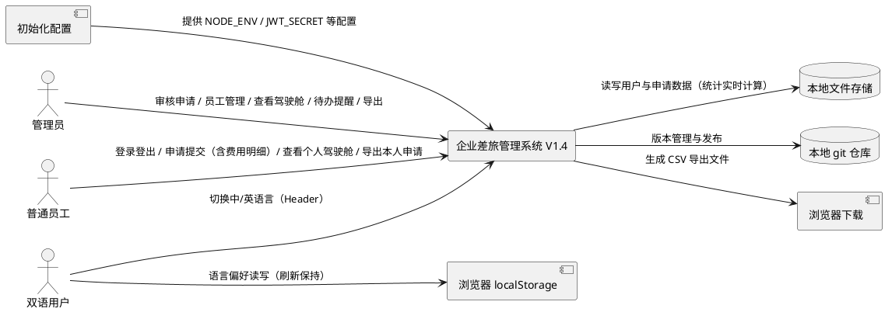
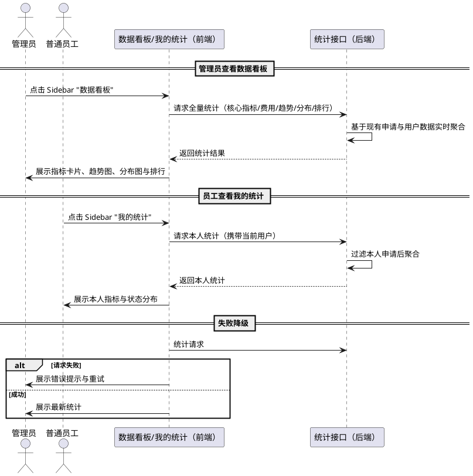
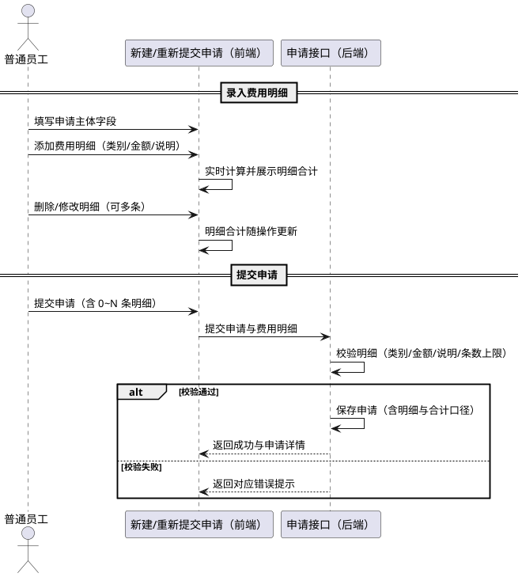
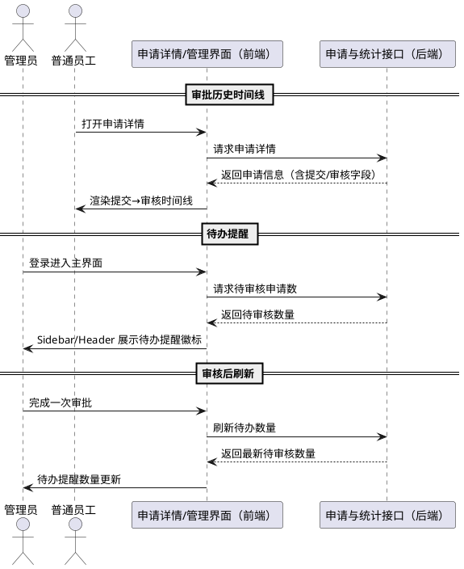
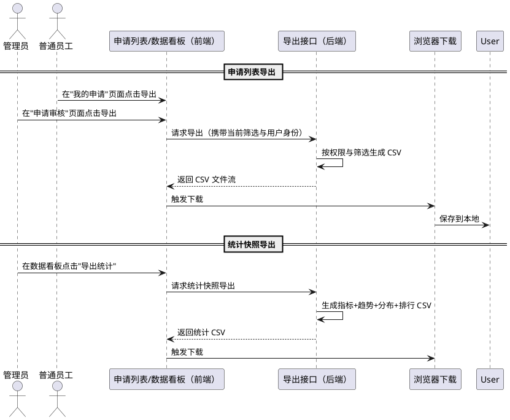

# 企业差旅管理系统 V1.4 需求规格

> 版本：V1.4 ｜ 基线：V1.3（2026-08-12）｜ 历史基线：V1.2、V1.1（加固版）、V1.0
> 定位：在 V1.3 基础上新增四项能力——①**Dashboard 管理驾驶舱与数据可视化**（统计总申请数、审批通过率、费用汇总、趋势图表、状态分布、部门/员工排行、个人驾驶舱，需求编号 7A）；②**费用明细扩展**（申请单支持多条费用明细的录入与汇总展示，需求编号 7B）；③**审批流优化**（申请详情审批历史时间线、管理员待办提醒，需求编号 7C）；④**统计导出**（申请列表与统计报表 CSV 导出，需求编号 7D）。
> 兼容性承诺：V1.0 ~ V1.3 全部既有业务规则、接口语义、路由、数据格式与双语体验保持兼容；本文档完整保留 V1.3 背景基线，V1.4 新增内容以 **【V1.4 新增】** 标注。
> 授权说明：用户已明确授权"所有决策点按推荐方案执行，默认同意，无需再审批"；V1.4 涉及的关键决策点（图表方案、部门字段扩展、费用明细与总费用口径、导出编码等）由本需求规格按最佳专业判断确定，并在第 7 章记录决策与推荐理由。
> 设计参考：依据 GitHub 开源差旅/费用管理项目（TravelExpenseTracker 差旅报销单+费用明细模型、FinPilot 企业费用审批仪表盘、gypsy-tms 差旅管理系统等）的功能模块与设计思路进行规划。

## 本版本变更概览（V1.3 → V1.4）

| 需求编号 | 变更类型 | 一句话说明 |
|---------|---------|-----------|
| 7A-1 ~ 7A-16 | 新增 | Dashboard 管理驾驶舱：管理员统计卡片（总申请/待审核/通过率/费用汇总）+ 趋势图表 + 状态分布 + 交通工具分布 + 部门/员工排行 + 员工个人驾驶舱 |
| 7B-1 ~ 7B-11 | 新增 | 费用明细扩展：申请单支持多条费用明细（类别/金额/说明）录入、明细合计自动汇总、列表与详情展示 |
| 7C-1 ~ 7C-9 | 新增 | 审批流优化：申请详情审批历史时间线（提交→审核完整轨迹）、管理员待办申请数提醒 |
| 7D-1 ~ 7D-8 | 新增 | 统计导出：管理员/员工按当前筛选导出申请列表 CSV、管理员导出 Dashboard 统计快照 CSV |

---

# **1. 组件定位**

## **1.1 核心职责**
**【V1.3 基线，保持不变】**
本组件负责在保持 V1.0 ~ V1.2 全部业务功能与接口语义不变的前提下，提供令牌黑名单清理、用户唯一性并发原子化、JWT_SECRET 强度校验等安全加固，以及版本号展示、UI/UX 视觉升级与中英双语支持。

**【V1.4 新增】** 本组件进一步负责：在 V1.3 既有架构、数据模型与 Ant Design + 双语体验之上，新增**管理驾驶舱与数据可视化**（面向管理员与员工的统计看板）、**费用明细**（申请单费用结构化拆分）、**审批流优化**（审批历史时间线、待办提醒）与**统计导出**（CSV 下载），实现"完善功能 + 数据可视化"的版本目标。

## **1.2 核心输入**
**【V1.3 基线，保持不变】**
1. 系统启动信号（来源：Node.js 进程启动，内容：环境变量配置，含 NODE_ENV、JWT_SECRET）
2. 用户登录/登出请求（来源：前端用户操作，内容：用户名、密码、当前认证令牌）
3. 管理员创建/编辑员工请求（来源：管理员前端操作，内容：用户名、姓名、初始密码、状态）
4. 员工差旅申请提交/撤回/重新提交请求（来源：员工前端操作，内容：申请单据字段）
5. 管理员申请审核请求（来源：管理员前端操作，内容：申请ID、审核结果、审核意见）
6. 语言切换请求与本地语言偏好读取（来源：用户操作与前端启动，内容：目标语言标识）
7. 版本号查询请求（来源：前端登录页/主界面，内容：无业务参数）

**【V1.4 新增】**
8. Dashboard 统计查询请求（来源：管理员/员工打开驾驶舱页面，内容：统计维度与筛选条件，如时间范围、状态、部门等）
9. 费用明细录入请求（来源：员工新建/重新提交申请操作，内容：费用类别、金额、说明等明细条目）
10. 审批历史与待办查询请求（来源：申请详情页与管理界面，内容：申请ID、当前用户身份）
11. 导出请求（来源：管理员/员工点击导出按钮，内容：导出范围与当前筛选条件）

## **1.3 核心输出**
**【V1.3 基线，保持不变】**
1. 登录/登出/员工管理/申请/审批等既有业务响应（目标：前端调用方，内容：与 V1.0~V1.3 完全一致）
2. 版本号查询响应（目标：前端调用方，内容：当前版本号 vX.Y.Z）
3. 双语界面文案与业务值显示映射（目标：浏览器用户，内容：中英文界面渲染）
4. 结构化日志与配置校验结果（目标：运行环境日志输出）

**【V1.4 新增】**
5. Dashboard 统计数据响应（目标：管理员/员工驾驶舱页面，内容：总申请数、审批通过率、费用汇总、趋势序列、状态分布、部门/员工排行、个人统计等结构化统计结果）
6. 费用明细汇总结果（目标：员工前端，内容：申请单费用明细列表与明细合计）
7. 审批历史轨迹响应（目标：申请详情页，内容：提交/审核的完整时间线，含审核人、时间、意见）
8. 待办申请数响应（目标：管理员界面，内容：当前处于待审核状态的申请数量）
9. CSV 导出文件（目标：浏览器用户下载，内容：申请列表或 Dashboard 统计快照的 CSV 文件）

## **1.4 职责边界**
**【V1.3 基线，保持不变】**
1. 本组件不改变 V1.0~V1.3 的登录、申请、审批、用户管理等既有业务行为与接口语义。
2. 本组件不引入新的存储技术；仍使用本地 JSON 文件持久化。
3. 本组件不引入分布式锁、消息队列、外部缓存等新组件。
4. 本组件不负责多级审批、报销结算、消息通知、行程预订等 V1.0 已声明不做的功能。

**【V1.4 新增】**
5. 本组件不改变既有申请状态机与审批规则：仍为管理员单级审核，待审核→已通过/已拒绝/已撤回，已拒绝→重新提交，不新增审批阶段与审批层级。
6. 本组件不引入独立 BI/报表系统、OLAP 数据仓库或第三方分析服务；Dashboard 统计基于现有请求/用户数据实时计算。
7. 本组件不新增费用报销、财务结算、币种换算功能；费用明细仅作为申请单信息的结构化展示与统计口径。
8. 本组件不改变既有表单字段与校验规则（目的地、日期、事由、交通工具、预计费用仍为必填主字段）；费用明细为可选扩展。
9. 本组件不改变既有 API 的请求/响应结构与错误码语义；V1.4 新增统计/导出相关接口为纯增量接口。
10. 本组件不负责导出文件的排版美化（仅提供结构化 CSV）；不新增打印、PDF、邮件发送等功能。

# **2. 领域术语**

**【V1.3 基线，保持不变】**

**差旅申请**
: 普通员工发起的出差请求单据，包含目的地、出发/返回日期、事由、交通工具、预计费用等信息。
: 备注：简称"申请"；V1.4 起申请单可选携带多条费用明细。

**申请状态**
: 差旅申请在生命周期中所处的阶段，取值为"待审核""已通过""已拒绝""已撤回"。

**待审核**
: 申请已提交、尚未被管理员审核的状态，是管理员待办与审核操作的目标状态。

**审批通过率**
: 已终审（已通过+已拒绝）申请中已通过所占的百分比，用于衡量审批效率与通过倾向。

**预计费用**
: 申请单填写的差旅总预算金额；V1.4 中当申请单录入费用明细时，明细合计为该申请的总费用口径。

**【V1.4 新增】**

**管理驾驶舱（Dashboard）**
: 面向管理员的汇总统计页面，集中展示系统申请数量、审批结果、费用、趋势与排行等关键经营指标的看板。

**个人驾驶舱**
: 面向普通员工本人的申请统计页面，展示本人申请数量、费用汇总与状态分布等个人数据。

**趋势图表**
: 按时间维度（如按月）统计申请数量或费用的连续序列可视化，用于观察业务量随时间变化。

**状态分布**
: 全部申请按申请状态（待审核/已通过/已拒绝/已撤回）分组的数量或费用占比结构。

**部门排行**
: 按员工所属部门维度聚合申请数量或费用的排名，用于横向比较各部门差旅活跃度。
: 备注：部门为员工的可选属性，未设置部门的员工归入"未分配"。

**员工排行**
: 按员工维度聚合申请数量或费用的排名，用于识别高活跃或高费用员工。

**费用明细**
: 申请单下拆分的具体费用条目，每条包含费用类别、金额与说明；多条明细合计构成申请的总费用。

**费用类别**
: 费用明细的业务分类，取值为"交通""住宿""餐饮""其他"。
: 备注：沿用既有交通工具体系之外的业务费用分类，非技术概念。

**审批历史**
: 申请从提交到最终审核的完整轨迹记录，含提交时间、每次审核人、审核时间、审核结果与审核意见。

**待办提醒**
: 管理员界面中展示的待审核申请数量提示，帮助管理员快速感知待处理工作负荷。

**统计导出**
: 将申请列表或 Dashboard 统计结果以 CSV 文件形式下载到本地的功能，用于离线分析与归档。

# **3. 角色与边界**

## **3.1 核心角色**
**【V1.3 基线，保持不变】**
- 管理员：执行员工创建、编辑、禁用/启用、重置密码与申请审核操作；V1.4 起新增查看管理驾驶舱、导出统计、查看待办提醒的能力。
- 普通员工：执行登录、登出、差旅申请相关操作；V1.4 起新增查看个人驾驶舱、录入费用明细、导出本人申请列表的能力。
- 中英双语用户：所有既有角色用户均可选择使用简体中文或英文界面；V1.4 新增页面与文案同样支持双语。

**【V1.4 新增】**
- 报表使用者（管理员/员工）：通过驾驶舱与导出功能获取统计数据与原始列表，进行业务分析与归档。

## **3.2 外部系统**
**【V1.3 基线，保持不变】**
- 本地文件存储系统：读写 `users.json`、`requests.json`、`audit-logs.json`、`token-blacklist.json` 等 JSON 数据文件。
- 初始化配置：系统启动时提供环境变量（NODE_ENV、JWT_SECRET、INIT_ADMIN_* 等）。
- 本地 git 仓库：承载 main/feature/release 分支与 vX.Y tag，反映版本管理与发布状态。
- 浏览器本地存储（localStorage）：保存用户语言偏好。
- 前端 i18n 资源与后端现有 API（保持不变）。

**【V1.4 新增】**
- 浏览器下载机制：承载 CSV 导出文件的下载（前端发起、浏览器保存到本地，不涉及第三方服务）。

## **3.3 交互上下文**

# **4. DFX约束**

## **4.1 性能**
**【V1.3 基线，保持不变】**
1. 核心接口（登录、登出、员工创建、员工编辑）响应时间上限保持 2 秒（单机本地文件存储场景）。
2. 版本号查询接口响应时间上限 200ms。
3. 语言切换后界面文案渲染必须在 500ms 内完成。

**【V1.4 新增】**
4. Dashboard 统计查询接口响应时间上限 2 秒（单机本地文件、数据量级 ≤ 万条场景）。
5. 导出接口响应时间上限 5 秒（导出数据量 ≤ 5000 条场景）；超出数据量时允许提示用户缩小范围。
6. Dashboard 页面首屏统计卡片加载不得阻塞页面渲染超过 2 秒；统计失败时页面必须降级展示，不得白屏。

## **4.2 可靠性**
**【V1.3 基线，保持不变】**
1. 黑名单清理失败不得阻断登录/登出主流程，且不得导致有效条目丢失或重复。
2. 用户唯一性原子化保证 users 集合强一致。
3. 语言偏好读写失败时按默认语言正常渲染，不阻塞页面。
4. 既有接口与版本接口不可用时前端降级策略保持 V1.3 行为。

**【V1.4 新增】**
5. Dashboard 统计为实时计算：统计数据必须基于当前存储数据即时计算，数据变更（新申请、审批、撤回）后重新查询必须返回最新结果，不得使用过期快照。
6. 统计或导出接口异常时不得影响既有申请/审批主流程；前端对统计失败进行降级提示（如展示空态或错误提示并允许重试）。
7. 费用明细合计计算必须准确：明细金额之和与申请总费用口径一致，存在差异时必须按规则处理（见 7B-8）并保证可复现。

## **4.3 安全性**
**【V1.3 基线，保持不变】**
1. JWT_SECRET 最小长度 ≥ 32 字符且不得命中弱密钥黑名单；生产模式弱密钥 fail-fast。
2. 密码存储使用 bcrypt 哈希，令牌机制保持 V1.0 不变。
3. 员工不能访问管理员页面，管理员可访问全部管理页面。
4. API 请求体/参数必须保持后端可识别的原始中文业务值。

**【V1.4 新增】**
5. Dashboard 统计接口必须按角色隔离数据：管理员可查看全量统计；普通员工只能查看本人申请相关的统计，禁止越权查看他人或全量数据。
6. 导出接口必须执行与对应列表查询一致的权限校验：员工只能导出本人申请；管理员可导出全量；未认证请求必须被拒绝。
7. 统计与导出接口不得返回用户密码哈希等敏感字段；导出 CSV 仅包含业务展示字段。
8. 新增的部门字段为可选业务属性，不改变既有认证与鉴权逻辑。

## **4.4 可维护性**
**【V1.3 基线，保持不变】**
1. 黑名单清理与启动配置校验输出结构化日志。
2. 全部用户可见文案集中管理于 i18n 资源文件；业务值显示映射单一维护。
3. 新增/修改文案同时维护中英两套资源。

**【V1.4 新增】**
4. Dashboard 统计指标口径必须文档化（如审批通过率、费用汇总范围），保证不同时期统计结果可比。
5. 新增统计/导出相关错误必须遵循既有错误码规范，输出结构化日志（含统计范围、失败原因）。
6. 导出 CSV 表头与内容必须与界面展示字段一致，字段顺序稳定，便于自动化比对与归档。
7. 费用类别枚举与统计维度（部门、状态、交通工具）必须单一来源维护，禁止页面散落硬编码。

## **4.5 兼容性**
**【V1.3 基线，保持不变】**
1. V1.0~V1.3 全部对外接口、请求参数、响应结构与错误码语义保持兼容。
2. 存量 JSON 数据格式保持兼容，无需数据迁移。
3. 既有路由、权限守卫、表单字段与校验规则保持不变；既有自动化测试必须全部通过。

**【V1.4 新增】**
4. V1.4 新增统计/导出接口为纯增量公开接口，不影响既有任何接口的地址、请求/响应结构与错误码语义。
5. 费用明细为申请单的可选扩展：存量申请单不包含费用明细时必须正常展示与统计，不得因缺明细字段而报错；新申请单可带明细。
6. 部门字段为员工的可选扩展属性：存量员工未设置部门时按"未分配"参与部门统计，不得影响既有员工管理功能。
7. 新增 Dashboard/费用明细/审批历史/导出页面与文案必须完整支持中英双语，且不改变 V1.3 既有双语行为。
8. 审批历史时间线必须兼容存量申请：历史数据仅含单次审核字段时，时间线须按既有数据推导展示，不得丢失或虚构信息。

# **5. 核心能力**

> 说明：5.1 ~ 5.7 为 V1.1~V1.3 基线需求（背景，保持兼容，本版本不修改）；5.8 ~ 5.11 为 V1.4 新增需求。

## **5.8 Dashboard 管理驾驶舱**【V1.4 新增】（需求编号 7A）

> 定位：数据可视化核心模块。管理员可查看全系统申请统计与经营指标，员工可查看本人申请统计；两者共用统计计算口径与可视化组件，仅数据范围不同。
> 决策记录（推荐方案）：Dashboard 图表采用 Ant Design Charts（@ant-design/charts）实现，与 V1.3 引入的 Ant Design v5 组件体系保持一致；统计计算由后端基于现有 requests/users 数据实时聚合；Dashboard 作为独立页面挂载在既有 Sidebar/Header 布局中，管理员菜单新增"数据看板"，员工菜单新增"我的统计"。

### **5.8.1 业务规则**

1. **7A-1 管理员驾驶舱入口规则（Ev）**：系统必须为管理员提供独立的数据看板页面入口（Sidebar 菜单），管理员登录后可访问该页面。
   a. 验收条件：When 管理员登录进入主界面，the system shall 在 Sidebar 菜单中提供"数据看板"入口并可通过点击进入。
2. **7A-2 员工个人驾驶舱入口规则（Ev）**：系统必须为普通员工提供个人统计页面入口（Sidebar 菜单），员工登录后可访问本人统计。
   a. 验收条件：When 普通员工登录进入主界面，the system shall 在 Sidebar 菜单中提供"我的统计"入口并可通过点击进入。
3. **7A-3 权限隔离规则（Ev）**：管理员驾驶舱仅管理员可访问，员工个人驾驶舱仅员工本人可访问，且员工统计接口不得返回全量或他人数据。
   a. 验收条件：When 普通员工直接访问管理员驾驶舱地址，the system shall 按既有权限守卫拒绝访问并重定向。
   b. 验收条件：When 员工调用个人统计接口，the system shall 返回结果仅包含该员工本人申请的统计，不含其他员工数据。
4. **7A-4 核心指标卡片规则（Ev）**：管理员驾驶舱必须展示核心指标卡片：总申请数、待审核数、已通过数、已拒绝数、已撤回数、审批通过率。
   a. 验收条件：When 管理员打开数据看板，the system shall 展示上述六项指标卡片，且数值与当前申请数据实时一致。
5. **7A-5 审批通过率计算规则（Eb）**：审批通过率必须按"已通过 / (已通过 + 已拒绝) × 100%"计算；当已通过与已拒绝均为 0 时，通过率显示为 0%。
   a. 验收条件：When 系统中存在已通过与已拒绝申请，the system shall 按该公式计算并通过率以百分比展示（保留 1 位小数）。
   b. 验收条件：When 系统无已终审申请，the system shall 展示通过率 0%，不出现除零错误。
6. **7A-6 费用汇总规则（Ev）**：管理员驾驶舱必须展示费用汇总指标：总预计费用、已通过申请费用、待审核申请费用。
   a. 验收条件：When 管理员打开数据看板，the system shall 展示总预计费用及按状态聚合的已通过、待审核费用汇总，金额以统一格式展示（千分位 + 两位小数）。
7. **7A-7 费用口径规则（Eb）**：统计口径必须一致：申请总费用 = 费用明细合计（当申请单含费用明细时）；不含明细的申请按预计费用字段计入统计。
   a. 验收条件：When 统计费用汇总，the system shall 含明细申请以明细合计计入、不含明细申请以预计费用计入，且口径在驾驶舱与导出中保持一致。
8. **7A-8 趋势图表规则（Ev）**：管理员驾驶舱必须提供按月份的申请数量趋势图与费用趋势图（默认近 6 个月，支持时间范围切换）。
   a. 验收条件：When 管理员查看趋势图，the system shall 以时间维度展示申请数量与费用变化序列，且切换时间范围后图表数据随之更新。
9. **7A-9 状态分布规则（Ev）**：管理员驾驶舱必须展示申请状态分布（待审核/已通过/已拒绝/已撤回 数量或占比）。
   a. 验收条件：When 管理员查看状态分布，the system shall 按申请状态分组展示数量与占比，各状态合计等于总申请数。
10. **7A-10 交通工具分布规则（Ev）**：管理员驾驶舱必须展示交通工具分布（火车/飞机/汽车/高铁/轮船/其他）。
    a. 验收条件：When 管理员查看交通工具分布，the system shall 按交通工具维度展示申请数量分布。
11. **7A-11 部门排行规则（Ev）**：管理员驾驶舱必须提供按部门聚合的申请数/费用排行（Top N，含"未分配"分组）。
    a. 验收条件：When 管理员查看部门排行，the system shall 展示各部门申请数与费用并按数值降序排列，未设置部门的员工归入"未分配"。
12. **7A-12 员工排行规则（Ev）**：管理员驾驶舱必须提供按员工聚合的申请数/费用排行（Top N）。
    a. 验收条件：When 管理员查看员工排行，the system shall 展示员工姓名（或用户名）、申请数、费用并按数值降序排列。
13. **7A-13 员工个人统计规则（Ev）**：员工个人驾驶舱必须展示本人申请总数、待审核/已通过/已拒绝/已撤回数量、本人费用汇总与本人状态分布。
    a. 验收条件：When 员工打开"我的统计"页面，the system shall 展示上述本人统计项，数据仅覆盖该员工本人申请。
14. **7A-14 数据实时性规则（Ev）**：Dashboard 每次进入或刷新必须基于当前数据重新计算统计结果。
    a. 验收条件：When 管理员/员工打开或刷新驾驶舱页面，the system shall 返回基于最新申请数据的统计结果。
15. **7A-15 双语支持规则（Ev）**：Dashboard 全部文案（标题、指标名、图表标签、Tooltip、图例、空态）必须支持中英双语，状态/角色/交通工具等业务值沿用显示映射。
    a. 验收条件：When 界面语言为 en-US 并浏览驾驶舱，the system shall 图表标题、指标名、图例与 Tooltip 均为英文，无系统固有中文残留。
16. **7A-16 统计空态与异常规则（Eu）**：当统计数据为空或统计请求失败时，驾驶舱必须展示空态/错误提示并提供重试能力，不得白屏或无限加载。
    a. 验收条件：If 统计请求失败，the system shall 展示错误提示与重试入口，页面其余部分不崩溃。
    b. 验收条件：If 系统无任何申请数据，the system shall 各统计区域展示空态，指标卡片显示 0，不出现异常。

### **5.8.2 交互流程**

### **5.8.3 异常场景**

1. **统计接口请求失败**
   a. 触发条件：网络异常、后端未启动或统计接口超时
   b. 系统行为：前端展示错误提示与重试入口，不阻塞其他功能
   c. 用户感知：驾驶舱显示"加载失败"提示，点击重试可恢复
2. **无申请数据**
   a. 触发条件：系统中不存在任何申请记录
   b. 系统行为：各统计区域展示空态，指标卡片显示 0
   c. 用户感知：驾驶舱正常展示空态，无异常报错
3. **员工越权访问管理员驾驶舱**
   a. 触发条件：普通员工直接访问管理员驾驶舱路由
   b. 系统行为：既有权限守卫拒绝访问并重定向
   c. 用户感知：被重定向到授权页面，无法查看全量统计
4. **统计数据与列表数据不一致**
   a. 触发条件：并发提交/审批后立即打开驾驶舱
   b. 系统行为：统计基于最新数据实时计算，刷新后一致
   c. 用户感知：刷新驾驶舱后统计数据与列表数量一致

## **5.9 费用明细**【V1.4 新增】（需求编号 7B）

> 定位：将申请单从"单一预计费用金额"扩展为"结构化费用明细列表"，每条明细含费用类别、金额与说明；明细合计与申请总费用统一口径，用于详情展示与 Dashboard 统计。
> 决策记录（推荐方案）：费用类别固定为"交通""住宿""餐饮""其他"；费用明细为申请单可选扩展字段，存量申请（无明细）保持兼容；新建/重新提交申请时可录入 0~N 条明细，明细合计作为该申请总费用口径（7B-8 规则）。

### **5.9.1 业务规则**

1. **7B-1 费用明细可选规则（Ev）**：新建申请与重新提交申请时，员工可选择录入 0 条或多条费用明细；明细为可选项，不影响申请主体字段（目的地/日期/事由/交通工具/预计费用）的既有必填校验。
   a. 验收条件：When 员工新建申请时不录入任何费用明细，the system shall 正常提交成功，申请不含费用明细字段。
   b. 验收条件：When 员工新建申请时录入费用明细，the system shall 随申请一并保存全部明细。
2. **7B-2 费用类别取值规则（Eb）**：费用明细的类别必须取自固定枚举"交通""住宿""餐饮""其他"，禁止录入枚举之外的类别。
   a. 验收条件：When 员工选择费用类别，the system shall 仅提供"交通/住宿/餐饮/其他"四个选项，保存时校验类别合法性。
3. **7B-3 明细金额校验规则（Eb）**：每条费用明细的金额必须为非负数字，且不能为 0 或负数。
   a. 验收条件：If 费用明细金额为 0 或负数，the system shall 拒绝提交并提示金额必须大于 0。
4. **7B-4 明细说明长度规则（Eb）**：费用明细的说明为可选文本，长度不得超过 200 字符。
   a. 验收条件：If 费用明细说明超过 200 字符，the system shall 拒绝提交并提示长度超限。
5. **7B-5 明细数量上限规则（Eb）**：单条申请的费用明细数量不得超过 20 条。
   a. 验收条件：If 费用明细条数超过 20，the system shall 拒绝提交并提示明细数量超限。
6. **7B-6 明细编辑能力规则（Ev）**：员工在新建/重新提交申请表单中必须能够添加、删除、修改费用明细条目。
   a. 验收条件：When 员工在申请表单编辑费用明细，the system shall 支持新增、删除与修改单条明细，并实时更新明细合计。
7. **7B-7 明细合计实时计算规则（Ev）**：表单中必须实时展示费用明细合计，明细合计为各条明细金额之和。
   a. 验收条件：When 员工增删改明细，the system shall 明细合计随操作实时更新且等于当前全部明细金额之和。
8. **7B-8 总费用口径规则（Eb）**：当申请单含费用明细时，申请总费用（统计与展示口径）必须等于明细合计；当无明细时，总费用为预计费用字段。
   a. 验收条件：When 申请单含费用明细且被展示或统计，the system shall 以明细合计作为该申请总费用。
   b. 验收条件：When 申请单不含费用明细，the system shall 以预计费用作为总费用，行为与 V1.3 一致。
9. **7B-9 详情展示规则（Ev）**：申请详情页必须展示费用明细列表（类别、金额、说明）与明细合计；无明细时展示空态或不展示明细区块。
   a. 验收条件：When 用户打开含明细的申请详情，the system shall 展示全部明细条目与合计金额。
   b. 验收条件：When 用户打开不含明细的申请详情，the system shall 不报错，明细区域按空态处理。
10. **7B-10 列表与统计联动规则（Ev）**：申请列表的费用列与 Dashboard 费用汇总必须采用与 7B-8 一致的总费用口径。
    a. 验收条件：When 申请列表或 Dashboard 展示申请费用，the system shall 含明细申请显示明细合计，不含明细申请显示预计费用。
11. **7B-11 存量数据兼容规则（Eu）**：存量申请单（V1.3 及更早创建，无费用明细字段）在列表、详情、统计中必须正常展示与计算，不得报错或计入为 0。
    a. 验收条件：When 系统存在无费用明细的存量申请，the system shall 其详情正常展示、列表费用按预计费用显示、统计按预计费用计入。

### **5.9.2 交互流程**

### **5.9.3 异常场景**

1. **明细金额非法**
   a. 触发条件：费用明细金额为 0、负数或非数字
   b. 系统行为：拒绝提交，返回校验错误
   c. 用户感知：提示"金额必须大于 0"，表单保留已填数据
2. **明细数量超限**
   a. 触发条件：单条申请费用明细超过 20 条
   b. 系统行为：拒绝提交，返回校验错误
   c. 用户感知：提示明细数量超限，需删除部分明细
3. **无明细的存量申请**
   a. 触发条件：查看 V1.3 及更早创建的无明细申请
   b. 系统行为：按无明细兼容处理，费用以预计费用为准
   c. 用户感知：详情/列表/统计正常展示，无异常提示
4. **明细合计与预计费用不一致**
   a. 触发条件：申请含明细且明细合计与用户填写的预计费用不同
   b. 系统行为：按 7B-8 以明细合计作为总费用口径，预计费用字段保留为用户填写的参考值
   c. 用户感知：列表与统计中该申请费用按明细合计展示，预计费用字段可在详情中查看

## **5.10 审批流优化**【V1.4 新增】（需求编号 7C）

> 定位：不改变既有审批状态机与单级审核规则，优化审批过程的信息呈现与操作入口——在申请详情页提供完整审批历史时间线，在管理员界面提供待办申请数提醒。
> 决策记录（推荐方案）：审批历史时间线展示提交节点与审核节点（审核人/时间/结果/意见）；待办提醒展示于管理员 Sidebar/Header，数值为当前待审核申请数，进入页面时刷新。

### **5.10.1 业务规则**

1. **7C-1 审批历史时间线规则（Ev）**：申请详情页必须展示该申请的审批历史时间线，包含提交节点与每次审核节点（审核人、审核时间、审核结果、审核意见）。
   a. 验收条件：When 用户（员工/管理员）打开申请详情页，the system shall 展示含提交时间与审核信息的时间线。
   b. 验收条件：When 申请已被审核，the system shall 时间线包含审核人、审核时间、审核结果与审核意见。
2. **7C-2 未审核时间线规则（Ev）**：待审核状态的申请，时间线必须展示"已提交，待审核"状态，不出现虚构的审核信息。
   a. 验收条件：When 申请处于待审核状态，the system shall 时间线仅展示提交节点并标注待审核，无审核人/意见信息。
3. **7C-3 存量申请兼容规则（Eu）**：对仅含单次审核字段（审核人/时间/意见）的存量申请，时间线必须基于既有字段推导展示，不得因缺少完整历史而报错。
   a. 验收条件：When 查看 V1.3 及更早审核过的申请详情，the system shall 时间线正常展示其提交与审核信息，不报错、不虚构额外节点。
4. **7C-4 管理员待办提醒规则（Ev）**：管理员登录后的界面必须展示待审核申请数量提醒（如 Sidebar/Header 徽标），数值为当前全部待审核申请数。
   a. 验收条件：When 管理员登录进入主界面，the system shall 展示待审核申请数量提醒，且数量等于当前待审核申请总数。
5. **7C-5 待办数量实时性规则（Ev）**：待办数量必须在进入页面或执行审核后刷新，确保与当前待审核数据一致。
   a. 验收条件：When 管理员完成一次审批后回到列表页，the system shall 待办提醒数量相应减少并反映最新待审核数。
6. **7C-6 待办数量为 0 规则（Ev）**：当不存在待审核申请时，待办提醒必须显示为 0 或隐藏，不得显示异常。
   a. 验收条件：When 无待审核申请，the system shall 待办提醒显示 0 或隐藏，不出现负数或错误。
7. **7C-7 审批历史与状态一致性规则（Eb）**：时间线的最终节点必须与申请当前状态一致（已通过→通过节点、已拒绝→拒绝节点、已撤回→撤回说明、待审核→待审核）。
   a. 验收条件：When 查看任何状态的申请详情，the system shall 时间线最终节点状态与申请当前状态一致。
8. **7C-8 审批流不改变规则（Ev）**：审批流优化不得改变既有审批规则：仍为管理员单级审核、通过/拒绝操作、拒绝必填审核意见、状态机流转不变。
   a. 验收条件：When 管理员执行审核操作，the system shall 行为与 V1.3 完全一致（状态流转、请求参数、错误码不变）。
9. **7C-9 双语支持规则（Ev）**：审批历史时间线与待办提醒的文案必须支持中英双语。
   a. 验收条件：When 界面语言为 en-US 并查看审批时间线或待办提醒，the system shall 相关文案为英文，无系统固有中文残留。

### **5.10.2 交互流程**

### **5.10.3 异常场景**

1. **待办数量接口失败**
   a. 触发条件：待办数量统计请求失败或超时
   b. 系统行为：待办提醒隐藏或显示默认值，不阻塞主界面使用
   c. 用户感知：待办徽标不可见或显示为 0，其余功能正常
2. **存量申请无完整审批历史**
   a. 触发条件：查看 V1.3 及更早创建、仅含单次审核字段的申请
   b. 系统行为：按既有字段推导时间线，不报错
   c. 用户感知：时间线正常展示，可能仅含提交与最终审核两个节点
3. **时间线与当前状态短暂不一致**
   a. 触发条件：审批完成后立即打开详情页
   b. 系统行为：详情数据基于最新数据返回，刷新后一致
   c. 用户感知：刷新详情页后时间线最终节点与状态一致

## **5.11 统计导出**【V1.4 新增】（需求编号 7D）

> 定位：将申请列表与 Dashboard 统计结果导出为 CSV 文件供本地下载，用于离线分析与归档。
> 决策记录（推荐方案）：CSV 导出由后端生成并提供下载；申请列表导出遵循当前列表的筛选条件与权限范围；Dashboard 统计快照导出为指标+趋势+分布+排行的结构化 CSV。文件编码采用 UTF-8（含 BOM，兼容 Excel 打开），列名使用当前语言文案。

### **5.11.1 业务规则**

1. **7D-1 员工导出本人申请规则（Ev）**：普通员工必须能够将本人申请列表导出为 CSV 文件，导出内容与当前列表一致（含筛选条件）。
   a. 验收条件：When 员工在"我的申请"页面点击导出，the system shall 生成仅包含该员工本人申请的 CSV 文件并触发下载。
2. **7D-2 管理员导出全部申请规则（Ev）**：管理员必须能够将申请列表（全量或按当前筛选）导出为 CSV 文件。
   a. 验收条件：When 管理员在"申请审核"页面点击导出，the system shall 生成包含当前筛选范围申请记录的 CSV 文件并触发下载。
3. **7D-3 导出字段完整性规则（Ev）**：导出 CSV 必须包含申请关键字段：提交人、目的地、出发日期、返回日期、事由、交通工具、总费用、状态、提交时间、审核信息。
   a. 验收条件：When 导出的 CSV 被打开，the system shall 文件包含上述全部业务字段，且每行对应一条申请记录。
4. **7D-4 导出范围一致性规则（Eb）**：导出数据必须与当前列表筛选条件一致（状态、分页范围语义按全部符合筛选的记录导出，而非仅当前页）。
   a. 验收条件：When 列表处于某筛选状态并点击导出，the system shall CSV 包含全部符合该筛选条件的记录，而非仅当前页记录。
5. **7D-5 管理员统计快照导出规则（Ev）**：管理员必须能够将 Dashboard 统计结果导出为 CSV 统计快照（含核心指标、趋势序列、状态分布、交通工具分布、部门/员工排行）。
   a. 验收条件：When 管理员在数据看板点击"导出统计"，the system shall 生成包含核心指标、趋势、分布与排行的 CSV 快照并触发下载。
6. **7D-6 导出编码与格式规则（Eb）**：导出的 CSV 文件必须采用 UTF-8 编码（含 BOM），字段使用英文逗号分隔，金额以数字+两位小数展示，日期保持 ISO 格式。
   a. 验收条件：When 导出文件被 Excel 或文本编辑器打开，the system shall 中文内容正常显示（不乱码）、字段分隔正确、金额与日期格式符合规范。
7. **7D-7 导出权限规则（Ev）**：导出操作必须执行与列表查询一致的认证与权限校验：员工仅能导出本人数据，管理员可导出全量，未认证请求被拒绝。
   a. 验收条件：If 未认证用户调用导出接口，the system shall 拒绝访问并返回认证错误。
   b. 验收条件：When 员工调用导出接口，the system shall 仅导出该员工本人申请，禁止导出全量数据。
8. **7D-8 导出失败处理规则（Eu）**：导出失败（数据量过大、生成异常、网络错误）时必须给出明确提示，不得静默失败或生成损坏文件。
   a. 验收条件：If 导出接口返回失败，the system shall 前端展示错误提示，不产生空文件下载。

### **5.11.2 交互流程**

### **5.11.3 异常场景**

1. **导出数据量过大**
   a. 触发条件：申请记录数量超过导出上限（5000 条）
   b. 系统行为：拒绝导出并提示用户缩小范围
   c. 用户感知：提示"数据量过大，请缩小筛选范围后重试"
2. **导出接口失败**
   a. 触发条件：后端生成 CSV 失败或网络异常
   b. 系统行为：返回错误，不产生损坏文件
   c. 用户感知：展示错误提示，可重试
3. **未授权导出**
   a. 触发条件：未认证或越权调用导出接口
   b. 系统行为：拒绝访问
   c. 用户感知：返回认证/权限错误
4. **空数据导出**
   a. 触发条件：筛选结果为空时点击导出
   b. 系统行为：生成仅含表头（或提示无数据）的 CSV，或提示无数据
   c. 用户感知：下载文件包含表头无数据行，或收到"无数据可导出"提示

# **6. 数据约束**

> 说明：6.1 ~ 6.7 为 V1.1~V1.3 基线内容（背景，保持不变）；6.8 ~ 6.10 为 V1.4 新增约束。

## **6.1 令牌黑名单条目（token-blacklist）**【V1.1 基线，保持不变】
1. **id**：每条记录的全局唯一标识，同一集合内不得重复。
2. **token**：登出时写入的 JWT 令牌原文，用于鉴权精确匹配。
3. **expiresAt**：令牌过期时间（ISO 8601 格式字符串），清理以此为过期判据。

## **6.2 用户账号（users）**【V1.1 基线，保持不变】
1. **username**：全局唯一，创建与编辑时在互斥临界区内校验。
2. **id**：账号唯一标识，创建时生成，创建后不得变更。
3. **passwordHash**：密码 bcrypt 哈希值，接口响应中必须剔除。
4. **role / status**：取值与语义保持 V1.0 不变（管理员/普通员工；启用/禁用）。
5. **createdAt / updatedAt**：ISO 8601 格式字符串。

**【V1.4 新增】**
6. **department**：员工所属部门的可选业务属性，长度不超过 50 字符；允许为空，为空时归入"未分配"分组参与部门统计；不改变既有认证鉴权逻辑。

## **6.3 系统版本号**【V1.2 基线，保持不变】
1. **version**：遵循语义化版本格式 X.Y.Z，以 server/package.json 的 version 字段为唯一事实来源。
2. **展示格式**：对外展示为 vX.Y.Z 格式。
3. **一致性**：与 CHANGELOG.md、git tag 对应。

## **6.4 分支与标签（git branch / tag）**【V1.2 基线，保持不变】
1. **main / feature/* / release/vX.Y / tag vX.Y**：命名与角色遵循 V1.2 规范。

## **6.5 Design Token 设计体系**【V1.3 基线，保持不变】
1. 颜色、圆角、间距、字体、状态色遵循 V1.3 确定的取值（企业蓝 #1677ff 等）。

## **6.6 i18n 语言资源**【V1.3 基线，保持不变】
1. 语言标识仅允许 zh-CN（默认）与 en-US；localStorage key 为 i18nLanguage。
2. 中英资源键一致，业务值显示映射单一维护。

## **6.7 双语显示映射（display mapping）**【V1.3 基线，保持不变】
1. 申请状态、角色、用户状态、交通工具的中英文映射遵循 V1.3 确定的映射表。
2. 请求参数约束：API 请求参数/请求体必须使用后端真实中文业务值。

## **6.8 差旅申请（requests）**【V1.4 新增扩展】
1. **既有字段保持不变**：submitterUsername、destination、startDate、endDate、purpose、transport、estimatedCost、status、submittedAt、createdAt、updatedAt、id、reviewerUsername、reviewedAt、reviewComment、resubmittedFrom 等字段语义与 V1.3 完全一致。
2. **expenseItems**：费用明细的可选数组字段；每条明细包含 category（费用类别）、amount（金额）、description（说明）；存量申请无该字段时必须兼容。
3. **费用类别（category）**：取值仅限"交通""住宿""餐饮""其他"，不在此枚举内的值视为非法。
4. **明细金额（amount）**：必须为非负数字且大于 0，保留两位小数精度。
5. **明细说明（description）**：可选文本，长度不超过 200 字符。
6. **明细数量上限**：单条申请的明细条目数不超过 20 条。
7. **总费用口径**：含明细的申请总费用 = 明细合计；不含明细的申请总费用 = estimatedCost；统计与展示必须使用同一口径。
8. **审批字段**：reviewerUsername、reviewedAt、reviewComment 保持既有语义；审批历史时间线由提交时间与审批字段推导，不新增历史数组字段。

## **6.9 Dashboard 统计数据（dashboard stats）**【V1.4 新增】
> 说明：统计数据为实时聚合结果，不持久化存储；以下为逻辑口径约束。
1. **核心指标**：总申请数=全部申请记录数；待审核/已通过/已拒绝/已撤回=按状态统计数；审批通过率=已通过/(已通过+已拒绝)×100%，分母为 0 时通过率=0%。
2. **费用汇总**：总预计费用、已通过费用、待审核费用均按 6.8-7 总费用口径聚合。
3. **趋势序列**：按自然月聚合申请数量与费用，默认返回近 6 个月（含当月），时间范围可切换。
4. **状态分布**：按申请状态分组统计数量与占比，各状态数量之和等于总申请数。
5. **交通工具分布**：按交通工具取值分组统计数量。
6. **部门排行**：按员工 department 聚合申请数量与费用，未设置部门归入"未分配"；按数值降序。
7. **员工排行**：按 submitterUsername 聚合申请数量与费用（关联用户姓名展示），按数值降序。
8. **员工个人统计**：仅聚合该员工本人申请数据，不得包含他人数据。

## **6.10 统计导出（CSV export）**【V1.4 新增】
1. **申请列表导出字段**：提交人、目的地、出发日期、返回日期、事由、交通工具、总费用、状态、提交时间、审核人、审核时间、审核意见。
2. **编码与格式**：UTF-8（含 BOM）；逗号分隔；金额数字+两位小数；日期 ISO 格式；列名使用当前语言文案。
3. **范围约束**：员工导出仅含本人数据；管理员导出含当前筛选范围；导出上限 5000 条。
4. **统计快照字段**：核心指标、月度趋势、状态分布、交通工具分布、部门排行、员工排行。

---

# **7. 待确认决策点【V1.4 新增】**

> 依据用户授权"所有决策点按推荐方案执行，默认同意，无需再审批"，以下决策点均由本需求规格按最佳专业判断确定推荐方案并默认采用；仅当实现阶段出现影响巨大的分歧时按此处记录沟通。

| 编号 | 决策点 | 推荐方案（已采用） | 推荐理由 |
|------|--------|------------------|---------|
| D-1 | Dashboard 图表方案 | Ant Design Charts（@ant-design/charts） | 与 V1.3 已引入的 Ant Design v5 生态一致，中文文档完善，图表类型覆盖折线/柱状/饼图/排行需求，避免引入不统一的可视化库 |
| D-2 | 统计计算方式 | 后端基于现有 requests/users 数据实时聚合，不持久化快照 | 数据量级为本地 JSON 小规模场景，实时计算保证"数据实时性"需求（7A-14），无需新增存储 |
| D-3 | 部门字段扩展 | users 新增可选 department 字段（≤50 字符），存量员工归入"未分配" | 满足"部门排行"需求且向后兼容（V1.5 兼容性约束），不改变既有员工管理与鉴权 |
| D-4 | 费用明细模型 | requests 可选 expenseItems 数组（类别/金额/说明，≤20 条），总费用=明细合计（有明细时） | 参考 TravelExpenseTracker 差旅报销单+费用明细模型；向后兼容存量申请，统计口径统一（7B-8） |
| D-5 | 费用类别枚举 | 交通 / 住宿 / 餐饮 / 其他 | 覆盖差旅常见费用构成，简洁够用，便于扩展 |
| D-6 | 审批历史实现 | 由提交时间 + 既有审批字段（审核人/时间/意见）推导时间线，不新增历史数组 | 单级审批场景下既有字段已足够还原轨迹；保持数据模型最小扩展，兼容存量申请（7C-3） |
| D-7 | 待办提醒位置 | 管理员 Sidebar/Header 展示待审核申请数徽标 | 符合企业管理后台惯例，入口可见、信息即时，实现轻量 |
| D-8 | CSV 编码 | UTF-8 含 BOM | 兼容 Excel 直接打开中文不乱码，业界通行做法 |
| D-9 | 导出上限 | 单次导出上限 5000 条 | 平衡本地文件存储性能与导出可用性，超限提示缩小范围 |
| D-10 | 导出生成方式 | 后端生成 CSV 文件流下载 | 权限校验（7D-7）与数据筛选统一在后端执行，保证员工/管理员数据隔离 |
| D-11 | 待办数量刷新时机 | 登录进入主界面、进入列表页、完成审核后刷新 | 满足 7C-5 实时性，实现简单，无需轮询 |

