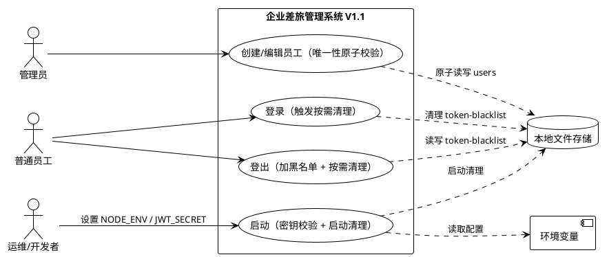
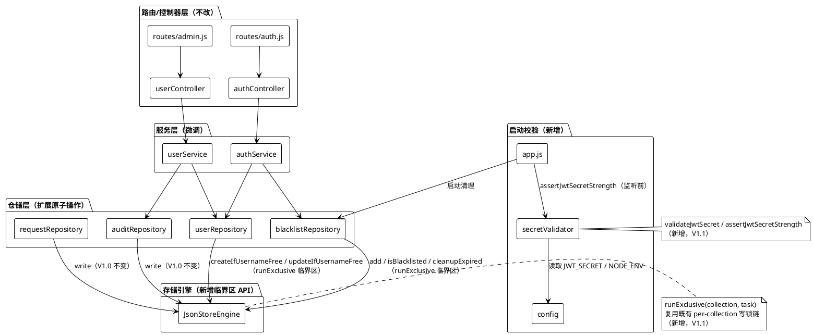
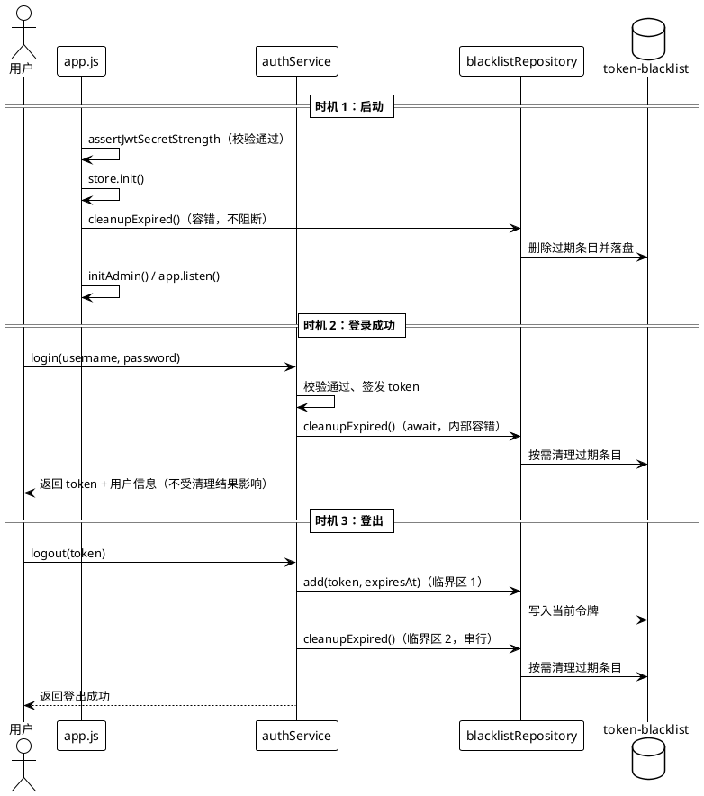
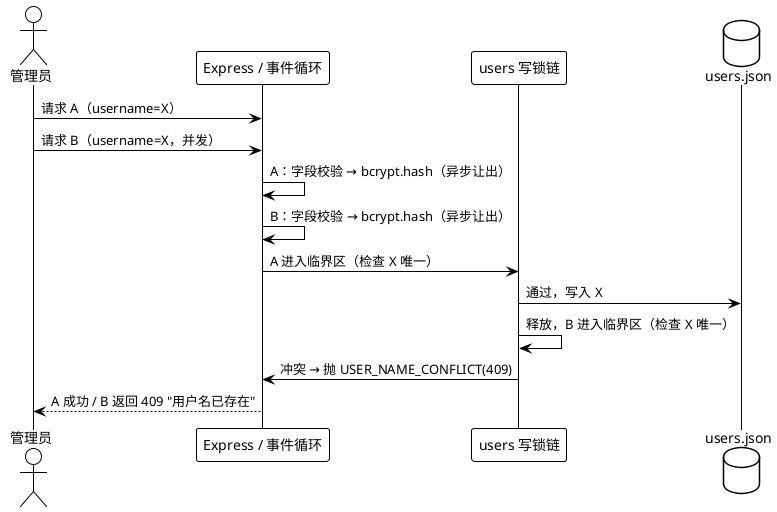
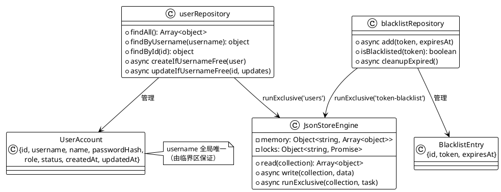

# 企业差旅管理系统 V1.1 加固版技术设计方案

> 版本：V1.1（加固版）｜基线：V1.0（2026-08-11）
> 对应需求：`docs/spec.md`（23 条需求，三个加固点）
> 设计原则：**改动点最小化**、保持 V1.0 业务语义与接口完全兼容、复用既有 per-collection 串行写锁机制、不引入新组件/新存储/定时任务。

---

# 一、需求与存量功能关系分析

本章明确 V1.1 三项加固需求与 V1.0 现有代码的关系，是增量设计的基础。所有代码位置均已核实到文件级（函数级以行号标注）。

## 1.1 需求功能与存量功能对比

### 1.1.1 已实现功能

以下功能在 V1.0 已完整实现，V1.1 **保持原样、不做改动**：

| 需求功能 | 存量功能 | 代码位置 | 匹配度 |
|---------|---------|---------|--------|
| 登出时将当前令牌加入黑名单 | `authService.logout()` 调用 `blacklistRepository.add()`，写入 `{id, token, expiresAt}` | `server/src/services/authService.js:36-42`；`server/src/repositories/blacklistRepository.js:4-8` | 100% |
| 鉴权时校验令牌是否在黑名单中 | `authRequired` 中间件调用 `blacklistRepository.isBlacklisted()`，命中返回 `AUTH_TOKEN_INVALID`(401) | `server/src/middlewares/auth.js:16-18`；`server/src/repositories/blacklistRepository.js:10-13` | 100% |
| 用户名唯一性检查的错误语义（`USER_NAME_CONFLICT` / HTTP 409 / "用户名已存在"） | `createUser()` 与 `updateUser()` 中的 `findByUsername` 冲突检查 | `server/src/services/userService.js:30-33, 73-76`；`server/src/constants/errorCodes.js:6` | 100% |
| JWT_SECRET 缺失时拒绝启动（`INIT_CONFIG_MISSING`） | `startServer()` 起始处缺失检查 | `server/src/app.js:19-21`；`server/src/constants/errorCodes.js:11` | 100% |
| 存储写入失败回滚内存态并抛 `STORE_WRITE_FAILED` | `JsonStoreEngine.write()` 的 try/catch 回滚逻辑 | `server/src/store/JsonStoreEngine.js:42-53` | 100% |
| 黑名单"按过期时间过滤"的删除逻辑 | `blacklistRepository.cleanupExpired()` 的 filter 判断（V1.1 仅扩展调用时机与临界区，不重写过滤逻辑） | `server/src/repositories/blacklistRepository.js:15-22` | 75%（逻辑已实现，缺调用点/临界区/日志，见 1.1.2） |
| 员工创建/编辑/禁用/重置密码、申请、审批、审计等既有业务 | 服务层 `userService` / `requestService` / `reviewService` / `auditService` 全量逻辑 | `server/src/services/*.js` | 100%（V1.1 不改动其业务语义） |

### 1.1.2 需要扩展的功能

以下功能与存量代码部分匹配，需要在现有基础上改造：

| 需求功能 | 存量功能 | 差异说明 | 扩展方向 |
|---------|---------|---------|---------|
| 清理操作纳入与读写相同的互斥临界区 | `cleanupExpired()` 直接 `read → filter → write`，未加锁；`add()` 亦未加锁 | ①清理与登出写入并发时可能互相覆盖丢失数据；②"检查+写"存在竞态窗口 | ①为 `JsonStoreEngine` 新增 `runExclusive(collection, task)` 串行临界区 API，复用既有 `this.locks[collection]` 锁链；②`add()`、`cleanupExpired()` 均改为在临界区内执行"读-改-写" |
| 启动 / 登录成功 / 登出三个时机触发清理 | `cleanupExpired()` 全项目无调用点 | 功能"定义了但未启用" | ①`app.js` 在 `store.init()` 后调用；②`authService.login()` 成功后调用；③`authService.logout()` 加入黑名单后调用；调用处均以内置容错包裹 |
| 清理失败不阻断主流程、输出结构化日志 | `cleanupExpired()` 无 try/catch、无日志 | 清理/持久化失败将向调用方抛错 | 在 `cleanupExpired()` 内统一 try/catch，记录 `BLACKLIST` 模块 ERROR 日志（含清理前后条目数、失败原因），失败不向外抛出 |
| `createUser` 唯一性检查 + 写入原子化 | 检查在 `userService.createUser()`，写入在 `userRepository.create()`，期间 `await bcrypt.hash()` 让出事件循环 | TOCTOU 竞态：并发同用户名创建时两个请求都可能通过检查 | ①`userRepository` 新增 `createIfUsernameFree()`，在 users 集合临界区内完成"唯一性检查 + 写入"；②`createUser()` 将 bcrypt.hash 提前到临界区外执行（缩短临界区） |
| `updateUser` 新用户名唯一性检查 + 写入原子化 | 检查在 `userService.updateUser()`（`userService.js:73-76`），写入在 `userRepository.update()` | 同上，存在竞态窗口 | ①`userRepository` 新增 `updateIfUsernameFree()`，临界区内完成"读用户 + 唯一性检查 + 写入"；②`updateUser()` 仅做参数/角色校验（临界区外只读），唯一性检查移交原子方法 |
| JWT_SECRET 强度校验（长度 ≥ 32 + 弱密钥黑名单 + 环境感知） | 仅 `app.js:19-21` 做缺失检查 | 无长度/黑名单校验；无 NODE_ENV 分支 | ①新增 `server/src/utils/secretValidator.js`（`validateJwtSecret` / `assertJwtSecretStrength`）；②`app.js` 在 `store.init()` 与 `listen()` 之前调用校验；③`config.js` 新增 `NODE_ENV` 字段 |
| 生产模式弱密钥 fail-fast、开发模式 WARN | 无 | 生产模式弱密钥会带病运行 | 由 `assertJwtSecretStrength()` 按 `NODE_ENV === 'production'` 分支：fail-fast 抛错终止启动（错误信息含失败原因类别）；非生产仅 `CONFIG` 模块 WARN |

### 1.1.3 需要新增的功能或接口

按业务模块分组，存量代码中完全没有对应实现的部分：

**A. 存储引擎层（`server/src/store/JsonStoreEngine.js`）**
- 新增 `runExclusive(collection, task)`：per-collection 串行临界区 API，与既有 `write()` 共享同一 `this.locks[collection]` 锁链，消除"检查 + 写"之间的竞态窗口；task 抛错不中断锁链（后续操作可继续）。

**B. 用户仓储层（`server/src/repositories/userRepository.js`）**
- 新增 `createIfUsernameFree(user)`：临界区内校验用户名唯一 → 生成 id → 写入；冲突抛 `USER_NAME_CONFLICT`(409)。
- 新增 `updateIfUsernameFree(id, updates)`：临界区内定位用户 → 校验新用户名唯一（排除自身）→ 写入更新；不存在返回 `null`（由服务层映射 404）。

**C. 配置校验（新增 `server/src/utils/secretValidator.js`）**
- 常量：`MIN_JWT_SECRET_LENGTH = 32`、`WEAK_JWT_SECRETS = ['dev-jwt-secret-key-for-testing-only', 'your-jwt-secret-key-change-in-production', ...]`。
- `validateJwtSecret(secret)`：返回 `{ valid, reason }`，`reason ∈ { 'missing' | 'too-short' | 'blacklisted' | null }`。
- `assertJwtSecretStrength(secret, nodeEnv)`：启动期入口，缺失→拒绝（保持 V1.0 语义）；生产模式弱密钥→抛错终止；开发模式→WARN 后放行。

**D. 错误码（`server/src/constants/errorCodes.js`）**
- 新增 `INIT_CONFIG_WEAK_SECRET`：仅用于启动期内部错误日志，不对外暴露（不改变任何对外接口错误码语义）。

**E. 配置项（`server/src/config.js`）**
- 新增 `NODE_ENV: process.env.NODE_ENV` 字段，供启动校验分支使用。

**F. 测试基础设施（新增，V1.0 无服务端测试）**
- `server/package.json` 新增 `"test": "node --test test/"` 脚本；新增 `server/test/` 目录（`secretValidator.test.js`、`blacklistCleanup.test.js`、`userConcurrency.test.js`、`startupValidation.test.js`），使用 Node 内置 `node:test` + `node:assert`，零新增依赖。
- `tests/hardening.test.js`：新增 Playwright E2E 加固回归用例。

**G. 配置示例（新增 `server/.env.example`）**
- 当前仓库仅有 `server/.env`（无 `.env.example`），新增示例文件并给出强密钥占位，避免误导（详见 2.1.3.4）。

## 1.2 存量功能详细分析

本节对 1.1.1"已实现功能"中与 V1.1 强相关的部分做深入解读，明确其接口契约与约束，避免设计落空。

### 1.2.1 JsonStoreEngine（存储引擎单例）

- **接口契约**：
  - `read(collection)`：同步返回 `this.memory[collection]`（不存在返回 `[]`）；**返回的是内存数组的引用**，调用方原地修改会直接污染内存态，且不会触发持久化。
  - `write(collection, data)`：将写入任务追加到 `this.locks[collection]` Promise 链（per-collection 串行写锁）；锁内先更新内存再同步 `writeFileSync` 落盘；失败则回滚 `this.memory[collection]` 并抛 `BusinessError(STORE_WRITE_FAILED, '数据写入失败', 500)`。
- **约束与边界**：
  - 锁仅覆盖"写"本身，`read` 为无锁同步读，**"读-检查-写"整体并非原子**——这是 V1.1 需要扩展的根本原因。
  - `this.locks[collection]` 初始为 `undefined`，`write()` 首次调用时初始化为 `Promise.resolve()`；锁链通过 `locks[collection] = locks[collection].then(...)` 不断追加，天然 FIFO 串行。
  - `COLLECTIONS = ['users', 'requests', 'audit-logs', 'token-blacklist']`，四类集合共用同一引擎与锁机制。
  - **死锁风险点**：若在临界区内再次调用 `write()`（链上自引用等待）会形成死锁，V1.1 新增 `runExclusive` 时必须通过契约规避（见 2.1.3.1）。

### 1.2.2 blacklistRepository（黑名单仓储）

- **接口契约**：
  - `add(token, expiresAt)`：`read → list.push → write`，无锁；`token` 可重复（V1.0 校验语义为准）。
  - `isBlacklisted(token)`：同步读内存做精确匹配，无写操作。
  - `cleanupExpired()`：`read → filter(expiresAt > now) → 若有删除则 write`；当前无 try/catch、无日志、**无任何调用点**。
- **约束**：`read` 返回引用，`list.push` 直接改内存后再 `write`（V1.0 依赖此行为）；改用临界区后需转为"不可变更新"模式以配合持久化判定（见 2.1.3.1 契约约定）。

### 1.2.3 userService 用户唯一性检查

- **接口契约**：
  - `createUser(operator, {username, name, password})`：字段校验(400) → `findByUsername` 查重(409) → `await bcrypt.hash()` → `userRepository.create()` → 审计。
  - `updateUser(operator, id, {username, name, status})`：`findById`(404) → 角色校验(403) → 字段校验(400) → 新用户名查重(409，排除自身) → `userRepository.update()` → 审计。
- **约束与竞态窗口**：`bcrypt.hash()` 为异步且耗时（bcryptjs 非阻塞实现），查重与写入之间必然让出事件循环；两个并发请求可同时通过查重后再先后写入，产生重复用户名——**V1.1 需将"查重 + 写入"整体纳入临界区**。
- **兼容性约束**：字段校验顺序、错误码与 HTTP 状态必须保持 V1.0 完全一致（400 校验 → 409 冲突 → 404 不存在 → 403 越权）。

### 1.2.4 app.js 启动流程

- **接口契约**：`startServer()`：缺失校验 → `store.init()`（读/建 JSON 文件）→ `await initAdmin()` → 构建 Express app → 注册路由/静态托管 → `app.listen(PORT)`。
- **约束**：`require('dotenv').config()` 位于 `app.js` 第 1 行，所有模块 require 时环境变量已就绪；启动失败经 `startServer().catch()` 记录 ERROR 日志并以 `process.exit(1)` 终止。V1.1 的密钥校验与启动清理必须插入到 `listen()` **之前**，且任何校验失败不得进入监听。

### 1.2.5 config.js 与测试现状

- `config.js` 为纯环境变量透传，无校验逻辑、无 `NODE_ENV` 字段；`JWT_SECRET` 为 `undefined` 时由 `app.js` 兜底报错。
- `server/.env` 当前 `JWT_SECRET=dev-jwt-secret-key-for-testing-only` **恰为 spec 指定的弱密钥黑名单示例值**：V1.1 实施后，开发/测试模式启动将输出 `CONFIG` 模块 WARN 告警但不阻断，符合 spec 兼容性条款 4.5.3，`playwright.config.js` 的 webServer（`node src/app.js`）不受影响。
- 服务端当前**无任何测试框架与脚本**（`server/package.json` 无 test 相关配置）；E2E 测试位于 `tests/`（Playwright，`helpers.js` 提供 `loginAs`/`apiCall`/`createEmployee` 等 API 封装）。

---

# 二、增量设计方案

本章将 V1.1 三项加固需求转化为可落地的技术方案。总体策略：**改动点最小化**——不重构既有分层（Controller → Service → Repository → Store），不改变任何对外接口/响应结构/错误码语义，仅在三处"薄改动点"（存储引擎临界区 API、黑名单与用户仓储原子操作、启动配置校验）上增量扩展。

## 2.1 实现模型

### 2.1.1 上下文视图

V1.1 不改变系统与外部角色/系统的交互边界，仅新增"启动期校验"与"清理/原子化"两类内部行为：



### 2.1.2 服务/组件总体架构

架构保持 V1.0 分层不变（Route → Controller → Service → Repository → JsonStoreEngine），V1.1 的改动集中标注如下：



组件职责与 V1.1 变更对照：

| 组件 | 职责 | V1.1 变更 |
|------|------|----------|
| `JsonStoreEngine` | 内存态管理、per-collection 串行写锁、JSON 落盘与回滚 | **新增** `runExclusive()`；`write()` 逻辑保持（内部可提取共享持久化辅助） |
| `blacklistRepository` | 黑名单增/查/清理 | `add()`、`cleanupExpired()` 改为临界区原子操作；清理补日志与容错 |
| `userRepository` | users 集合 CRUD | **新增** `createIfUsernameFree()`、`updateIfUsernameFree()`；既有 `create`/`update` 保留（供 `initAdmin` 等使用） |
| `userService` | 用户管理业务 | `createUser`/`updateUser` 改调原子方法；bcrypt.hash 提前到临界区外 |
| `authService` | 登录/登出 | 登录成功后、登出加黑名单后触发按需清理 |
| `app.js` | 启动编排 | 监听前插入密钥强度校验；`store.init()` 后插入启动清理 |
| `secretValidator`（新） | JWT_SECRET 强度判定与环境分支 | 新增模块 |
| `config` | 环境变量透传 | 新增 `NODE_ENV` 字段 |

### 2.1.3 实现设计文档

#### 2.1.3.1 加固点 1：令牌黑名单定期清理

**核心设计——存储引擎串行临界区 API `runExclusive`**

三个加固点的并发正确性均依赖"既有 per-collection 写锁的复用"，因此先在 `JsonStoreEngine` 上新增唯一一个公共并发原语：

```js
/**
 * 在指定集合的串行临界区内执行 task（复用既有 this.locks[collection] 锁链，
 * 与 write() 天然串行——同一把锁，FIFO）。
 *
 * 契约约束（防止死锁与内存污染）：
 *  1) task 内禁止调用 write() 或 runExclusive() 自身（链上自引用会死锁）；
 *     允许调用同步 read() 读取当前集合快照。
 *  2) task 返回值约定：返回「变更后的完整集合数据（新数组/不可变更新）」→
 *     引擎在锁内同步落盘，失败回滚内存态并抛 BusinessError(STORE_WRITE_FAILED, 500)；
 *     返回 null / undefined → 视为无变更，不落盘（保证清理幂等、无副作用）。
 *  3) task 抛错（含业务冲突）时，引擎以 run.catch(() => {}) 维持锁链连续，
 *     后续操作不被阻塞（错误向上冒泡给调用方处理）。
 *
 * @param {string} collection - 集合名（users / requests / audit-logs / token-blacklist）
 * @param {() => Promise<Array<object> | null>} task - 临界区内任务
 * @returns {Promise<void>}
 */
async runExclusive(collection, task)
```

设计要点：
- **锁复用**：`runExclusive` 与 `write()` 读写同一个 `this.locks[collection]`，因此"登出加黑名单（add）"与"清理（cleanupExpired）"在锁链上排队串行，天然满足 spec 5.1.1-5"清理与读写在同一互斥临界区串行执行"。
- **避免死锁**：通过契约（临界区内不调 `write`）+ 锁链失败延续（`run.catch(() => {})`）双保险；`read()` 保持同步无锁（Node 单线程下读取内存快照不会与锁内写交错），因此 `isBlacklisted()` 等纯读接口无需改造，**不增加鉴权路径等待**（满足 spec 4.1-3 性能约束）。
- **幂等性**：task 返回 `null` 表示无过期条目时不落盘，重复清理无副作用（满足 spec 6.1-4）。

**blacklistRepository 改造**

```js
// add：读-改-写整体纳入临界区（不可变更新）
async function add(token, expiresAt) {
  await store.runExclusive('token-blacklist', () => {
    const list = store.read('token-blacklist');
    return [...list, { id: crypto.randomUUID(), token, expiresAt }];
  });
}

// cleanupExpired：仅删过期条目 + 容错 + 结构化日志（内部吞错，不向外抛）
async function cleanupExpired() {
  const before = store.read('token-blacklist').length;
  try {
    await store.runExclusive('token-blacklist', () => {
      const list = store.read('token-blacklist');
      const now = Date.now();
      const filtered = list.filter(e => new Date(e.expiresAt).getTime() > now);
      return filtered.length === list.length ? null : filtered; // 无过期则 null（不落盘）
    });
    const after = store.read('token-blacklist').length;
    logger.info('BLACKLIST', 'Expired tokens cleaned', { before, after });
  } catch (e) {
    logger.error('BLACKLIST', 'Cleanup expired tokens failed', { error: e.message });
  }
}
```

- **错误处理**：持久化失败由 `runExclusive` 回滚内存态并抛 `STORE_WRITE_FAILED`，被 `cleanupExpired` 的 try/catch 吞掉并记录 ERROR 日志 → **登录/登出主流程不受阻断**（满足 spec 5.1.1-6）。数据文件损坏导致读取失败同样被捕获，仅记录日志，行为不劣于 V1.0（满足 spec 5.1.3-3）。

**三个触发时机的调用链**



- 登录成功后 `await cleanupExpired()`：清理同步完成后返回登录结果，保证"必须执行"语义且不影响结果正确性（内部容错）。清理为同步文件写（数据量小），登录响应保持在 2s 基线内（spec 4.1-1）。
- 登出时 add 与 cleanup 为两次独立临界区调用，在锁链上**串行执行**，不会互相覆盖（spec 4.2-3）。
- 三个时机之外无任何自动清理入口，**不引入定时任务**（spec 5.1.1-8）。
- 黑名单校验语义不变：`isBlacklisted()` 保持同步读，已登出令牌（含过期/未过期）访问接口仍返回 `AUTH_TOKEN_INVALID`(401)（spec 5.1.1-7）。

#### 2.1.3.2 加固点 2：用户唯一性并发原子化

**核心设计——用户仓储原子方法**

在 `userRepository` 新增两个原子方法，将"唯一性检查 + 写入"整体纳入 users 集合临界区：

```js
/**
 * 临界区内创建用户：唯一性检查 + 写入原子化（复用 users 集合既有写锁）。
 * 唯一性冲突 → 抛 BusinessError(USER_NAME_CONFLICT, '用户名已存在', 409)（与 V1.0 语义一致）；
 * 持久化失败 → 由 runExclusive 统一回滚并抛 STORE_WRITE_FAILED(500)。
 * @param {object} user - { username, name, passwordHash, role, status, createdAt, updatedAt }
 * @returns {Promise<object>} 创建后的用户（含 id，经闭包捕获返回）
 */
async createIfUsernameFree(user)

/**
 * 临界区内更新用户：定位 + 新用户名唯一性检查（排除自身）+ 写入原子化。
 * 用户不存在 → 返回 null（服务层映射 404）；新用户名冲突 → 抛 USER_NAME_CONFLICT(409)。
 * @param {string} id
 * @param {object} updates - { username?, name?, status? } 等
 * @returns {Promise<object|null>} 更新后的用户或 null
 */
async updateIfUsernameFree(id, updates)
```

**userService 改造**

- `createUser()`：
  1. 字段校验（400）——**临界区外，与 V1.0 顺序一致**；
  2. `await bcrypt.hash(password)`——**提前到临界区外**执行（耗时异步操作不占锁，缩短临界区）；
  3. 调用 `createIfUsernameFree({...})`——临界区内完成查重 + 写入；
  4. 审计、返回脱敏用户（不变）。
- `updateUser()`：
  1. `findById` + 角色校验 + 字段校验（临界区外只读快照，V1.0 语义不变）；
  2. 调用 `updateIfUsernameFree(id, updates)`——临界区内"重新定位用户 + 新用户名查重（排除自身）+ 写入"；
  3. 返回 `null` 映射 404；审计、返回（不变）。

> 说明：`findById`/角色校验放在临界区外读快照是安全的——V1.0 中用户 role 创建后不可变，且不存在删除用户操作，临界区内 `updateIfUsernameFree` 会基于锁内最新记录合并写入，状态类并发（如同时禁用）不会破坏唯一性。

**并发时序（以并发创建同用户名为例）**



- **结果**：任一用户名在任意时刻至多一条账号记录（spec 5.2.1-8）；并发重名仅一个成功，其余返回 `USER_NAME_CONFLICT`(409)（spec 5.2.1-3/4）。
- **锁作用域**：仅 users 集合受影响；requests、audit-logs、token-blacklist 的既有写操作继续走 `write()`，与 users 临界区互不干扰（spec 5.2.1-6）。
- **错误处理**：冲突抛 `USER_NAME_CONFLICT`；临界区内写入失败回滚内存并抛 `STORE_WRITE_FAILED`(500)；数据文件损坏导致读失败时本次操作拒绝、不产生半写入状态（spec 5.2.3）。

#### 2.1.3.3 加固点 3：JWT_SECRET 强度校验

**核心设计——secretValidator 模块（新增 `server/src/utils/secretValidator.js`）**

```js
const MIN_JWT_SECRET_LENGTH = 32;
const WEAK_JWT_SECRETS = [
  'dev-jwt-secret-key-for-testing-only',          // spec 指定示例
  'your-jwt-secret-key-change-in-production',      // spec 指定示例
  // 后续可扩展其他已知示例/弱密钥
];

/**
 * 纯判定函数（可单测）：
 * @param {string|undefined} secret
 * @returns {{ valid: boolean, reason: 'missing'|'too-short'|'blacklisted'|null }}
 */
function validateJwtSecret(secret)

/**
 * 启动期校验入口（须在 app.listen 之前调用）：
 *  - 缺失（任何模式）→ 抛 BusinessError(INIT_CONFIG_MISSING, 'JWT_SECRET 配置缺失', 500)，保持 V1.0 语义；
 *  - 生产模式（NODE_ENV === 'production'）弱密钥 → 抛 BusinessError(INIT_CONFIG_WEAK_SECRET,
 *    含原因类别消息（缺失/长度不足/命中示例黑名单）, 500) → fail-fast 终止进程；
 *  - 非生产模式弱密钥 → logger.warn('CONFIG', 'JWT_SECRET 为弱密钥，仅限开发环境使用', { reason }) → 放行。
 * @param {string|undefined} secret
 * @param {string|undefined} nodeEnv
 * @returns {{ ok: boolean, reason: ... }}
 */
function assertJwtSecretStrength(secret, nodeEnv)
```

**app.js 启动流程改造（校验时机：端口监听前）**

```plantuml
@startuml
!theme plain
[*] --> 加载配置(dotenv)
加载配置 --> 校验 JWT_SECRET
校验 JWT_SECRET --> alt[缺失] : 任何模式
alt[缺失]
  --> [抛错 INIT_CONFIG_MISSING] --> 终止进程(exit 1)
end
校验 JWT_SECRET --> alt[弱密钥]
alt[弱密钥]
  --> alt[NODE_ENV=production]
  alt[NODE_ENV=production]
    --> [抛错 INIT_CONFIG_WEAK_SECRET(含原因)] --> 终止进程(exit 1)
  else[非生产]
    --> [WARN 告警] --> 继续启动
  end
else[强密钥]
  --> [无告警] --> 继续启动
end
继续启动 --> store.init() --> 启动清理(容错) --> initAdmin() --> app.listen(PORT)
@enduml
```

- **校验时机**：`assertJwtSecretStrength` 置于 `startServer()` 最前（`store.init()` 之前、`app.listen()` 之前），确保弱密钥进程**不会对外监听**（spec 5.3.1-7）。
- **fail-fast 语义**：生产模式校验失败抛出的错误经 `startServer().catch()` 记录 ERROR 日志并以 `process.exit(1)` 终止，退出码非 0（spec 5.3.3-1）。
- **错误信息可定位**：生产模式错误消息明确标注失败原因类别（缺失/长度不足/命中示例黑名单）（spec 5.3.1-6）。
- **新错误码** `INIT_CONFIG_WEAK_SECRET` 仅用于启动期内部日志，不改变任何对外接口错误码（对外接口错误码集合保持不变）。

#### 2.1.3.4 config 加载与校验设计

- **加载时序**：`app.js` 第 1 行 `require('dotenv').config()` 先于一切模块加载执行，`config.js` 及各依赖模块 require 时环境变量已就绪（V1.0 既有行为，不变）。
- **`config.js` 变更**：新增 `NODE_ENV: process.env.NODE_ENV`（其余字段不动）；`JWT_SECRET` 仍为 `process.env.JWT_SECRET` 透传，校验职责下沉到 `secretValidator`，避免 config 模块承担业务判定。
- **校验链路**：`app.js → secretValidator.assertJwtSecretStrength(config.JWT_SECRET, config.NODE_ENV)`，单入口、可单测、不侵入 jwt 签发/校验路径。
- **示例配置文档化**：新增 `server/.env.example`（当前仓库缺失），示例中 `JWT_SECRET` 使用 ≥32 字符强密钥占位（如 `please-change-me-to-a-random-secret-at-least-32-chars`）并注释说明；`server/.env` 现有弱密钥值**保持不变**——开发模式将输出 WARN 但不阻断（符合 spec 4.5.3 预期行为变更），保证开发与 E2E 启动不被破坏。

## 2.2 接口设计

### 2.2.1 总体设计

- **对外接口（HTTP API）零变更**：`/api/auth/login`、`/api/auth/logout`、`/api/admin/users`（GET/POST/PUT/PATCH/reset-password）、`/api/requests/**` 的路径、请求参数、成功响应结构、错误码与 HTTP 状态全部保持 V1.0 不变。新增/修改的均为**进程内内部接口**（存储引擎、仓储、启动校验）。
- **接口分类**：内部接口分为三类——①存储引擎并发原语（`runExclusive`）；②仓储原子方法（`createIfUsernameFree`、`updateIfUsernameFree`、改造后的 `add`/`cleanupExpired`）；③启动校验（`validateJwtSecret`、`assertJwtSecretStrength`）。
- **稳定性等级**：`read`/`write`/`findByUsername` 等既有接口为**稳定**；新增内部接口为**实验级**（V1.1 内部使用，未来可演进）；无废弃接口。
- **类型安全**：全栈 JS 技术栈，内部接口以 JSDoc `@param`/`@returns` 声明类型；临界区 task 返回值严格约定为 `Array<object> | null`（运行时语义约束 + 契约文档化），杜绝 `any`/非结构化 Map 传参。

### 2.2.2 接口清单

**A. 存储引擎层（`JsonStoreEngine`，新增/变更）**

```js
// 新增
async runExclusive(collection, task)          // 串行临界区，契约见 2.1.3.1
// 不变（既有接口，锁链与 runExclusive 共享）
read(collection)                              // 同步读内存快照
async write(collection, data)                 // 串行写 + 失败回滚
```

**B. 仓储层（新增原子方法 / 变更）**

```js
// blacklistRepository（改造，行为对外不变）
async add(token, expiresAt)                   // 临界区内读-改-写（不可变更新）
async cleanupExpired()                        // 仅删过期 + 容错 + 结构化日志
isBlacklisted(token)                          // 不变（同步读）

// userRepository（新增）
async createIfUsernameFree(user)              // 冲突抛 409；返回新用户
async updateIfUsernameFree(id, updates)       // 不存在返回 null；冲突抛 409
```

**C. 启动校验（`secretValidator`，新增）**

```js
validateJwtSecret(secret)                     // → { valid, reason }
assertJwtSecretStrength(secret, nodeEnv)      // 生产 fail-fast / 开发 WARN / 缺失拒绝
```

## 2.3 数据模型

### 2.3.1 设计目标

- 支持的业务场景：黑名单过期条目按需清理；并发下用户名全局唯一；启动期密钥强度校验。
- 兼容策略：`users.json`、`token-blacklist.json` 存量数据格式**零变更、零迁移**（spec 4.5-2）；不新增任何数据文件。
- 性能目标：临界区仅含"内存读 + 比较 + 同步文件写"，单次临界区耗时 ms 级；核心接口响应保持 2s 基线内。

### 2.3.2 模型实现

**核心对象关系（V1.0 数据条目不变，仅新增操作语义）**



- **`token-blacklist` 条目**：`id` / `token` / `expiresAt`（ISO 8601）——结构不变；`expiresAt` 为唯一过期判据（spec 6.1）。
- **`users` 条目**：`username` 唯一性由临界区在写入时保证（spec 6.2-1）；`passwordHash` 存储与脱敏逻辑不变；`role`/`status` 取值语义不变；`createdAt`/`updatedAt` 生成规则不变（`updatedAt` 在 `updateIfUsernameFree` 内同步刷新）。
- **对象生命周期**：黑名单条目仅由 `add` 创建、由 `cleanupExpired` 批量删除；用户记录仅由创建/更新原子方法写入，无新增删除操作。

## 2.4 改动点清单（文件级 + 方法级）

| # | 文件 | 改动类型 | 方法/位置级改动 |
|---|------|---------|----------------|
| 1 | `server/src/store/JsonStoreEngine.js` | 修改（新增方法） | 新增 `runExclusive(collection, task)`；`write()` 内部可提取私有 `_persist` 共享落盘/回滚逻辑（可选重构，行为不变） |
| 2 | `server/src/repositories/blacklistRepository.js` | 修改 | `add()` 改临界区不可变更新；`cleanupExpired()` 改临界区 + 容错 + 结构化日志；`isBlacklisted()` 不变 |
| 3 | `server/src/repositories/userRepository.js` | 修改（新增方法） | 新增 `createIfUsernameFree(user)`、`updateIfUsernameFree(id, updates)`；既有 `create`/`update` 保留 |
| 4 | `server/src/services/userService.js` | 修改 | `createUser()`：bcrypt.hash 提前到临界区外，改调 `createIfUsernameFree`；`updateUser()`：唯一性检查移交 `updateIfUsernameFree` |
| 5 | `server/src/services/authService.js` | 修改 | `login()`：签发 token 后 `await cleanupExpired()`；`logout()`：`add()` 后 `await cleanupExpired()` |
| 6 | `server/src/app.js` | 修改 | `startServer()`：监听前调用 `assertJwtSecretStrength`；`store.init()` 后调用 `cleanupExpired()` |
| 7 | `server/src/config.js` | 修改 | 新增 `NODE_ENV: process.env.NODE_ENV` |
| 8 | `server/src/constants/errorCodes.js` | 修改 | 新增 `INIT_CONFIG_WEAK_SECRET`（仅启动期内部使用） |
| 9 | `server/src/utils/secretValidator.js` | **新增** | `MIN_JWT_SECRET_LENGTH`、`WEAK_JWT_SECRETS`、`validateJwtSecret`、`assertJwtSecretStrength` |
| 10 | `server/.env.example` | **新增** | 配置示例（强密钥占位 + 注释） |
| 11 | `server/package.json` | 修改 | 新增脚本 `"test": "node --test test/"` |
| 12 | `server/test/secretValidator.test.js` | **新增** | 密钥判定单测 |
| 13 | `server/test/blacklistCleanup.test.js` | **新增** | 清理逻辑 + 并发不丢数据 |
| 14 | `server/test/userConcurrency.test.js` | **新增** | 并发重名唯一性（Promise.all） |
| 15 | `server/test/startupValidation.test.js` | **新增** | 生产 fail-fast / 开发 WARN（子进程） |
| 16 | `tests/hardening.test.js` | **新增** | E2E 加固回归用例 |

**明确不改动**：`controllers/*`、`routes/*`、`middlewares/auth.js`、`middlewares/errorHandler.js`、`utils/jwt.js`、`utils/bcrypt.js`、`utils/validator.js`、`utils/response.js`、`utils/logger.js`、`errors/BusinessError.js`、`requestService`、`reviewService`、`auditService`、`requestRepository`、`auditRepository`、`initAdmin.js`（内部不动）、`client/**`、`server/.env`（保留弱密钥值，开发模式 WARN 属预期）。

## 2.5 风险与兼容性分析

| 维度 | 风险/影响 | 评估与对策 |
|------|----------|-----------|
| 接口兼容 | 对外 HTTP API 路径、参数、响应、错误码零变化 | `USER_NAME_CONFLICT`(409)、`AUTH_TOKEN_INVALID`(401) 等语义原样保留；新错误码仅启动期内部日志 |
| 数据兼容 | `users.json` / `token-blacklist.json` 格式不变 | 无数据迁移；`runExclusive` 落盘内容与既有 `write` 一致（`JSON.stringify(data, null, 2)`） |
| 并发正确性 | `runExclusive` 死锁（task 内调 `write`） | 契约约束（临界区内禁调 `write`/`runExclusive`）+ 锁链失败延续（`run.catch(() => {})`）+ 代码评审；纯读接口不进临界区，无额外等待 |
| 并发正确性 | 内存污染（task 原地修改集合引用） | 契约强制"不可变更新"（返回新数组）；`data === previous` 判定跳过落盘，避免误写 |
| 行为兼容 | `createUser` 的 bcrypt.hash 提前 | 对外校验顺序与错误码不变（校验仍先于查重，查重后移但语义等价）；重名时多消耗一次 hash 成本（~100ms 级），单用户操作场景可接受 |
| 启动行为 | 生产模式弱密钥将拒绝启动 | 属 spec 明确要求的 fail-fast；开发模式仅 WARN 不阻断，`server/.env` 现有值（黑名单示例）在开发/E2E 下照常启动 |
| 启动耗时 | 启动新增一次同步清理（数据量小） | 影响可忽略；清理失败不阻断启动（内部容错） |
| 测试隔离 | 服务端测试会触碰真实 `server/data/` | 每个测试文件在 require 模块前设置 `process.env.DATA_DIR` 为临时目录（`node:test` 文件级进程隔离天然支持），杜绝污染 |
| 兼容性回归 | E2E webServer（`node src/app.js`）启动判定 | 开发模式弱密钥仅 WARN，端口正常监听，Playwright `reuseExistingServer` 行为不变 |

## 2.6 测试方案设计

分层验证策略：**服务端自动化测试（`node:test`）承担并发正确性与启动期校验的核心验证；Playwright E2E 覆盖主流程加固回归**（与已确认的设计选择一致）。

### 2.6.1 服务端自动化测试（`server/test/`，零新增依赖）

测试运行：`cd server && npm test`（即 `node --test test/`，Node 18+ 内置 runner）。

**隔离约定**：每个测试文件为独立进程（`node:test` 默认），文件顶部先设置 `process.env.DATA_DIR = <os.tmpdir() 下的临时目录>`、`process.env.JWT_SECRET = <≥32字符强密钥>`（启动校验用例除外），再 `require` 被测模块；`after` 钩子清理临时目录。

| 测试文件 | 覆盖点 | 关键用例 |
|---------|--------|---------|
| `secretValidator.test.js` | 密钥判定逻辑（纯函数单测） | ①缺失→`{valid:false, reason:'missing'}`；②`31` 字符→`'too-short'`；③黑名单示例值→`'blacklisted'`（两个示例均覆盖）；④≥32 非黑名单→`valid:true`；⑤`assertJwtSecretStrength` 开发模式弱密钥返回 `{ok:true}` 且输出 WARN；⑥生产模式弱密钥抛出且消息含原因类别 |
| `blacklistCleanup.test.js` | 清理逻辑与并发安全 | ①仅删 `expiresAt < now` 条目、未过期条目完整保留；②无过期条目时不落盘（文件 mtime/内容不变，验证幂等）；③并发 `Promise.all` 发起多条 `add` + 一次 `cleanupExpired`，断言全部未过期新条目与清理结果一致、无条目丢失；④模拟写入失败（注入引擎写异常）时 `cleanupExpired` 不抛错且内存态回滚 |
| `userConcurrency.test.js` | 用户唯一性并发原子化 | ①并发 `createIfUsernameFree` 两个相同 username（`Promise.all`，利用 bcrypt.hash 异步让出制造真实竞态），断言恰一个成功、一个抛 `USER_NAME_CONFLICT`；②`updateIfUsernameFree` 改为已有用户名（排除自身）→ 抛 409；③HTTP 层（`app.listen(随机端口)` + 内置 `fetch`）并发 POST `/api/admin/users` 同 username，断言一 200 一 409 且错误码 `USER_NAME_CONFLICT`；④users.json 最终无重复 username |
| `startupValidation.test.js` | 启动期校验（子进程） | ①`NODE_ENV=production` + 弱密钥 → `spawn node src/app.js` 退出码非 0、日志含原因类别；②`NODE_ENV=production` + 缺失 → 退出码非 0、`INIT_CONFIG_MISSING`；③非生产 + 弱密钥 → 退出码 0、日志含 WARN、端口可访问；④生产 + 强密钥 → 正常启动 |

### 2.6.2 Playwright E2E 加固回归（`tests/hardening.test.js`）

沿用 `tests/helpers.js` 既有 API 封装（`loginAs` / `apiCall` / `createEmployee`），在既有 E2E 基础上**仅追加加固点回归用例**（不重构既有用例）：

| 用例 | 步骤 | 断言 |
|------|------|------|
| 创建重名员工仍返回 409（串行回归） | 登录管理员 → 创建员工 X → 再次创建同名员工 X | 第二次响应 `status=409`、`code=USER_NAME_CONFLICT`、提示"用户名已存在" |
| 登出后令牌失效且登出流程不受清理影响 | 登录管理员 → 登出 → 携带已登出 token 访问 `/api/admin/users` | 登出返回 `code=0`；后续请求 `status=401`、`code=AUTH_TOKEN_INVALID` |
| 登录/登出主流程冒烟回归（覆盖清理触发路径） | 管理员登录 → 登出 → 重新登录 → 创建员工 | 每一步均成功（`code=0`），系统持续可用，验证三时机清理未破坏主流程 |

> 说明：真实并发重名、启动期密钥校验等**不依赖浏览器交互**的验证由服务端 `node:test` 承担（E2E 单浏览器无法构造真实并发），与已确认的测试分层一致。
